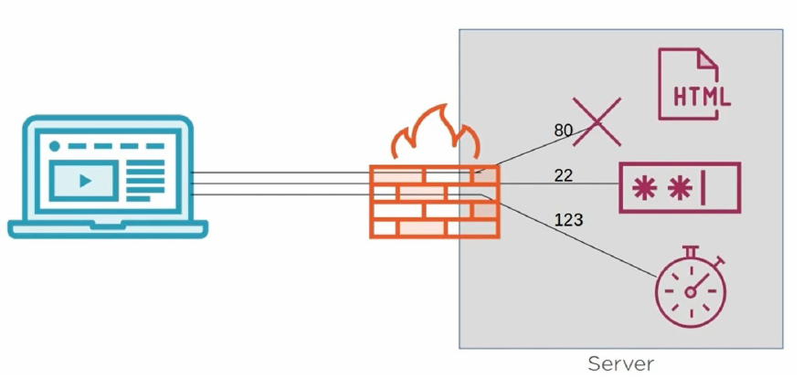



# Bash - Instalaciones y primeros pasos
***


## Eso del código abierto
***

- El termino **Open source** se refiere a un tipo de software abierto a todo publico, donde el código puede ser usado, modificado, analizado y re distribuido por cualquier persona. 


- Como el código de este tipo de Software es abierto a todo publico, es necesario definir qué se puede y qué no se puede hace con él. Y es allí donde salen a relucir las licencias Open Source.


- Podemos definir una **licencia open source** como un tipo de licencias asociada a un Software. Esta licencia define como el software podrá ser utilizado, distribuido, analizado, e inclusive, modificado.


- A través de las licencias open source que seremos capaces de establecer reglas de lo que se puede o no hacer con nuestro proyecto.


- Existen una gran cantidad de licencias en el mercado, pero hay cuatro especialmente relevantes:

- **GNU General Public License (GPL)**
  - Esta licencia permite ejecutar el programa, estudiarlo y distribuirlo, ya sea mediante una copia exacta del programa o en versiones modificadas.
  - Algo importante a mencionar es que, esta es una licencia copyleft, lo que significa que, además de ofrecer el derecho de poder hacer lo que deseemos con el software, cualquier trabajo derivado, obligatoriamente, debe distribuirse bajo la misma licencia.
  - Más información: [https://www.gnu.org/philosophy/philosophy.html](https://www.gnu.org/philosophy/philosophy.html)

- **APACHE LICENSE 2.0**
  - Esta es una licencia **muy permisiva** con el software. En su versión 2.0 la licencia Apache obliga a mantener todos los derechos de autor y patentes asociadas al software. Así mismo permite que el software pueda ser ejecutado, modificado y redistribuido.
  - Y en caso el código sea modificado, se debe mencionar cada una de las modificaciones realizadas. Si existen partes de código sin modificar, estas deben conservar la licencia Apache 2.0
  - Más información: [https://www.apache.org/licenses/LICENSE-2.0](https://www.apache.org/licenses/LICENSE-2.0)

- **MIT License**
  - Esta es la licencia **más permisiva** de las cuatro, ya que prácticamente permite hacer lo que nosotros deseemos con el software. Ya sea ejecutarlo, estudiarlo, modificarlo, redistribuido, e inclusive**, sub-licenciar.**
  - Las únicas restricciones son:
    - Mantener los derechos de autor.
    - El autor original se deslinda de cualquier daño o mal uso resultado del código licenciado.
    - En las copias generadas se debe mantener la licencia MIT.
  - Algunos softwares famosos que utilizan esta licencia pueden ser **Node.JS, Vue.JS o Ruby On Rails, etc**
  - Más información: [https://opensource.org/licenses/MIT](https://opensource.org/licenses/MIT)

- **MOZILLA PUBLIC LICENSE (MPL)**
  - The Mozilla Public License (MPL) es una licencia desarrollada y mantenida por la fundación Mozilla.
  - Esta es una licencia copyleft y algo permisiva. Al igual que las licencias anteriores, esta permite ejecutar el software, estudiarlo, y redistribuir.
  - Los puntos a descartar son los siguiente.
    - Se mantienen los derechos de autor.
    - Si el código es modificado, el código original con licencia MPL debe estar disponible, y se debe informar dónde y cómo se puede obtener.
  - Más información: [https://www.mozilla.org/en-US/MPL/](https://www.mozilla.org/en-US/MPL/)

## Distribuciones de Linux
***

- Linux ya no es un único S.O, existen cientos de variantes (a 2022 más de 600), tantas que ahora vamos a hablar de algunas de ellas organizándolas a través de una serie de factores:
  - Si se busca estabilidad
  - Si se empieza en este mundillo de Linux.
  - Si se busca privacidad
  - Si se dispone de equipos poco potentes
  - Si se quiere un OS especializado para aficiones varias
- Un lugar donde hallar todas las distribuciones:
  - [https://distrowatch.com/](https://distrowatch.com/)

### Si se busca estabilidad:

  - **Red Hat Enterprise Linux**: Distribución comercial de Linux desarrollada por Red Hat. Ofrece una estabilidad y flexibilidad punteras, lo que la coloca como una de las más recomendadas para empresas y servidores.
  - **Debian**: Muy estable y 100% libre, Debian destaca por su sistema de paquetería .deb y su gestión de paquetes APT. Es una de las distribuciones más importantes de GNU/Linux, ya que en ella se basan gigantes como Ubuntu.
  - **openSUSE**: Es una de las alternativas más potente contra la familia de distribuciones basadas en Debian. Está disponible con los entornos de escritorio KDE y Gnome, y cuenta como una de sus mejores armas con la robusta herramienta de instalación y configuración YaST y el configurador gráfico SaX.
  - **Fedora**: Distribución gratuita creada y mantenida por la empresa Red Hat que utiliza el sistema de paquetería RPM (Red Hat Package Manager). Tiene tres versiones diferentes para escritorio, servidores y sistemas en la nube, y destaca por su seguridad gracias al sistema SELinux ("Security- Enhanced Linux").
  - **AlmaLinux:** El antiguo CentOS Linux es historia, y AlmaLinux es uno de los sucesores de la comunidad. Está entre nosotros con la mayoría de los paquetes de RHEL.
  - **Arch Linux:** Una distribución modular en la que empiezas desde cero y tienes que ir añadiéndole los componentes que quieras. No es muy apta para principiante, y utiliza pacman, su propio gestor de paquetes. Se trata de una Rolling Release, lo que quiere decir que todos sus componentes van actualizándose sin necesidad de instalar versiones nuevas del sistema operativo.
  - **Manjaro:** Una prometedora distribución que promete llevar todo el potencial de Arch Linux al usuario menos experimentado. Para eso, ofrece un sistema operativo ya montado y basado en Arch, con un instalador sencillo como el que podemos encontrar en otras distribuciones como Ubuntu. Tiene versiones oficiales con los entornos de escritorio XFCE y KDE. 
  
### Si se empieza en esto:
  - **Ubuntu**: Una de las distribuciones más utilizadas gracias a su gran facilidad de uso. Basada en Debian, es amada y odiada por partes iguales por su exclusivo entorno de escritorio Unity, con el que persigue convertirse en una distribución versátil que pueda utilizarse tanto en ordenadores como móviles y tabletas.
  - **Linux Mint**: Basado en Ubuntu, es uno de los más recomendados para todos aquellos que tocan Linux por primera vez. Su entorno de escritorio, Cinnamon, tiene muchas similitudes con el de Windows, y es también uno de los más personalizables.
  - **Elementary OS:** De todas las distribuciones basadas en Ubuntu, esta una de las que más personalidad tiene gracias a su cuidadísimo aspecto, que imita el del sistema operativo OS X de Apple. Increíblemente rápida y fácil de usar, le ofrece al usuario todo lo que pueda necesitar desde el primer momento, incluyendo una colección de aplicaciones propias diseñadas para integrarse a la perfección con su estilo visual.
  - **Zorin OS**: Distribución también basada en Ubuntu que nació con la intención de ayudar a que el usuario diera el salto a Linux ofreciéndole una interfaz lo más similar posible a Windows. Tiene varias versiones, algunas gratuitas como Core (versión básica), Lite (para PCs poco potentes) y Educational (incluye aplicaciones educativas), y otras cuantas de pago muy al estilo de las versiones de Windows.
  - **Peppermint OS**: Distribución rápida y ligera basada en Ubuntu con entorno de escritorio LXDE. Utiliza la tecnología Prism de Mozilla para integrarse con las aplicaciones basadas en la nube, utilizando las webapps como si fueran nativas. Se presenta como una alternativa a otros sistemas basados en la nube como Chrome OS.

### Si se busca privacidad:
  - **Tails**: Promocionada por el propio Edward Snowden y basada en Debian, es una distribución lista para ser ejecutada desde un USB o DVD. Tails se conecta a TOR tan pronto termina el proceso de inicio del sistema operativo, y toda conexión a Internet se realiza a través de esta red.
  - **Kali Linux**: Distribución basada en Debian con una inmensa colección de herramientas para proteger nuestros equipos. Utiliza un kernel personalizado con parches de seguridad y tiene soporte para la arquitectura ARM. Es el más utilizado para hacer Labs de Seguridad
  - **BlackArch Linux**: Una distribución orientada a la seguridad informática que en un principio nació como expansión de Arch Linux, pero que ha seguido su propio camino. Nos da acceso a una impresionante cantidad de herramientas de hacking entre las que destaca Sploitctl, un script que permite instalar, actualizar y buscar sploits.
  - **Arch Assault**: Se trata de una nueva distribución, también basada en Arch Linux y muy parecida a la anterior, también dirigida a hackers y amantes de la seguridad. Minimalista, con gestor de ventanas Openbox acompañado por el panel Tint2, a pesar de estar aun verde ya ofrece soporte para arquitecturas ARM.
  
### Si se tienen equipos poco potentes:
  - **Puppy Linux**: Una minúscula distribución que puede llevarse en un USB o CD, pero sorprendentemente rápida al cargarse enteramente en la memoria RAM del ordenador. Se carga en 30 o 40 segundos y ocupa sólo 100 MB.
  - **Lubuntu:** Se trata de una versión de Ubuntu mucho más ligera y asequible para equipos poco potentes al utilizar el sistema de escritorio LXDE y el gestor de ventanas Openbox. También incluye software personalizado bastante más ligero, por lo que sólo nos pide 128MB de RAM y un Pentium II o Celeron de 1999 para funciona.
  - **Damn Small Linux**: Distribución especialmente diseñada para los equipos más antiguos, como los Pentium de primera generación o incluso los i486. Como entorno gráfico y gestor de ventanas nos propone JWM, su iso ocupa apenas 50 MB y sólo nos pide como mínimo un Intel 486DX y 16 MB de memoria RAM.
  
### Si se tienen equipos poco potentes:
- **SliTaz**: Otro peso pluma aunque con un software ligeramente más moderno que el del anterior. Utiliza el entorno Openbox y sólo necesita un Pentium III con 256MB de RAM y 100 MB libres en el disco duro para funcionar.
  - **LXLE**: Basada en Lubuntu, esta distribución promete ser aun más ligera gracias a un mejor procesado de inicio y el entorno de escritorio LXDE. Ofrece varios perfiles que amoldarán la distro para que se parezca a Windows XP, Vista, y 7 Starter/Basic.
  - **Bodhi Linux**: Aunque actualmente su desarrollo está paralizado después de que su creador abandonase el barco, aun podemos utilizar las últimas versiones de esta distribución para nuestros equipos antiguos. Utiliza un entorno de escritorio Enlightenment y sólo pide como mínimo un equipo con procesador de 300 MHz, 128 MB de RAM y 2,5 GB de espacio libre en el disco duro.
  - **Q4OS**: Y si el anterior era un proyecto que llegaba a su fin, Q4OS es uno que está comenzando. Se trata de una distro basada en Debian. Su entorno de escritorio deriva de la una versión 3.x de KDE llamada Trinity DE e imita el aspecto de Windows XP. Puede usarse en equipos con Pentium de 300MHz, 128 MB de RAMy 3 GB de disco duro.
  
### Si se quiere un OS especializado para aficiones varias:
  - **Distro Astro**: Esta distribución está basada en Ubuntu 14.04 LTS y utiliza el entorno de escritorio MATE, aunque lo más importante es su completa colección de aplicaciones dirigidas a los amantes de la astronomía.
  - **SteamOS**: Aun en fase beta, esta es la distribución basada en Debian desarrollada por Valve, y que está más dirigida a ser una especie de media center para videojuegos integrando el modo big picture que un sistema de sobremesa.
  - **ArtistX**: Distribución de Linux enfocada en la producción multimedia. Basada en Ubuntu, aunque diseñada para ser utilizada en formato LiveDVD y USB, se puede instalar en cualquier equipo. Usa el entorno KDE y ofrece una colección de programas de código abierto para edición de vídeo y creación de gráficos 2D y 3D.
  - **Ubuntu Studio**: Basada en Ubuntu y orientada a la edición multimedia profesional de audio, video y gráficos. Utiliza el entorno de escritorio Xfce y no lleva preinstalado ningún tipo de software ofimático, sólo el diseñado para la edición multimedia.
  
### Si se quiere un OS especializado para aficiones varias:
  - **Scientific Linux**: Se trata de un clon a nivel binario de la distribución Red Hat Enterprise Linux, y está desarrollada y mantenida por los laboratorios de Física CERN y Fermilab con el objetivo de tener un sistema operativo específico para la computación científica.
  - **CEELD**: Distro basada en OpenSUSE que usa el entorno KDE y está especialmente dirigida a los ingenieros electrónicos y a estudiantes de esta carrera, al permitirles diseñar o simular circuitos electrónicos.
  - **Edubuntu**: Otro derivado de Ubuntu, pero en esta ocasión especialmente dirigido a escuelas y profesores. Ofrece una gran colección de software y herramientas educativas, por lo que también es una buena opción para instalar en los ordenadores de los más jóvenes de la casa.
  - **Openelec**: Pequeña distribución Linux creada desde cero para convertir un ordenador en un centro multimedia basado en Kodi, lo que antes se conocía como XBMC. Hace lo que promete y necesita sólo 90-125 MB de almacenamiento interno. A parte de su versión oficial, tiene otras dos buids para Raspberry Pi y Apple TV.
  
[Evolucion de las distribuciones.png](img/Evolucion_de_las_distribuciones.png)

## Comenzando con Linux
***

Es el momento de comenzar con lo más básico de Linux.

  - Vamos a ver este sistema operativo en mayor profundidad que los basados en Windows, porque dentro del mundo Cloud, salvando el caso de Azure y también lo utiliza, es el más usado. Además, es de todos sabido que Powershell sólo fue creado para que Windows tuviera un terminal que fuera tan potente como los de Linux.
  - Principalmente veremos Terminal, no tanto la parte GUI del sistema. Ya que como hemos dicho, en los servidores no se utiliza sino la versión mínima, que sólo es accesible vía terminal.
  - En cuanto a las diferencias entre Ubuntu y CentOS las iremos comentando a medida que vayan surgiendo porque no son tantas.
    - Se trabajan estos dos sistemas, porque son dos de los más conocidos y porque las familias a las que pertenecen (Debian y Red Hat) son las más extendidas.
    
Lo primero es entender como inicia un S.O Linux

- Una vez que aparezca el escritorio y dado que una de las herramientas que vamos a utilizar mucho es el terminal, se puede abrir con la combinación:
  - **Ctrl + Alt + T**
- También podemos añadir el terminal a la barra de favoritos. Para ello, primero en el cuadro de puntos, buscaremos el terminal y con botón derecho elegiremos Añadir a Favoritos


- En Linux, podemos acceder a todo a través de su sistema de archivos.
- Por ejemplo, si accedemos a la carpeta /boot

```bash
cd /boot 
ls
```

Veremos una serie de ficheros, entre los que se encuentra vmlinuz…….-generic que versiones del kernel de Linux comprimido.

Otros ficheros de esa carpeta son ficheros de apoyo al sistema.

La carpeta grub, contiene los archivos utilizados por el cargador de arranque GRUB. Podriamos ver cualquiera de estos ficheros con una instrucción como:
  ***less /boot/grub/…..***

En Linux podemos decir que existen unos “Niveles de ejecución” que son simplemente números que le dicen a Linux cómo debería estar funcionando el sistema operativo:


Esta lista puede cambiar entre las versiones de Linux que usemos

- 0 system halt
  - Aunque de miedo, simplemente indica que aplicar el código 0, apagará la máquina.
- 1 single-user (rescue) mode
  - Permite solucionar problemas de seguridad o estabilidad sin conectividad de red y sin riesgo a que otros usuarios inicien sesión.
- 3 multi-user mode without GUI
  - Se ejecuta como un servidor con solo terminal.
- 5 multi-user mode with GUI
  - Se accede a un escritorio típico. El término multiusuario significa que más de un usuario puede iniciar sesión en el sistema a la vez.
  - El que varios usuario se puedan conectar a una máquina Linux de forma remota es algo que caracteriza a  los servidores Linux.
  - Linux se asegura que cada usuario nunca tenga más acceso del que necesita.
- 6 Reboot
  - Para  reiniciar la máquina

El comando para cambiar de nivel de ejecución utilizamos la llamada:
  - ***sudo telinit 0***

- De todos modos, una forma más correcta de hacerlo es a través de systemctl, para que systemd se entere de lo que está pasando.
  - systemctl get-default
  
- Obtendremos que estamos en el nivel gráfico multiusuario. (graphical.target)
- Para cambiarlo temporalmente:
  - systemctl isolate rescue.target
  - systemctl enable multi-user.target


### La Jerarquía de ficheros de Linux

En Linux, todo es un archivo de texto plano.

La forma en la que se ejecuta el sistema, las operaciones que permite que ocurran y los objetos a los que se pueden acceder, están determinado por fichero de texto. 

**Organización de ficheros**

El sistema raíz es una barra / y de él cuelgan todos los directorios de nivel root y que explicaremos a continuación:
    
- **/bin** : Ficheros binarios de comandos del sistema en modo usuario único. Es decir todos los programas para lanzar lo más básico de Linux, incluidas muchas herramientas de navegación y manipulación.
- **/sbin:** Ficheros binarios del sistema también, incluyen recursos de red. Solo pueden ser accesibles desde sesiones multiusuario completas.
- **/boot**: Es donde se encuentra las imágenes de Linux y los ficheros de configuración de arranque.
- **/dev**: Contiene archivos que representan y proporcionan control sobre todos los dispositivos físicos.
- **/etc**: Lugar donde se encuentran todos los ficheros de configuración del sistema. Antes era el lugar donde se guardaba lo que no cabía en otra (Por ello lo del etc.)
- **/home:** Contiene los ficheros del usuario actual. Para almacenar archivos privados.
- **/lib**: Utilizado para bibliotecas de software que necesitan los programas binarios.
- **/root:** Ficheros del usuario Root. Por razones de seguridad no se inicia sesión con el usuario root. Por lo que este directorio no se usa mucho.
- **/usr**: archivos binarios y los archivos de datos que necesitan esos binarios.
- **/var**: archivos cuyo contenido se cambie a menudo. Registros, correos, caché de aplicaciones.

Además de los ficheros normales, Linux también utiliza archivos virtuales o **pseudo files**. No son persistentes y se crean de forma virtual durante el inicio del sistema en respuesta a un evento.

- **/prox**: Archivos que representan procesos de sistema iniciados.
- **/dev**: Pseudo archivos representando dispositivos o controladores de dispositivos.
- **/sys**: Es otro directorio para pseudo-archivos. Contine información sobre el sistema y las características de Linux.
  - Esta carpeta tiene una serie de ficheros
  - **block**: Contiene dispositivos de bloque adjuntos como discos duros y usb. 
    - dentro de /sys/block se encuentran entre otros sda, puede que también un sdb que será como llame a nuestros discos duros. En cada sda o sdb se encuentran las particiones de la unidad. 


  - **block**: Contiene dispositivos de bloque adjuntos como discos duros y usb.
    - Si nos metemos en sda1, aparte de ver qué hay en ese disco.
    - y hacemos **cat size**, obtendremos un valor de tamaño de sda.
    
### Configuración inicial de un Linux.

Podemos cambiar nuestro valor de país y ciudad utilizando **locale**: ***locale***
La configuración real se encuentra en el directorio:
  - cd /usr/share/i18n/locales/

Si mostramos el contenido del fichero:
  - less es_ES

Ahora, la mayoría usa más localectl de systemd, para ver y editar:
  - localctl status
  - localctl list-locales
  - localctl set-locale LANG=en_EN.utf8

### Más comandos básicos

Para conocer dónde nos encontramos exactamente en el árbol de directorios:
````bash
pwd
````

Que es lo mismo que utilizar
````bash
echo $PWD
````

Es decir, estamos utilizando Variables de entorno.

Se puede acceder a todas la variables de entorno a través del comando:
````bash 
env
````

El comando type nos permite ver dónde o cómo se conforma un comando dentro del sistema de archivos.
`````bash
type wget
`````


### Variables 
Podemos asignar variables directamente con el =
```bash
mivalor=5
echo $mivalor
```

Sin embargo, todo esto afectará sólo al terminal. Ya que si abrimos otro shell con 
```bash
bash
```

Y queremos volver a imprimir mivalor, no aparecerá nada.

Si escribimos
```bash
exit
```
 
Volveremos al Shell original y allí si que seguiremos con un mivalor. Si queremos que mivalor aparezca en todos los Shell secundarios:
```bash
export mivalor
```

Comenzando con Linux

#### Historial

Cada vez que escribimos una instrucción, se añade una línea al historial de ese terminal. Así, si subimos con la flecha del teclado, podremos acceder al anterior comando, o al anterior del anterior, etc.

Si escribimos
```bash
history
```

Accederemos a todos los comandos ejecutados en ese terminal.

### Fechas y horas

Para conocer la fecha y la hora de la configuración:
```bash
timedatectl
```

Para conocer las zonas horarias
```bash
timedatectl list-timezones
```

O mejor, filtrando con grep
```bash
timedatectl list-timezones | grep -i Europe
```

Para cambiar la zona horaria
```bash
timedatectl set-timezone Europe/Lisbon
```

### Conseguir información de dispositivos del sistema

Para conocer por ejemplo, los discos de nuestro Linux:
````bash
df -ht ext4
````

Linux se refiere a los discos, siempre por su dirección virtual

Para ver todos los dispositivos de bloque:
````bash
lsblk | grep sd
````

Otra herramienta es la que nos permite mostrar los mensajes relacionados con el búfer del kernel, es decir cómo entiende Linux su equipo físico.
````bash
dmesg | grep wi
````
El comando que nos permite ver qué dispositivos tenemos en nuestro ordenador es
````bash
sudo lshw
````

Este comando en CentOS hay que instalarlo con ***yum install lshw***


### Instalaciones y paquetes


Ya hemos visto cómo instalar algo con CentOS, pero esto cambia según la distribución


**Instalación desde el Desktop**

Desde el Desktop es sencillo, ya que basta con acceder a Ubuntu Software (El icono de la maleta naranja con la letra A blanca) y aparecen las distintas aplicaciones para instalar

Si nos encontramos ante el problema que al intentar abrir Ubuntu Software se queda un rato intentando abrirlo y al final se acaba cerrando, podemos arreglarlo desinstalando y volviendo a instalar esta aplicación con los siguientes comandos:

````bash 
sudo snap remove snap-store
sudo snap install snap-store
````

Si tampoco, hay que cambiarle el idioma a ingles y ya tira: Configuracion/Idioma

**Instalación desde la terminal**

Desde terminal, el lugar donde se guarda la información sobre los repositorios usados, etc, es en 
````bash 
cd /etc/apt
ls
less sources.list
````

Tras quitar todos los comentarios vemos líneas como estas:
* **deb http://security.Ubuntu.com/Ubuntu_focal-securitiy_main_restricted**


Los repositorios de software de Linux:
  - **Main**: Software de código abierto. Los paquetes restrintgidos son oficialmente compartibles
  - **Restricted**: Son oficialmente compartibles pero están construidos con software de código cerrado. Programas propietario.
  - **Universe**: software de código abierto mantenido por la comunidad en general.
  - **Multiverse**: software de código abierto mantenido por la comunidad pero que tiene uso restringido.

El número de software compartido en el repositorio Main es:
````bash 
apt list --all-versions | wc
````

#### Ubuntu/Debian

Antes de instalar nada, es conveniente utilizar:
````bash 
sudo apt update
````

Así el índice del software local que utiliza APT coincida. Podemos usar search para búsquedas inexactas
````bash 
apt search business card | less
apt show glabels
````

Y mostrará información sobre la aplicación.
`````bash
sudo apt install glabels
`````

También se pude usar apt-get, sobre todo en scripts de automatización


#### CentOS / Red Hat

Con yum:
`````bash
yum info vino
`````

Para instalar:
`````bash
yum install vino
`````

Luego nos pedirá confirmación. Pero que también podemos colocar el flag -y para que diga a todo que SI.

## Comandos Linux

Repaso a los comandos Linux básicos

## Ejercicios y Material
Se acompañan una serie de documentos para repaso de los comandos básicos:
- [Más comandos básicos](https://github.com/isotomor/thebridgecdptenero23/blob/main/01%20-%20RampUp/Modulo%203%20-%20Fundamentos%20de%20Administraci%C3%B3n%20de%20sistemas/Bash/Comandos%20basicos%20linux/M%C3%A1s%20comandos%20b%C3%A1sicos.pdf)
- [Anexo Comandos Linux](https://github.com/isotomor/thebridgecdptenero23/blob/main/01%20-%20RampUp/Modulo%203%20-%20Fundamentos%20de%20Administraci%C3%B3n%20de%20sistemas/Bash/Comandos%20basicos%20linux/Anexo_Comandos_Linux.pdf)
- [Chuleta shell script](https://github.com/isotomor/thebridgecdptenero23/raw/main/01%20-%20RampUp/Modulo%203%20-%20Fundamentos%20de%20Administraci%C3%B3n%20de%20sistemas/Bash/Comandos%20basicos%20linux/chuleta-shell-script.pdf)
- [Comandos Linux Completo](https://github.com/isotomor/thebridgecdptenero23/raw/main/01%20-%20RampUp/Modulo%203%20-%20Fundamentos%20de%20Administraci%C3%B3n%20de%20sistemas/Bash/Comandos%20basicos%20linux/Comandos%20Linux%20Completo.pdf)

# Bash - Más sobre comandos y scripting

## Más sobre comandos en línea

Cuando los comandos en línea aparecieron, no había nada más que ellos.

Muchos años después, la razón por la cual se sigue utilizando a pesar de tener unas GUI maravillosas es 
- Por eficiencia. (Por muy rápido que pinchemos botones, si lo tenemos que hacer 1000 veces, nos cansaremos)
- Por automatización de infraestructura. (Podremos copiar y pegar codigo que cree infraestructuras)

- Al igual que hicimos con Powershell, ya que los comandos son muchos e incluso los argumentos que acepta cada uno pueden ser decenas, debemos comenzar sabiendo cómo poder acceder a ayuda. 

### Ayuda

Como es obvio, podemos obtener ayuda en algunas páginas como:
- [https://serverfault.com/questions/tagged/linux](https://serverfault.com/questions/tagged/linux)  
- [https://stackoverflow.com/questions/tagged/linux](https://stackoverflow.com/questions/tagged/linux)

Pero Linux también tiene sus propios modos de soporte incluidos.

### man

El comando man nos permite preguntar por algún comando.  
La ayuda es extensa y con el espacio vamos cambiando de página  

Con la tecla q salimos de man  
Con la tecla h obtenemos más ayuda.

### info

Es posible que info no se encuentre el SO Linux

```BASH
sudo apt update
sudo apt install info
```
Para utilizar info, sólo tenemos que acceder y preguntarle dentro del programa.


### Archivos ocultos

En Linux, los archivos ocultos tienen en el primer carácter del nombre un punto.

Para poder ver todos los ficheros ocultos de un directorio podemos utilizar:
```bash
ls -a
```

En nuestro directorio de usuario, hay un fichero oculto especial llamada **.bashrc** que tiene información de configuración de la sesión que tenemos iniciada. Aparte de poder colocar scripts que se realicen según qué opciones, es un buen lugar para definir variables de entorno que se apliquen a toda la sesión.

Otro fichero que contiene información sobre nuestra sesión es **.profile**, donde, es posible que tenga una línea de script que le diga que si existe un fichero **.bashrc**, lo cargue y aplique la configuración.
- También exist otro fichero llamado profile pero en /etc, donde encontraremos información relevante al sistema completo.

```bash
less /etc/profile
```

### Asignaciones internas.


En el fichero /etc/passwd tenemos una serie de datos asignados para la sesión: 

```bash
cat /etc/passwd
```
 
Qué nos dice esa línea: 

- Que al usuario se la asignado el id de **usuario 1000** y el de **grupo** también **1000** 
- Utiliza como ruta de inicio el directorio /home/usuario 
- Usa **/bin/bash** como shell 

## Patrones de uso comunes 

Muchos comandos en Linux, mantienen patrones comunes. Conocer estos patrones, nos puede ayudar a ser más rápidos en controlar los comandos.
1. Los comandos comienzan por su nombre.
2. Algunos pueden lanzarse con o sin argumentos (como **ls**) pero son los menos. Casi siempre llevarán uno 
   1. varios argumentos comenzando por un guión medio (-)
3. Los argumentos se pueden agrupar tras un guión ( **ls -l -a**  à **ls -la**)
4. En casi todos los comandos se puede poner un argumento llamado **--all** que lanzará una versión con todos los argumentos.
5. Como norma, cuando se utilizan **--** suele ser palabra completa, cuando es **-** sólo una letra, distinguiéndose entre mayúsculas y minúsculas. Hay alguna excepción como por ejemplo **ip addr** ó **ip a**, que no lleva guiones.
6. Los espacios son considerados separadores, por lo que una instrucción como **touch mi fichero**, no creará un fichero vacío sino dos. Cuando queramos que el nombre tenga espacios, es necesario escribirlo entre comillas o bien que se escapen los espacios con la \: touch mi\ fichero

## Administración del Sistema de archivos de Linux

Como ya vimos, el directorio raíz de Linux es /, hay que denotar que es la barra inversa a la utilizada en las rutas de Windows.
Siempre se empieza por una barra. Por ejemplo la dirección base donde comienza la sesión un usuario es /home/usuario. 
- Si no ponemos la barra delante, bash interpretará que nos referimos a un directorio que cuelga del directorio actual en el que nos encontramos.

```bash
cp fichero.dat otrodirectorio/
```

- Copia **fichero.dat** al directorio **otrodirectorio** que cuelga del actual.

Hemos visto ya comandos como **cd, cp, mv, mkdir, ls, rm**, **rmdir**, así como la edición de ficheros a través de **touch, nano, gedit**, etc. Solo recordar que usar **touch** con un fichero ya creado, actualiza la fecha y la hora del archivo.

También ya conocemos el uso de los Wildcard \*, ?, etc. Porque es el mismo uso que se da en otros comandos de terminal de Windows u otros sistemas.
Por lo demás, 
  - Poner **../directorio1**, provoca que estemos haciendo referencia al padre de **directorio1.** También si escribimos **cd ..** subirá hasta el padre del directorio en el que nos encontremos.
  - Poner **un único punto con su espacio antes**, indica que queremos referenciar a la carpeta actual en la que nos encontramos, pero si vemos este ejemplo tendremos la respuesta:
````bash
mv ../fichero/* .
````

Cuando utilicemos funciones de borrado como **rm** \* o **rmdir**, o **rm -rf**, hay que tener cuidado porque no hay una papelera de reciclaje de donde podamos deshacer la operación. Bash no la tiene. 

También hay que recordar que no se puede borrar un directorio que no esté vacío a no ser que se fuerce con **rm -rf**

Otro tema importante en un sistema de archivos de Linux es la búsqueda. Esto es así, porque un equipo habitual puede tener más de 1 millón de archivos sin mucho esfuerzo.

El principal comando para buscar por nombre es locate. Sin embargo en Ubuntu hay que instalarlo:
````bash
sudo apt install mlocate

locate adduser

# Nos dará una lista de ficheros, colocando al principio los que Bash cree que son la mejor búsqueda.
````

- Si queremos que la búsqueda aún sea más efectiva pasado un tiempo, es recomendable actualizar el índice: **sudo updatedb**

Pero además de buscar a nivel de fichero, también es muy importante buscar dentro de los ficheros.

Los ficheros de trazas de logs que lanzan ciertos programas son muy interesantes de analizar para sacar conclusiones sobre el funcionamiento.

- Por ejemplo podemos mostrar el contenido del fichero /etc/group que tiene los índice de grupo de todo lo que circula por esta sesión:

````bash
cat /etc/group

less /etc/group
````

Pero si queremos, podremos filtrar 

```bash
cat /etc/group | grep usuario
```

Y obtendremos sólo las líneas donde se encuentra la palabra usuario, y además las marcará en color rojo.

 - Si queremos que la salida se añada a un fichero, recordamos que **>>** añade al final de un fichero, pero **>** destruye el viejo y lo vuelve a crear con el contenido añadido
 
Otras herramientas para analizar un fichero pueden ser:
  - **head**: muestra las 10 primeras líneas de un fichero
  - **tail**: muestra las 10 últimas líneas de un fichero

Si por ejemplo el fichero tiene algún carácter delimitador, podemos usar cut para acceder a algún valor en particular. En el ejemplo del fichero group, el delimitador son los : y como sabemos que el tercer campo es el valor del grupo, podríamos escribir lo siguiente para sacar los valores de esos id de grupo solamente:

````bash 
cut -d: -f3 /etc/group
````
- -d: indica que el carácter : será el que busquemos como separador.
- -f3 indica que queremos el tercer campo.

También se podría colocar el resultado anterior ordenado:

````bash
cut -d: -f3 / etc/group | sort -n -nr si lo queremos invertido
````

Para conocer cuántas, líneas, palabras y caracteres tiene un fichero utilizaremos 
````bash
wc /etc/group
````

Como antes hemos hablado de los redireccionamiento, ahora hay que tratar el resto de redireccionadores:
  - < sirve para indicar entrada de datos:
````bash
mysql -u root -p < mibasedatos.sql
````

### Compresión de archivos

La compresión de archivos es necesaria para la eficiencia. Esto es así, porque en los movimientos de archivos, **es más lento pasar los ficheros directamente a otra ubicación que comprimir primero y después mover un solo fichero**.

En Linux la forma más común es utilizar **tar**: Muchas veces aparecerá una doble extensión **.tar** y otra como **.gz**. La última indica que fue comprimido con el algoritmo **gzip**.

Ya hemos visto que para descomprimir:
````bash
tar xzf fichero.tar.gz
````
Para comprimir haríamos lo siguiente:
````bash
tar czf nuevofichero.tar.gz carpeta_a_comprimir/
````
Nota: Es importante comprobar que el fichero comprimido no está corrupto para estar seguro. 

Otras formas de ficheros comprimidos puede ser .zip, utilizado por Windows:

````bash
unzip fichero.zip
````

Para comprimir

````bash
zip otrofichero.zip \*
````

## Administración de periféricos en Linux

En el reconocimiento de problemas en los periféricos hay dos pasos:


Para el paso 1

- Dispositivos USB: **lsusb** 
- Dispositivos PCI: **lspci** 
- Todo el hardware: **lshw** 

Para el paso 2

  - Podemos tener el caso de que no exista el módulo del kernel que controle el dispositivo, aunque este suele ser el caso más marginal.
  - Lo normal es que sí que esté instalado, pero no esté despierto. 
    - Estos ficheros están en la carpeta **/lib/modules** pero el módulo que quiere usar está condicionado por la versión del kernel de Linux que estemos utilizando.
    - Para saber qué versión se está utilizando podemos usar este comando
      - **uname -r**
      
  - Y ahora podemos incluir los dos comandos en uno:
````bash
ls /lib/modules/ uname -r 

cd / lib/modules/ uname -r / kernel
````


- Si ahora quisiéramos trabajar con el sonido, tendremos que ir a la carpeta sound 
````bash
cd sound
````

- Podemos primero ver qué módulos están cargados con **lsmod**
````bash
lsmod | grep sound
````

- Debe aparecer ya en la lista, pero si no estuviera cargado: modprobe soundcore

## Conectividad en Linux

Actualmente son muy escasas las máquinas que no accedan a algún tipo de red, ya sea interna o externa.

Linux se creó pensando ya en la conectividad, por eso sacó ventaja rápidamente.

Para poder conectarse a una red, un dispositivo debe ser identificable por una dirección IP única. Ya vimos en la parte de redes cómo funciona el redireccionamiento.


Pero cómo poder trabajar con Linux para conocer información sobre la conectividad del sistema. El primer paso es ver si tiene acceso a un enrutador de red de un tipo u otro.

````bash
ip route show
````


Esto nos está diciendo que nuestra ruta predeterminada de la red es doble, una que va a 10.0.2.2 y luego la 192.168.0.1. Esto cuadra con las dos redes que incluimos a la hora de definir esta máquina virtual, la NAT y la interna. La NAT es el dispositivo **enp0s3** y  la interna en el dispositivo **enp0s8**
 
Tras esto aparecen aquellas que tienen … proto kernel scope link src… y la ip siguiente es la dirección real de la máquina.

También podemos lanzar el comando **dhclient** 

O ver sólo nuestras direcciones IP: **ip addr**
- Esto siempre mostrará una IP local, 127.0.0.1 o localhost
- Luego mostrará las dos ips, tanto la de la red NAT y la de la interna.

- Al igual que ip addr, podemos utilizar **ifconfig** que es un poco más fácil de leer.

Otro comando muy importante es:
````bash
netstat -i
````
- Que nos permite ver estadísticas sobre transmisiones y recepciones.

````bash
netstat -l
````
- Nos permite saber si hay o no puntos de entrada innecesarios e inseguros en el sistema. ●

- Equivalente a netstat puede ser:
````bash
ss -i
````

Se puede conocer el estado del servidor DNS a través del comando host <<nombre de dominio>>

- El sistema responderá con la IP address

Cuando no funciona el nombre de dominio, también podemos hacer ping sobre la dirección IP, para saber si lo que falla es el nombre de dominio, que tendrá que ver con la traducción del nombre de dominio a la Ip, o es la propia IP.
````bash 
ping
````
El fichero que gestiona estos nombres de dominio en algunas distribuciones es /etc/resolv.conf

Podemos resolver con para mostrar cómo se configuran las cosas actualmente para usted

````bash
systemd systemd-resolve --status
````

En lo que muestra, la información clave aquí es la línea de DNS Servers que debe enumerar correctamente la dirección IP de los enrutadores.
También se pueden crear manualmente los propios índices DNS. a través de la edición del fichero /etc/hosts, esto hará que anotemos en una misma línea, la IP y el nombre de dominio.
- Esto lo trabajamos cuando creamos la red y lo volveremos a tratar cuando veamos SSH.

## Scripts en Linux

Al igual que en los otros dos lenguajes de scripts de terminal, en Linux podemos escribir pequeños códigos con instrucciones de Bash, para así automatizar de la mejor manera las operaciones.

Necesitamos un editor de texto, ya sea **nano, vi, vim o gedit**, el caso es que escriba texto plano de Linux (recordar que no es igual que el texto plano de Windows)

Los ficheros de script de Bash tienen extensión **.sh** Es importante recordar que antes de poder ejecutar estos ficheros, tenemos que habilitar los permisos de ejecución:
````bash
chmod +x script.sh
````

Para lanzarlo hay que escribir el comando de esta manera: 
````bash 
./script.sh
````

Suelen tener una marca de script como si fuera un comentario para decirle a Bash que es un fichero de script.   
- **#!/bin/bash**

Entrada de texto:

````bash
#!/bin/bash
declare -i number1
declare -i number2
declare -i total
echo "¿Cuales tu número favorito?"
  read number1
echo "¿Qué numero odias?"
  read number2
  
total=$number1*$number2
echo "Son igual a" $total

exit 0
````

- Notamos que se declaran las variables como enteras -i para que no se acepte la entrada como una cadena.
- Que cuando hacemos uso del valor de la variable, utilizamos el signo $ antes.
- Al final del script, aunque no es obligatorio, debemos salir indicando un código de error. En este caso, el 0 es ausencia de error.


### Declare:

En Bash hay que declarar (definir) el tipo de las variables. 
En el ejemplo hemos visto -i como declaración de una variable de tipo entero

````bash
declare -i numero=5
````
- Si a una variable definida como entero, luego le asignamos un texto, dará 0
- En Bash no es posible de forma nativa utilizar decimales. Para ello utilizamos **bc**, en el fichero **decimales.sh** se muestra un ejemplo.

Pero además podemos declarar constantes, con **-r** de **read only**:
````bash
declare -r constante="valor fijo de la constante"
````

- También podemos declarar arrays con **-a**
````bash
declare -a usuarios=([0]='juan' [1]='pepe' [2]='ana' [3]='eugenia')
````


Estas opciones también las podemos consultar en la documentación de declare:
**help declare**
### Bucles

````bash

#!/bin/bash
for i in {0..10..2}
  do
    echo "Atravesamos $i veces"
  done
##################################

#!/bin/bash
for filename in file1 file2 file3
  do
    echo "Importante fichero" >> $filename
  done
````

- El primer bucle indica que va de 0 a 10 en incrementos de 2
- Las acciones del bucle están encerradas entre **do** y **done**
- El segundo bucle va recorriendo textos, para luego añadir un texto al fichero.
- Se acompaña un fichero bucles.docx para ampliar

### Estructuras If-else

````bash

#!/bin/bash
echo "¿Cual es tu color favorito?"
read text1
echo "¿Qué color le gusta a tu amigo?"
read text2
  if [ $text1 != $text2 ]; then
    echo "Los opuestosse atraen."
  else
    echo "Tal para cual!"
  fi
exit 0
````

- La herramienta **test** ejecuta una condición. No olvidar el **;** que viene después de la condición.
- Si una condición se abre con if, se cierra con fi exit 0
- Se acompaña un fichero para ampliar sobre **test**


### While

```bash
#!/bin/bash
declare -icounter
counter=10
  while [ $counter -gt 2 ]; do
    echo El Contador marca $counter
    counter=counter-1
  done
exit 0
```
- En este caso la condición de salida del bucle Whiletiene un operador -gt(mayor que). Como en el if, el fin de la condición se marca con un ;
- Después, el conjunto de instrucciones a realizar se enmarca en una estructura do… done, como en el bucle for.


### Parámetros en Shell script

````bash
#! /bin/bash
#Le pasamos dos parametrose imprime el que esta en la posicion1 y 2
echo "Hola" $1;
echo "Hola" $2;
echo "Nombre del fichero:" $0;
echo "Numero de parametros": $#;
echo "Todos los parametros menos el 0": $*;
````

Este ejemplo muestra cómo usar parámetros.
- **$0** tiene el nombre del script
- **$1..$n** los distintos parámetros introducidos en echo "Todos los parametros menos el 0": $\*; orden
- **$#** el número de parámetros
- **$?** valor devuelto de la última orden ejecutada
- $\* todos menos el nombre del script.
- **$!** pid del último proceso ejecutado.en back
- **$$** tendría el Id de proceso

Para llamarlo, suponiendo que se llamase ***script.sh***: ***script.sh parametro1 parametro2 parametro3***

### Condicional múltiple (Case)

````bash
#!/bin/bash
echo "¿Qué tiempo hará mañana?"
read weather
  case $weather in
    soleado| calido) echo "Me encanta cuando está" $weather
    ;;
    nuboso| fresco ) echo "No es para tanto..." $weather" también está bien"
    ;;
    lluvioso| frio) echo "Buff" $weather" me deprime"
    ;;
    * ) echo "Perdona, no te he entendido."
    ;;
  esac
exit 0
````

## Ejercicios y Material

* Aquí puede realizar ejercicios con los comandos de linux: [ejercicios-comandos-linux.pdf](Ejercicios/ejercicios-comandos-linux.pdf)
* Aquí puede realziar ejercicios de scripting: [ejercicios-shell-script.pdf](Ejercicios/ejercicios-shell-script.pdf)

# Bash - Administración de Sistemas Operativos
***

## Monitorización de sistemas
***

Antes de tomar decisiones es necesario conocer qué está sucediendo en nuestros sistemas.

Para ello, vamos a utilizar una serie de herramientas que permiten obtener métricas sobre:
  - Uso de RAM
  - Cantidad de almacenamiento ocupada
  - Uso de CPU
  - Ancho de banda.
  - La monitorización nos ayuda principalmente en:
    - Saber si se necesitan actualizaciones
    - Conocer si el servidor está infrautilizado.
    - Identificar problemas o procesos huérfanos en ejecución que consumen recursos

- Esos datos recopilados son enviados al terminal. Pero existen aplicaciones que nos ayudan a visualizar mejor tendencias, problemas:


En esta primera parte veremos los comandos a utilizar para exponer esos datos en terminal. 
Gran parte de la información bruta que nos da el sistema se encuentra en el directorio /proc

````bash
cd /proc

ls
````

Los archivos allí presentes son virtuales en el sentido de que no son persistentes ya que se crean dinámicamente con cada inicio del sistema en repuesta a “eventos” del sistema.
  - **meminfo** por ejemplo, contiene información sobre la capacidad y los niveles de uso de la memoria el sistema.
    - ***less meminfo***
  - **cpuinfo**, contiene información sobre la capacidad y las especificaciones de los núcleos disponibles en el sistema
    - ***less cpuinfo***

Sin embargo, para poder tener una visión general y en tiempo real de lo que ocurre en el sistema, podemos lanzar:

```bash
top
```

- ***top***
  - Nos muestra en tiempo real datos de porcentaje de uso de CPU, Memoria, de cada uno de los comandos que están realizando operaciones en la máquina.
  - Es similar al Administrador de Tareas de Windows, pero en pantallas negras.
  - Es útil cuando notamos ralentización y saber el culpable.

**Nota**: Hay que decir que el “sospechoso habitual” es la falta de disponibilidad de la memoria del sistema, lo cual acaba en procesos de **swapeo** que, a pesar de que Linux gestiona de manera bastante eficiente el problema, tirar de disco para disponer de más memoria siempre acaba mal.

Otro comando con el que podemos ver qué ***cantidad de memoria libre*** tenemos es: 
````bash
free -h
````
- Nos aparecerán resultados en Gigas y en Megas. En caso de que el valor de Available se acerque muy frecuentemente a 0, comenzarán los problemas

Respecto ***al almacenamiento***, el comando que nos puede mostrar información sobre el usado:
  
````bash
df
````
  - O bien, añadiremos comandos como estos, para evitar datos sobre particiones virtuales, etc. y darnos valores legibles:

````bash
df -ht ext4
````

Respecto al ancho de banda, existe varias herramientas, incluso desde un servicio web. Aquí vamos a instalar **iftop**,

```bash
sudo apt update 
sudo apt install iftop
```

**iftop** necesita una interfaz de red a estudiar. Para ello, la podemos conseguir con **ifconfig** o con **ip addr**

Una vez conseguida es llamar a iftop

```bash
# Para consultar la red mirar ifconfig. 
# Si ifconfig no está instaldo ejecutar el comando sudo apt install net-tools

sudo iftop -i enp0s1
```

Parece que no hay datos, pero en sistemas muy ocupados, esto ardería, mostrando direcciones de origen y destino asociadas a solicitudes.

- Si hubiera procesos que realizaran llamadas pesadas de datos a un servidor remoto, se mostraría

## Gestión de procesos del sistema
***

Los procesos pueden ser una amenaza mayor que un ataque de zombies.

De hecho es necesario un control exhaustivo de todos los procesos que se están ejecutando para conocer si se extralimitan en sus funciones.

Existe un comando importante que es:
````bash
ps
````

Aunque tal vez es mejor teclear: 

````BASH
ps aux | less
ps aux | wc
ps aux | grep sshd
````

Ya que este muestra cualquier proceso activo en el sistema.

Si advertimos que hay algo que no anda bien, podríamos buscar en el registro de log del sistema.

La carpeta donde se encuentra todo es /var/log •

````bash
cd /var/log

ls
````

- Ahí guarda **syslogd** todo lo que va ocurriendo al sistema, eso si, en ficheros separados.
- El fichero más actual será el que no tiene número, incrementándose a medida que son más antiguos. Las entradas más recientes también se guardan en **syslog**


Otra herramienta para la monitorización de los procesos en ejecución es **dmesg**

Técnicamente, administra los mensajes provenientes del **kernel ring buffer,** una estructura de datos de tamaño fijo que registra los mensajes de arranque del núcleo, así como cualquier mensaje en vivo del kernel. Como cuando se agrega un nuevo dispositivo USB, etc.
- **dmesg**

Por ejemplo, aparecen ciertas trazas de una negación de acceso al kernel por apparmor, está relacionado con algún proceso. 
  - Si este proceso no es imprescindible podríamos terminarlo.
  
### Terminación de procesos.

Para no ser tan drásticos, vamos a crear un proceso ficticio que lance texto al “agujero negro” o lo que es lo mismo a /dev/null (Se le llama así porque todo lo que acaba en esa carpeta, desaparece)

````bash
yes > /dev/null &
````

Hemos colocado el & al final para que el proceso se quede en background. El comando yes, manda caracteres y si miramos los procesos con **ps**, obtenemos:

 

Con dicha información, si queremos acabar con el proceso, basta con teclear kill y el número de proceso que aparece:
  - ***kill 119608*** # Poner aquí el id del proceso correspondiente.
  - Al hacer de nuevo ps


Existe otra forma de hacer lo mismo y que tal vez sea más eficaz 
````bash
killall yes
````

La diferencia con **kill** es que **killall** eliminará todas las instancias de **yes** que se ejecuten en el sistema, no solo la que está nombrada por el pid.

Esta última forma puede ser muy rápida para no tener que ir una a una eliminando cada instancia, pero hay que tener cuidado de no pasarnos de frenada y que borremos lo que no queríamos borrar.

Ahora vamos a ver, cómo no solo se mata un proceso sino también como se evita que vuelva de entre los muertos la próxima vez que iniciemos un sistema.

Supongamos que instalamos Docker:

```bash
# Update APT
sudo apt update
# Install these packages first
sudo apt-get install \
     ca-certificates \
     curl \
     gnupg \
     lsb-release
# Add GPG Keys
curl -fsSL https://download.docker.com/linux/ubuntu/gpg | sudo gpg --dearmor -o /usr/share/keyrings/docker-archive-keyring.gpg

# Then add Docker repository:
echo \
  "deb [arch=$(dpkg --print-architecture) signed-by=/usr/share/keyrings/docker-archive-keyring.gpg] https://download.docker.com/linux/ubuntu \
  $(lsb_release -cs) stable" | sudo tee /etc/apt/sources.list.d/docker.list > /dev/null

# Update again
sudo apt-get update

# Install docker-ce, cli and containerd.io:
sudo apt-get install docker-ce docker-ce-cli containerd.io

# Check if is installed. 
dicker version
```

* Ahora si hacemos:

````bash
sudo systemctl status docker
````

Ahora, tenemos encendido el servicio Docker y si no hacemos nada, por mucho que ahora lo matemos, cuando se reinicie la máquina volverá a aparecer. Esto es así, porque **Enabled es True**
- Ahora podríamos para el servicio Docker con: 

````bash
sudo systemctl stop docker***
````

- Y si ahora no queremos que se inicie de nuevo al reiniciar la máquina 
````bash
sudo systemctl disabled docker
````

Si queremos volver a iniciar el servicio Docker:
````bash
sudo systemctl start docker
````

### Gestión de la prioridad de los procesos

Linux, como todos los SO modernos, puede ejecutar múltiples procesos a la vez.

Pero estos procesos no tienen por qué ser iguales a la hora de acceder a los recursos del sistema.

Para poder establecer quién tiene más prioridad a la hora de acceder a los recursos, utilizaremos el comando nice.

Por ejemplo, vamos a abrir dos pestañas con el botón que se encuentra en la parte superior izquierda del  terminal. En la primera pestaña ejecutamos otra vez yes

````bash
yes > /dev/null &
````


- Vemos que su valor NI es 0, que es el valor por defecto, ni mucha ni poca  prioridad. 
- Ahora volvemos a la primera pestaña  y ejecutaremos: 

````bash
# Poner vuestro proceso.
kill 137338
nice -19 yes > /dev/null &
````
- 
- El proceso con mayor NI se queda  arriba. 
  - **-19** es el mayor y **--20** el menor 

Podemos cambiar este valor directamente con el **pid** del proceso y **renice** 
````bash
# Ponemos el valor de nuestro proceso. 
sudo renice 10 -p 137776
````

## Gestión de usuarios en Linux
***

El control de usuarios y grupos es fundamental en un SO.

Con Linux podremos seguir la teoría del **“mínimo privilegio**”: Es decir, *que cada usuario debe tener los* *mínimos privilegios que les permitan cumplir su trabajo.*

Para que esta administración de usuario no sea un suplicio, los usuario se agrupan para conceder los permisos a los grupos y los usuarios pertenezcan a un grupo.

Vamos a ver lo siguiente:
  - En qué lugar del sistema de fichero se almacenan los datos de cuentas
  - Como dar control de acceso a los usuarios
  - Medir la actividad de las cuentas, así como administrar las cuentas y también los grupos.


### Usuarios

Linux proporciona herramientas y procesos que permiten minimizar los riesgos de que muchos usuarios tengan acceso al sistema.

Hay ciertas buenas prácticas:
- **Nunca** se debe iniciar sesión con privilegios de **administrador o root**. ¿Por qué?
- Se deben asignar **cuentas con autenticación única** para cada usuario
- Seguir **la regla del mínimo privilegio posible** para cada uno de los usuarios.
- Usar sólo los privilegios de administración a través de **sudo**. Así, si por algún motivo queremos acceder a algún recurso protegido, (**less /etc/shadow**) por ejemplo, pedirá que se haga a través de sudo.
- Otro fichero similar es **/etc/passwd**, donde se guardan los id de usuario y grupo de todos los usuarios y cuentas de usuario del sistema. Si aparece una x es que existe una contraseña en el archivo instantáneo.
- También es importante **/etc/group**, donde se guardan el nombre del grupo y el ID.
  - Por ejemplo, vemos que nuestro **usuario** es parte del grupo **sudo**, que le permite adoptar privilegios de administrador.
- Otra forma de comprobar que permisos están asignados a un determinado usuario es escribir: **id usuario**
- Podemos ver también qué usuario están conectados con el comando. 
  - **who**
    - Y si sólo ponemos **w** tendremos incluso información sobre lo que están haciendo. 

- Otro comando interesante es last. Que nos permite ver una lista de todos los inicios de sesión desde el comienzo del mes.
  - ***last | less***

### Creación de Usuarios y Grupos

El comando que nos permite crear un usuario nuevo es **useradd**
````bash
sudo useradd -s /bin/bash -d /home/pepe/ -m -G sudo pepe
# A continuación asignamos una contraseña al usuario
sudo passwd pepe

````

> Si no recuerdas la contraseña se puede cambiar en CMD. **wsl -u root** y **passwd username**

- **-s /bin/bash** - Setea en /bin/bash un login para la nueva cuenta. 
- **-d /home/pepe** - Setea en /home/vivek/ como home directory de la nueva cuenta. 
- **-m** - Crea el usuario en home directory. Creando el nuevo directorio en árbol de directorios.
- **-G sudo** - Hace sudo al nuevo usuario. 

Todo lo que haya en esa carpeta aparecerá en las nuevas cuentas creadas.


### Creación de Grupo y asignación de privilegios

Un grupo ya hemos dicho que es un conjunto de usuarios que comparten ciertos privilegios. 
La forma en la que se hace el proceso siempre es:
  - Primero asignar al grupo una serie de privilegios
  - Después asignar el usuario a ese grupo.
  
Vamos a suponer que tenemos una carpeta con fichero muy importantes. Como no soy muy avispado, la llamo /var/secretos

```bash
sudo mkdir /var/secretos
```

Creamos el grupo, que como no quiero llamar la atención lo llamo 
````bash
sudo groupadd grupo_secreto
````

A continuación digo que el propietario de la carpeta secretos es el grupo_secreto 
````bash
sudo chown :grupo_secreto /var/secretos
````

- Por último vamos a añadir a nuestro usuario pepe al grupo: 
````bash
sudo usermod -a -G grupo_secreto pepe
````
  - **-a** significa agregar y **-G** grupo existente
  
  - Y ya solo falta asignar los permisos sobre la carpeta 
```bash
sudo chmod g+w /var/secretos
```

Si ahora queremos trabajar como si fuéramos el usuario pepe, bastaría con escribir el comando que cambia de usuario (superusuario):

```bash
su pepe
```

Nos pediría de nuevo la contraseña y ya estaríamos trabajando como el usuario thebrige, con sus privilegios. 


## Seguridad en Servidores Linux
***

Cuando se tienen que administrar servidores que harán alguna tarea, no podemos descuidar la seguridad.

Si no se incorpora seguridad en cada capa de la implementación. El problema está servido.

Se van a tratar temas como:
- Permisos
- Seguridad en actualizaciones
- Gestión de puertos de red
- Encriptación de datos en reposo y en tránsito.

### Más sobre permisos

En Linux, cada objeto, ya sea un archivo o directorio tiene asociados unos metadatos únicos. 

Estos metadatos se muestran cuando realizamos ls -l (forma larga)


La aparición de un guión (fichero) o de una letra d (directorio) al principio de la definición  de los permisos es importante.

- El fichero **data.txt** tiene como propietario a Jane.
- Sin embargo, el **directorio** ha sido creado por root (ya que se usó sudo) pero el grupo es grupo_secreto.


- Si quisiéramos que el propietario no fuera root, sino usuario, tendríamos que utilizar chown:
  - ***sudo chown usuario:secret_group /var/secret***

### Hands On
Realizar estas pruebas con el grupo y el usuario creado anteriormente. Crear un fichero en /var/secret con el nuevo
usuario y ver los permisos con el usuario principal. 


### Más sobre permisos

Los permisos se agrupan de la siguiente manera: La primera letra que dice si es un directorio, un fichero o un enlace. A continuación 3 grupos de tres letras. Primero los permisos de **propietario**, el segundo de **grupo del propietario** y el tercero de **otros usuarios y grupos** 


Chmod es el comando que nos permite cambiar los permisos de un directorio o de un fichero: Se pueden usar combinaciones de letras o números

Recordamos las letras de chmod

 - **g** indica que se refiere a permisos de grupo
 - **o** indica que se refiere a permisos de otros
 - **u** (o nada) indica que se refiere a permisos de otros
 - **+** ó **-** indica añadir o revocar permisos respectivamente
 - **w** es permisos de escritura
 - **r**son permiso de sólo lectura
 - **x** permisos de ejecución

**También se puede consultar en man chmod**

En caso de usar números, lo que importa es la suma. Es decir cada número indica a qué elemento se refiere (propietario, grupo, otros).  
El número de 0 al 7 se puede deducir de la tabla siguiente.
  - Así **chmod 664 fichero.txt** indica Lectura y Escritura para usuario y grupo, pero no para otros.
  - ó **chmod go-w+x mydir** indica Ejecución para grupo y otros, pero le quita Escritura
  - ó **chmod u=rwx,go= cmd** indica que sólo el usuario tiene todos los permisos sobre el comando cmd.
  
#### Hay una serie de permisos especiales:

**sticky bit**
  - Es un permiso creado inicialmente para ficheros y directorios, pero que actualmente se utiliza en directorios. 
  - Cuando se asigna significa que los elementos que hay en ese directorio sólo pueden ser renombrados o borrados por su propietario o bien por root.
  - El resto de usuarios, aunque tengan permisos de lectura o  escritura, los podrán leer o escribir pero no borrar.
  - Se puede otorgar así:
    - chmod 1775 test 
    - chmod +t /test
  - En los metadatos aparecerá como una t.

**SUID**

 - Se activa sobre ficheros y significa que el que lo ejecute va a tener los mismos permisos que el que creó el archivo. Hay que utilizarlo con cuidado.
 - En los metadata aparece como una s


**SGID**
  - Es lo mismo que SUID pero a nivel de grupo. Es decir que todo archivo que tenga activo el SGID, al ser ejecutado, tendrá los privilegios del grupo al que pertenece.
  - Es útil si queremos configurar un directorio para colaborar diferentes usuarios. (directorios compartidos)
    - ***chmod g+s "directorio“***
    - ***chmod 2555 "fichero"***


### Enlaces simbólicos

A veces es posible que queramos acceder a un mismo archivo desde varias ubicaciones. 

En estos casos tenemos dos alternativas

- Copiar el fichero a todas las ubicaciones, pero cuando se modifique tendremos un problema ya que quedarán desactualizados.
- Crear **enlaces simbólicos** en todas las ubicacicones.

Podríamos entender estos enlaces como si fueran equivalentes (salvando las distancias) a los enlaces directos de Windows.

Por ejemplo, vamos a crear un script que sólo haga ls sobre el lugar donde se ejecute.

````bash
# En usuario especificar vuestro usuario. 
nano /home/usuario/miscript.sh
#!/bin/bash 
ls
````

- Ahora para crear el enlace simbólico utilizaremos:
````bash
sudo ln -s /home/usuario/miscript.sh /var/secretos
````
- Y ahora aparecería el enlace


### Hardening de servidores

El **hardening** del sistema se refiere a las acciones realizadas para reducir la superficie de ataque, asegurando las configuraciones de los componentes del sistema.

En un mundo abierto a redes públicas, es muy importante minimizar los riesgos en la mayor medida posible. 

Vamos a ver una serie de buenas prácticas que permitirán reducir ese riesgo, no al cero, porque es imposible, pero si hasta un punto óptimo.
  - Actualizaciones
  - Seguridad en puertos

#### Actualizaciones

Cada una de las distribuciones de Linux tienen equipos que trabajan 24x7 para mantener un sistema de actualización y mejora de los paquetes que conforman el sistema.

Si se detecta una vulnerabilidad, inmediatamente la corrigen en el menor tiempo posible.

Pero de nada sirve si los usuarios no mantienen actualizados los paquetes ni los sistemas por lo que es la responsabilidad del usuario mantener una consecuente actualización periódica a través del Administrador de paquetes.

- Algunas páginas interesantes al respecto son:
  - [https://wiki.debian.org/Teams/Dpkg](https://wiki.debian.org/Teams/Dpkg)
  - [https://usn.Ubuntu.com/](https://usn.ubuntu.com/)

Para actualizar todo el software es necesario ejecutar regularmente dos instrucciones clave: 
````bash
sudo apt update
sudo apt upgrade
````

En CentOS podemos utilizar simplemente. ***yum update***

#### Puertos

Otro punto delicado son los puertos de red.

Un **puerto de red es** un número entre 0 y 65535 que puede ser interpretado por un servidor para dirigir las solicitudes entrantes

Permiten que se pueda utilizar una sola dirección IP para múltiples servicios

Así por ejemplo, dependiendo de qué puerto elijamos (hay algunos asignados por convención) podemos acceder a distintos 
servicios de mi servidor aunque éste tenga una IP muy determinada.

 

Pero al igual que nosotros podemos indicar el puerto, también lo pueden indicar aquellos que se acercan a nuestro servidor con mala fe. ¿Cómo podemos evitarlo?


- **Service Hardening:**
  - La primera es la forma en la que se configuran sus servicios.
    - Se podría restringir el acceso SSH solo a aquellos con claves válidas.
    
- **Port Control:**
  - O lo que es lo mismo, cerrar los puertos no utilizados lo cual reducirá las posibilidades del ataque.
  - Pero los puertos en realidad ni se abren ni se cierran, lo que se tiene que hacer es que no haya un servicio escuchando por ese puerto si no se quiere utilizar. *Un ejemplo con Apache: Si no se quiere utilizar el puerto 80, pues no instalemos un servidor Apache si no lo necesitamos y así se ignorarán las solicitudes a dicho puerto.*

- **Firewall rules:**
  - Un firewall bien diseñado, ya sea físico como un Cisco o un Juniper, o bien un software open source como **iptables** que se puede ejecutar en un ordenador normal. 
  - Su misión es bloquear paquetes basándose en unas reglas que define el administrador, como por ejemplo orígenes no deseados, o por número de puerto asociado.



Vamos a comenzar, utilizando una herramienta que nos diga quien escucha sobre qué puertos para que se pueda apagar si no me conviene: nmap
Esta herramienta es compleja y poderosa, bien usada es de gran ayuda, mal usada es un arma para descubrir lugares vulnerables y aprovecharlos.

````bash
nmap -v -sT localhost
````
- **-v** por verbose
- **-sT** por utilizar el protocolo tcp para el escaneo

Nos permite localizar los puertos abiertos y por qué servicio.


Si ahora no quisiéramos que se aceptaran solicitudes por el puerto 80 ejecutaríamos una vieja conocida:

````bash
sudo systemctl disable apache2
````

#### Firewall

A la hora de crear reglas de firewall, en Ubuntu existe un aliado imprescindible: **UFW**

**UFW, o Uncomplicated Firewall**, es una interfaz de gestión de **firewall simplificada** que oculta la complejidad de las tecnologías de filtrado de paquetes de nivel inferior, como **iptables** y **nftables**.

- Como requisito previo, y aunque UFW ya viene instalado por defecto, podríamos instalarlo con: ***sudo apt install ufw2***

En principio lo que sigue está preparado para IPv4, pero si el servidor Ubuntu tiene IPv6 habilitado, lo único que hay que hacer es editar un fichero:
```bash
sudo nano /etc/default/ufw
```

- En ese fichero escribiremos: **IPV6=yes**

Como buena práctica se puede marcar los valores predeterminados de UFW que deben ser Denegar todo el tráfico entrante y Permitir todo el tráfico saliente:
```bash
sudo ufw default deny incoming

sudo ufw default allow outgoing
```

- Una vez hecho esto hay que habilitar las conexiones SSH, para ello creamos la regla: 
````bash
sudo ufw allow ssh
# ó
sudo ufw allow 22
````

- Y ahora para habilitar ufw: 

````bash
sudo ufw enable
````

Tras habilitar UFW, recibiremos una advertencia que indicará que el comando puede interrumpir las conexiones SSH existentes. Ya configuramos una regla de firewall que permite conexiones SSH. Debería ser posible continuar sin inconvenientes. Respondermos a la solicitud con **y**
Para comprobar qué reglas se han configurado: 
````bash
sudo ufw status verbose
````

- Se podrían configurar reglas para otros puertos como:
  - HTTP en el puerto 80, que es lo que utilizan los servidores web no cifrados, con ***sudo ufw allow http*** o ***sudo ufw allow 80***
  - HTTPS en el puerto 443, que es lo que utilizan los servidores web cifrados, con ***sudo ufw allow https*** o ***sudo ufw allow 443***


También se pueden elaborar reglas que se apliquen a un intervalo de puertos:
  - ***sudo ufw allow 6000:6007/tcp***
  - ***sudo ufw allow 6000:6007/udp***

O especificar direcciones IP específicas: 
  - ***sudo ufw allow from 203.0.113.4***

También se puede unir IP y Puerto:
  - ***sudo ufw allow from 203.0.113.4 to any port 22***

Si desea permitir una subred de direcciones IP, se puede utilizando la notación CIDR para especificar una máscara de red:
    - ***sudo ufw allow from 203.0.113.0/24***

Al igual que hemos creado una regla permitiendo el tráfico, la podemos hacer denegando el tráfico. Solo habría que cambiar allow por deny.

De todos modo, de forma predeterminada todo el tráfico entrante está denegado, lo que simplifica y mucho.
- ***Eliminar Reglas***
  
Existen dos maneras diferentes de especificar las reglas que se eliminarán: 
- por número de regla
- por regla real.

**Eliminación por número de regla**
  - Primero mostraremos todas las reglas con un número:
    - ***sudo ufw status numbered***
  - Si ahora queremos eliminar la número 2:
    - ***sudo ufw delete 2***

**Eliminación por regla real**
  - Se especifica la regla real
    - ***sudo ufw delete allow http*** ó - ***sudo ufw delete allow 80***

Por último, podemos deshabilitar el firewall con la instrucción:
  - ***sudo ufw disable***

Y si lo que queremos es eliminar todas las reglas de un plumazo para comenzar de 0:
  - ***sudo ufw reset***

#### Encriptación

Encriptar sirve para proteger nuestra información de “miradas indiscretas”


Los usuarios que sí puedan acceder a esa información pueden disponer de varios métodos:
  - Par de claves
  - Tokens de inicio de sesión
  - Contraseña

La encriptación se puede aplicar no al dispositivo completo, sino a la parte que contiene la información, como el disco.

Algunas distribuciones como Ubuntu, permiten encriptar el disco en la instalación, aunque también se puede hacer después.

Una herramienta muy habitual para estas encriptaciones es **ecryptfs**.
  - Se pueden encriptar ficheros o directorios, incluso se pueden cifrar volúmenes completos.

Otro conocido en el mundo web son los certificados de cifrado SSL, o su sucesor TSL. Incluso hay organizaciones como **letsencrypt.org** que facilitan la adquisición de certificados. Este tipo de certificados se asocian al puerto 443.

**¿Cómo funciona la encriptación TSL?**

Cuando en un navegador escribimos una dirección a un sitio web, buscará un certificado TSL en el servidor que sea compatible con un certificado raíz instalado en el navegador.

  - Si el sitio tiene un certificado válido autorizado por una autoridad de certificación, se iniciará una sesión segura a través de la cual se cifrará toda la información entre el navegador y el servidor.
    - Así se evitará el ataque más conocido en este caso: Man in the middle. Es decir, un extraño que se pone a observar y cambiar la información que fluye entre cliente y servidor.
  - En este enlace podríamos crear un certificado para un aplicación Apache que corre sobre una Ubuntu 20.
    - [https://certbot.eff.org/instructions?ws=apache&os=ubuntufocal](https://certbot.eff.org/instructions?ws=apache&os=ubuntufocal)
      - La parte práctica de este tema la realizaremos cuando ya estemos en la parte Cloud 

## Hands On

Resolver los siguientes ejercicios: [linux administración.pdf](Ejercicios/ejercicios linux administración.pdf)
