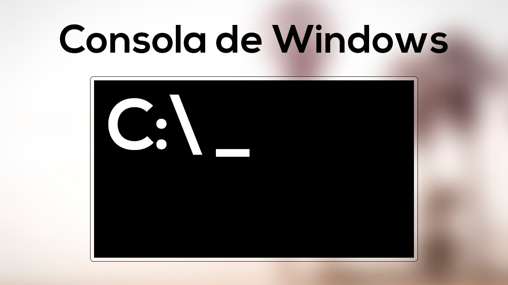

# CMD
***



Windows Terminal 

**CMD (abreviatura de CoMmanD)** es un programa (cmd.exe) de **Microsoft Windows** equivalente al programa
**command.com -intérprete de comantos- de MS-DOS (Microsoft Disk Operating System)**

Hay varias formas de abrir el terminal:

* Escribiendo en el buscador: CMD. 
	- Cuando aparece el menú, podemos elegir el Modo administrado o modo normal. 
	- Desde la carpeta en la que queremos abrir el terminal, selecionando el texto de la ruta y escribiendo **CMD** y pulsando enter. 
	- Abriendo la terminal en las versiones de Windows 10 en adelante. 

Dentro de la terminal, nos aparecerá un cursor, la ruta donde nos encontramos y un símbolo >. 

## Uso básico del S.O. Windows CMD.<a name="id1"></a>
***

* CMD no distingue entre minúsculas y mayúsculas. 
* Podemos cambiar el color de fondo con los siguentes comandos: 
    - color 1e -> (Donde 1 es el color azul y la e es blanco)
    - color 0f -> ** Volvemos al color original **
    - color 2e
    - color 3e.. 
	
    La primera letra hace referencia al color de fondo y la segunda al color de la letra. 
	
    [Más información](https://www.pantallazos.es/2018/07/windows-cmd-colores-texto-fondo-personalizados-color.html) 


* En cualquier terminal podemos usar las flechas de arriba y abajo para buscar la instrucción anterior.

### Comandos más utilizados
***

* **CLS** -> Es el comando que permite borrar todo lo que está visualizando la terminal. 
* **CTRL-C**  -> Cancelar comandos.
* **DATE y TIME** -> Permite modificar la hora de sistema.
  * Si no queremos mostrar nada solo la fecha usamos /T
* **HELP** -> Nos permite mostrar la ayuda con un comando.  
* **EXIT** -> Cerrar la pantalla del terminal.
* **VER** -> Muestra la versión de nuestro CMD. 
* **DIR** -> Permite ver el contenido del directorio que hemos abierto. 
* **MD ó MKDIR** -> Crea un directorio. Si quieremos incluir espacios tenemos que usar comillas. Sino creamos tantos directorios como palabras. 
* **CD** -> Permite cambiar entre directorios.
  * Si queremos cambiar de una ruta basta con poner el nombre de la ruta por ejemplo "c:"
* **COPY CON** -> Permite crear ficheros de texto plano. 
  * Una vez creado pulstamos Ctrl+z y pulsamos ENTER
    * Crear la siguiente ruta:
    
```cmd
copy con ejemplo.txt

Este es un ejemplo de fichero creado con copy con es una inmensa y ya para rematarlo escribo Hola Mundo.
```

* **TYPE** -> Nos permite mostrar el contenido de uno o varios archivos.
* **TREE** -> Muestra el arbol de directorios donde nos encontramos.  

* **COPY** -> Permite copiar ficheros a directorios: 
    * Si queremos pegarlo desde un directorio al actual ponemos la ruta y un .
    ```cmd
      MKDIR directorio
      COPY ejemplo.txt directorio
      COPY directorio\ejemplo.txt .
    ```
* **XCOPY** -> Permite copiar el contenido de un directrorio.
* **REN o Rename** -> Permite cambiar el nombre a ficheros o directorios.
* **DEL o ERASE** -> Permite eliminar ficheros o directorios.
    * La complejidad del comando viene por la sinxasis que debemos usar usamos el domando "Help del" para ver información. 
* **RD o RMDIR** -> Eliminar directorios **Vacíos** Para eliminar directorio no vacío poner la S al final. 
    ```cmd
    RD directorio2
    RD directorio2 /s
    ```

* **Caracteres comodín**:
  * Asteriosco *: Indica 0 o más caracteres indeterminados
  * ?: Indica un único carácter indeterminado.-

* **ECHO**: Permite mostrar un texto por pantalla. Es muy utilizado en CMD para mostrar información por pantalla.

### Caracteres principales.
***

* **Carácter >**: Desviar la salida, en lugar de mostrarse por pantalla. 
    ```cmd
    dir "G:\Mi unidad" > lists.txt
    o
    dir "C:\Program Files" > C:\lists.txt
    ```
* **Carácter >>**: Similar al anterior pero añade el contenido a un fichero existente. 
    ```cmd
    dir "G:\Mi unidad\Bootcams" >> lists.txt
    o
    dir "C:\Program Files\Users" >> C:\lists.txt
    ```
* **Carácter |**: Es el carácter de canalización. 
  * Toma la salida (normalmente STDOUT) de un comando y lo redirige como la entrada del siguiente  (por defecto STDIN)
  * El siguiente comando orena el resultado de mostar el directorio C:
    ```cmd
    dir c:\ | sort
    ```
  * Se puede combinar con otros comandos:
    ```cmd
    dir C:\ | find "txt" > AllText.txt
    dir c:\ /s /b | find "TXT" | more
    ```

### Argumentos en ficheros por lotes. 
***

Cuando se llama a un fichero por lotes (.bat, .cmd) las palabras que acompañan al fichero 
serán tomadas como argumentos de entrada. 

El orden en el que se interpretan los comandos es por orden así el % será el primer argumento
introducido tras el nombre, el %2 el segundo y así.

```cmd
echo Para crear un fichero nuevo escribimos 'Copy con nombre_fichero.bat'

@echo off
echo The first parameter is %1
echo The second parameter is %2
echo the third parameter is %3
```

CMD solo puede procesar hasta 9 parámetros de entrada.


## Batch Script

Batch Script se diseñó para automatizar secuencias de comandos que son de naturaleza repetitiva,
en forma de secuencia de comandos. 

Algunas de las características de Batch Script son:

* Puede leer las entradas de los usuarios para que pueda procesarse más.
* Tiene estructuras de control como for, if, while, switch para una mejor automatización y secuencias  de comandos.
* Admite funciones avanzadas como funciones y matrices.
* Soporta expresiones regulares.
* Puede incluir otros códigos de programación como Perl.

Alguno de los usos más comunes son: 

* Configuración de servidores para diferentes propósitos.
* Automatización de actividades de limpieza, como la eliminación de archivos no deseados o archivos  de registro.
* Automatización del despliegue de aplicaciones de un entorno a otro.
* Instalación de programas en varias máquinas a la vez.

Los archivos suelen tener extensión **.bat** o **.cmd**
* Cuando estás en un entorno virtual se pueden ejecutar haciendo doble-click sobre él. 
* Cuando estás en un terminal, se puede ejecutar simplemente escribiendo su nombre. 

### Creación de ficheros batch
***

* Los ficheros por batch o por lotes, siempre mostrarán las líneas que está ejecutando a menos que pongamos @echo off
  * Si observamos que empieza por @, eso quiere decir que sólo se aplicará el que no se muestre las funciones que van siendo ejecutadas. Pero no afecta a sí misma. 

    ````cmd
    @echo off
    rem Este script almacena todos los directorios que cuelgan de Program files  
    dir "G:\Mi unidad\Bootcams\Cloud\Part Time\00 Ramp-up\Módulo 3 - Sistemas Operativos Operaciones\CMD\ejemplos\" > "G:\Mi unidad\Bootcams\Cloud\Part Time\00 Ramp-up\Módulo 3 - Sistemas Operativos Operaciones\CMD\ejemplos\lists.txt"
    echo " El script ha terminado"
    ````

### Variables en ficheros batch
***

Hay dos tipos de variables que se pueden pasar en los archivos por lotes. 
* Los parámetros que se pueden pasar cuando se llama al archivo por lotes.
  * Los argumentos se definen en la llamada del script y se usan dentro del script %1 %2..
    * Podríamos lanzar una llamada así: **test.bat variable1 variable2 variable3**
* Variables definidas a través del comando **SET**. Sirve para asignar un nombre de variable a un valor. Para acceder hay que colocar la variable %
  * Ej:
````cmd
  @echo off
  :comment "Ejemplo para mostrar un valor de tipo string."
  SET valor=Esto es un ejemplo
  echo %valor%

  :comment "Ejemplo para mostrar un valor de tipo int reulizando la variable."
  SET /A valor=3
  echo %valor%

  :comment "Ejemplo suma de variables."
  SET /A a=5  
  SET /A b=10
  SET /A c = %a% + %b%
  echo %c%
  ````
  * Las variables set son marcadas globales. Si queremos que una variables solo sea local al script donde se define, debemos definirla dentro de **SETLOCAL ... ENDLOCAL**
  * También se puede crear variables de entorno **SET VAR_ENTORNO=valor**
  * También se puede pedir una variable como parámetro de entrada:
````cmd
set /p tabladel="Dime el valor que quieras de entrada. : "
````

### Comentarios en ficheros batch
***

* **Para añadir comentarios se realiza de la siguiente forma**
  * **REM** "Comentario"
  * **::** "Comentario"
  * Si se quiere mostrar después de un comando *comando & REM "Comentario"*

### Cadenas en ficheros batch
***

Los ficheros por lotes pueden crear, editar, eliminar cadenas, pero además tienen ciertas funciones de ayuda para manejo de cadenas. 

* Crear una cadena:

````cmd
  @echo off
  :: This program just displays Hello World  
  set message=Hello World
  echo %message%
````

* Crear un cadena vacía:

````cmd
@echo off  
SET a=
SET b=Hello
if [%a%]==[] echo “Cadena A vacia"  
if [%b%]==[] echo “Cadena B vacia"
````

* Crear una cadena como mezcla de otras cadenas, permite textos y números:
````cmd
@echo off  
SET a=Hello
SET b=World
SET /A d=50
SET c=%a% and %b% %d% 
echo %c%
````

* No hay nunguna función para calcular el número de caracteres de una cadena, se puede usar un script como este:
````cmd
@echo off
set str=Hello World
call :strLenstr strlen
echo String is %strlen% characters long
exit /b

:strLen
setlocalenabledelayedexpansion

:strLen_Loop
    if not "!%1:~%len%!"=="" set /A len+=1 & goto:strLen_Loop
(endlocal& set %2=%len%)
goto:eof
````

* Convertir un texto alfanumérico a número para a continuación realizar operaciones

````cmd
@echo off
set var=13145
set /A var=%var% + 5  
echo %var%
````

* Eliminar una parte de una cadena. En este ejemplo se elimina la palabra "un"

````cmd
@echo off
set str=Este es un ejemplo
echo %str%
set str=%str:un= %
echo %str%
````

* Existen otras funciones para extraer texto a la derecha, izquiereda o en medio:
````cmd
@echo off
set str=Helloworld
echo %str%
:: izquierda
set str_iz=%str:~0,5%
echo %str_iz%
:: derecha
set str_de=%str:~-4%
echo %str_de%
:: medio
set str_medio=%str:~5,10%
echo %str_medio%
````

* Eliminar espacios

````cmd
@echo off
set str=This string has a lot of spaces
echo %str%
set str=%str:=%
echo %str%
````

* Reemplazar subtextos de un texto más grande
````cmd
@echo off
set str=This message needs changed.
echo %str%
set str=%str:needs=has%
echo %str%
````

### Arrays
*** 
Los array son matrices no se definen específicamente como un tipo en BatchScript, pero se pueden implementar. Es necesario tener en cuenta lo siguiente cuando se implementan arrays en BatchScript.
* Cada elemento de la matriz debe definirse con el comando set
* Se requeriría el ciclo 'for' para iterar a través de los valores de la matriz

Se pueden crear matrices usando el siguiente comando:

* **set a[0]=1**: Donde el índice de la matriz 0 y 1 es el valor asignado al primer elemento de la matriz. 

* Acceder al valor de dicho array
````cmd
@echo off
set a[0]=1
echo %a[0]%
````

* Para modificar los valores de un array:
````cmd
@echo off
set a[0]=1
set a[1]=2
set a[2]=3
rem Añadir un elemento al final del array
set a[3]=4
echo El ultimo elemento del array es %a[3]%
````

### Listas
***

Otra forma de asignar varios valores a una variable son las listas.

* **set lista=1 2 3 4**

### Buble for
*** 
Los bubles nos permiten iterar en lista o arrays. Esto permite realizar operaciones repetitivas con un número muy pequeño de instrucciones. La sintaxis básica de un for es:

* for %variable in (grupo) do (comando) -> para un linea ejecutada únicamente
* for %% variable in (grupo) do (comando) -> si estamos en un script. 

Por ejemplo si quisiéramos mostar todos los elementos de la lista anteior:
````cmd
@echo off
set list=1 2 3 4
(for %%a in (%list%) do (
    echo %%a
))
````

Pero lo más importante tiene que ver con los ficheros. Grupos válidos serían:

* (*.doc) -> Recorrería todos loa archivos con extensión .doc
* (*.doc *.txt, *.me) -> Recorrería todos los archivos con extención .doc, .txt **y** .me
* (ene*.doc ene*.rptfeb*.doc feb*.rpt) ¿?
* (ar??1991.* ap??1991.*) ¿?

Ejemplo: 
````cmd
:: Para ejecutar dentro de un fichero .bat
for %%f in (c:\windows\*.*) do @echo %%f

:: Para ejecutar con la línea de comandos. 
for %f in (c:\windows\*.*) do @echo %f

:: Nos mostrará los archivos que estánd entro de la carpeta c:\windows 
:: (similar a un "dir" pero solo nos mostrará el nombre. 
````

El buble for permite una serie de parámetros que cambian su funcionamiento.

* /l permite iterar entre rangos
  * Los rangos van a tener esta sintaxis (inicio, paso, final)
````cmd
@echo off
setlocal enabledelayedexpansion
set topic[0]=comments
set topic[1]=variables
set topic[2]=Arrays
set topic[3]=Decision making
set topic[4]=Time and date
set topic[5]=Operators
for /l %%n in (0,1,5) do (
    echo !topic[%%n]!
)
````

* /d permite iterar por los directorios que índique el grupo
````cmd
for /d %s in (c:\windows\*.*) do @echo %s
````

* /r permite iterar de forma recursiva por todos los elementos del grupo
````cmd
for /r %s in (c:\windows\*.*) do @echo %s
````

#### Buble for -> Análisis de archivos. 

El análisis de archivos se compone de la lectura de la información de salida, la cadena o el contenido del archivo, su división en líneas individuales de texto y el análisis de cada línea en cero o más iteraciones.

La sintaxis puede ser la siguiente: 

* for /F ["palabrasClaveDeAnálisis"] {%% | %}variable in (grupoNombreArchivos) do comando [opcionesDeLíneaDeComandos]
* for /F ["palabrasClaveDeAnálisis"]{%% | %}variable in ("cadenaLiteral") do comando [opcionesDeLíneaDeComandos]
* for /F ["palabrasClaveDeAnálisis"] {%% | %}variable in ('comando') do comando [opcionesDeLíneaDeComandos]

Las palabras clave pueden ser:
* **eol=c**: Especifica un carácter de fin de línea (sólo un carácter).
* **skip=n**: Especifica el número de líneas que se omitirán al principio del archivo.
* **delims=xxx**: xxxEspecifica un grupo de delimitadores. Reemplaza el grupo de delimitadores predeterminado, formado por los caracteres espacio y tabulador.
* **token=x,y,m-n**: Especifica los testigos de cada línea que se pasarán al cuerpo de for en cada iteración. Como consecuencia, se asignarán nombres de variable adicionales. La forma m-n es un intervalo que especifica los testigos m hasta n. Si el último carácter de la cadena tokens= es un asterisco (*), se asigna una variable adicional que contendrá el texto que queda en la línea después del último testigo analizado.
* **usebackq**: Especifica que se pueden utilizar comillas para incluir los nombres de los archivos de grupoNombreArchivos, que una cadena incluida entre comillas se ejecutará como si fuera un comando y que una cadena escrita entre comillas simples es un comando de cadena literal.

Ejemplos:

* **for /f %i in (pr.abcpr1.txt) do (echo %i)**
  * Leerá todos los ficheros enumerados en la cláusula 'in' del directorio en curso y el contenido de ellos, línea por línea lo pasará dentro de la variable i al do de ejecución.
  * Con la partícula **in** no podemos usar caracteres comodín.
* **for/f "skip=1" %i in (pr.abc) do (echo %i)**
  * Ignorará la primera línea del archivo
* ````cmd
  for /f "tokens=1,3,5" %%a in (fichero.txt) do (
    echo %%a %%b %%c
    )
  ````
  * Muestra los tokens (palabras) primera, tercera y quinta de cada linea de  fichero.txt. En el For solo definimos %%a, y automáticamente se crean las  variables %%b y %%c
  
* ````cmd
  for /f "tokens=*" %%a in (fichero.txt) do (
    echo %%a
    )
  ````
  * Mostrará toda la línea completa (todos los tokens) 
  
* ````cmd
    for /f "delims=.,;:" %%a in (fichero.txt) do (
    echo %%a
    )
  ````
  * Los tokens se crean no dividiendo por espacios sino por el punto, la coma el punto y coma y los dos puntos.

### Operadores
***

Un operador es un símbolo que le dice al compilador que realice manipulaciones matemáticas o lógicas específicas. 
En los script por lotes, son posibles los siguientes tipos e operadores.

* Operadores aritméticos
* Operadores relacionales
* Operadores lógicos
* Operadores de Asignación
* Operadores bit a bit

#### Operadores aritméticos

````cmd
@echo off

set a=21
set b=32

:: SET /a nos servirá para realizar operaciones

:: los operadores aritméticos son iguales a los de cualquier otro leng. de programación

set /a suma=%a%+%b%
set /a resta=%a%-%b%
set /a producto=%a%*%b%
set /a division=%a%/%b%

:: Mostramos los resultados

echo Suma: %suma%
echo Resta: %resta%
echo Producto: %producto%
echo Division: %division%
````

#### Operadores relacionales

* EQU  equivale a  =
* NEQ  equivale a !=
* LSS   equivale a <
* LEQ  equivale a <=
* GTR  equivale a >
* GEQ  equivale a >=

````cmd
@echo off
SET /A a= 5
SET /A b= 10
if %a% EQU %b% echo A is equal to than B
if %a% NEQ %b% echo A is not equal to than B
if %a% LSS %b% echo A is less than B
if %a% LEQ %b% echo A is less than or equal B
if %a% GTR %b% echo A is greater than B
if %a% GEQ %b% echo A is greater than or equal to B
````

#### Operadores lógicos

````cmd
@echo off
SET /A a= 5
SET /A b= 10
IF %a% GEQ 10 (
    IF %b% LEQ 0 (
        ECHO %a% is NOT less than 10 OR %b% is NOT greater than 0
    ) ELSE (
        ECHO %a% is less than 10 OR %b% is greater than 0
    )
) ELSE (
    ECHO %a% is less than 10 OR %b% is greater than 0
)
````

#### Operaciones de asignación

* +=: Esto agrega el operando derecho al operando izquierdo y asigna el resultado al operando izquierdo. 
* -=: Esto resta el operando derecho al operando izquierdo y asigna el resultado al operando izquierdo.
* *=: Esto multiplica el operando derecho al operando izquierdo y asigna el resultado al operando izquierdo.
* /=: Esto divide el operando derecho al operando izquierdo y asigna el resultado al operando izquierdo.
* %=: Esto toma módulo usando dos operadores y asigna el resultado al operador izquierdo.

````cmd
@echo off
SET /A a= 5
SET /A a+=5
echo %a%
SET /A a-=5
echo %a%
SET /A a*=5
echo %a%
SET /A a/=5
echo %a%
SET /A a%=5
echo %a%
````

#### Operadores a nivel de bit.
* **&**: Este es el operador bit a bit "y"
* **|**: Este es el operador bit a bit "o"
* **^**: Este es el operador bit a bit "xor"

````cmd
@echo off
SET /A "Result = 48 & 23"
echo %Result%
SET /A "Result = 16 | 16"
echo %Result%
SET /A "Result = 31 ^ 15"
echo %Result%
````

### Estructuras de decisión
***

Las estructuras de toma de decisiones requieren que el programador especifique una o más condiciones para que el programa las evalúe o pruebe, junto con una declaración o declaraciones que se ejecutarán si se determina que la condición es verdadera y, opcionalmente, otras declaraciones que se ejecutarán si la condición es verdadera. se determina que la condición es falsa.

Batch permite tres tipos de condiciones: 

* Condicional IF
* Condicional IF / ELSE
* Condicional IF anidado

#### Condional IF

Uno de los usos comunes de la declaración 'if' en BatchScript es para verificar las variables que se establecen en el Script. La evaluación de la instrucción 'if' se puede realizar tanto para cadenas como para números.

* Ejemplo de condicional para cadenas: 
````cmd
@echo off
SET /A a= 5
SET /A b= 10
SET /A c= %a% + %b%
if %c%==15 echo "The value of variable c is 15"
if %c%==10 echo "The value of variable c is 10"
````

* Ejemplo de condicional para comprobar argumentos de línea de comandos: 

````cmd
@echo off
echo %1
echo %2
echo %3
if %1%==1 echo "The value is 1"
if %2%==2 echo "The value is 2"
if %3%==3 echo "The value is 3"
````

#### Condional IF / ELSE
También es utilizado para controlar el valor de variables, pero siempre que las dos posibilidades requieran lanzar líneas de código

* Ejemplo de cadenas para números

````cmd
@echo off
SET /A a= 5
SET /A b = 10
SET /A c = %a% + %b%
if %c%==15 (echo "The value of variable c is 15") else (echo "Unknown value")
if %c%==10 (echo "The value of variable c is 10") else (echo "Unknown value")
````

* Ejemplo de condicional para cadenas:

````cmd
@echo off
SET str1= String1
SET str2= String2
if %str1%==String1 (echo "The value of variable String1") else (echo "Unknown value")
if %str2%==String3 (echo "The value of variable c is String3") else (echo "Unknown value")
````

* Ejemplo de condicional para argumentos:

````cmd
@echo off
echo %1
echo %2
echo %3
if %1%==1 (echo "The value is 1") else (echo "Unknown value")
if %2%==2 (echo "The value is 2") else (echo "Unknown value")
if %3%==3 (echo "The value is 3") else (echo "Unknown value")
````

#### Condicional IF anidado

Cuando las posibilidades son más de dos, es necesario anidar instrucciones IF, la forma es similar a estos ejemplos:

````cmd
@echo off
SET /A a= 5
SET /A b = 10
if %a%==5 (
  if %b%==10 (
    echo "The value of the variables are correct“
   )
)
````

De todos modos, algunas de las estructuras anidadas se pueden escribir con operadores AND.

* Hay un caso especial para errores. Si se cumple saca un mensaje:
````cmd
if errorlevel0 echo "The value of the variables are correct" 
````


### Funciones
***

Una **función** es un conjunto de declaraciones organizadas juntas para realizar una tarea específica. 
En los scripts por lotes, se adopta un enfoque similar para agrupar declaraciones lógicas para formar una función.

Como cualquier otro lenguaje las funciones en Batch Script siguien el mismo procedimiento:

* **Declaración de función**: Información al compilador sobre el nombre de la función, el tipo de devolución y los parámetros
* **Definición de función**: proporcional el cuerpo real de la función.

Sintaxis de una función simple es la siguiente:

    : nombre de la función
    Instrucciones_que_hacen_algo
    EXIT /B 0

Un ejemplo sería:

````cmd
:Display
SET /A index=2
echo The value of index is %index%
EXIT /B 0
````

Para **llamar** a una función: 

    call: nombre de la función

En el caso anterior, para ejecutar el código de la función Display

    call:Display

Podemos incluir una call y la función en el mismo script:

````cmd
@echo off
SETLOCAL
CALL :Display
EXIT /B %ERRORLEVEL%
:Display
SET /A index=2
echo The value of index is %index%
EXIT /B 0
````

Las funciones pueden llegar **parámetros** a la vez que se llama a la función.
Los parámetros serán entendidos según el orden en el que se instroduzca en la llamada. 

    call:nombre_funcion parametro1, parametro2, …. parametroN

En la función se podrá acceder a ellos como %~1, %~2

````cmd
@echo off
SETLOCAL
CALL :Display 5, 10
EXIT /B %ERRORLEVEL%
:Display
echo The value of parameter 1 is %~1
echo The value of parameter 2 is %~2
EXIT /B 0
````

* Utilizar SETLOCAL … ENDLOCAL en una función puede prevenir conflictos de nombres y cambios de valor indeseados dentro de un script. En este ejemplo, al ser local, no afecta la salida al resultado que imprime.

````cmd
@echo off
set str = Outer
echo %str%
CALL :SetValuestr
echo %str%
EXIT /B %ERRORLEVEL%
:SetValue
SETLOCAL
set str = Inner
set "%~1 = %str%"
ENDLOCAL
EXIT /B 0
````

* Podemos realizar funciones recursivas:

`````cmd
@echo off
set "fst= 0"
set "fib= 1"
set "limit= 1000000000"
call:myFibofib,%fst%,%limit%
echo.Thenext Fibonacci number greater or equal %limit% is %fib%.
echo.&pause&goto:eof
:myFibo--calculate recursively the next Fibonacci number greater or equal to a limit
SETLOCAL
set /a "Number1= %~1"
set /a "Number2= %~2"
set /a "Limit= %~3"
set /a "NumberN=Number1 + Number2"
if /i %NumberN% LSS %Limit% call:myFiboNumberN,%Number1%,%Limit%
(ENDLOCAL
    IF "%~1" NEQ "" SET "%~1 = %NumberN%"
)goto:eof
`````

### Procesos
***

Podemos obtener la lista de procesos que se están ejecutando gracias al comando TASKLIST. 

    tasklist > tareas.txt -> Saca la lista de procesos en el fichero tareas.txt

    tasklist /fi "memusage gt 40000" -> Muestra aquellos procesos con memoria superior a 40MB

También podemos matar procesos con el comando TASKKILL. Lo habitual es conocer primero cual es el piddel proceso a eliminar utilizando TASKLIST y después eliminarlo. Pero también se puede realizar a partir de otras formas.

    taskkill/f /imnotepad.exe -> Elimina la tarea de abrir el bloc de notas si está abierto
    taskill/pid9214 -> Elimina un proceso cuyo pides 9214


### Red 
***

Desde Batch Scripting podemos trabajar con la configuraciónd e red. El comando net se puede usar para actualizar, corregir o ver la configuración de la red.

* **NET ACCOUNTS**: Permite ver la contraseña actual y las restricciones de inicio de sesión para un ordenador.

* **NET CONFIG**: Muestra la configuración actual de su servidor y grupo de trabajo., 

* **NET COMPUTER**: Agrega o elimina una computadores conectada al controlador de dominio de windows.

* **NET USER**: Muestra los detalles de un usuario en particular. Puede también añadir cuenta de usuario borrar y modificar una cuenta de usuario. 
