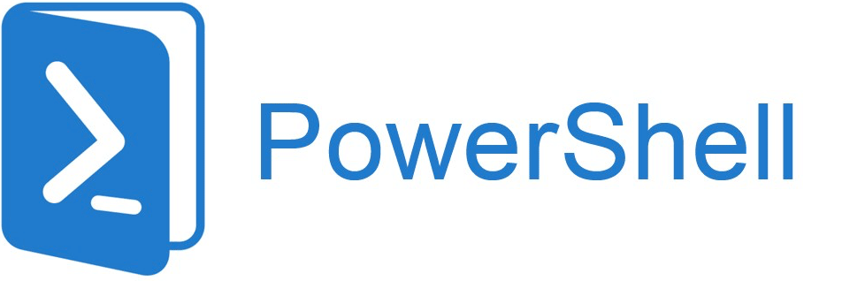

# Power Shell
***




**PowerShell** es un programa de **administración de configuración** y **automatización de tareas** de Microsoft, que consiste en un shell de línea de comandos y el lenguaje de secuencias de comandos asociado.

Inicialmente, solo era un componente de Windows, conocido como Windows PowerShell. También se le conoce como PowerShell 5. Se basa en .NET Framework y sólo se puede ejecutar en máquinas Windows.

En agosto de 2016 se hizo de código abierto y multiplataforma con la introducción de PowerShell Core (también llamado PowerShell 7). Se basa en .NET Core, es más reducido que el anterior, pero se puede instalar, además de en Windows, en Linux y en iOS

El por qué Microsoft lanzó PowerShell teniendo ya CMD, es obvia: **Con CMD no se puede automatizar todas las facetas de la GUI de Windows** debido a los equivalentes limitados y un lenguaje de secuencias de comandos también muy limitado.

Características:

* En PS, las tareas administrativas generalmente se realizan a través de cmdlets 
* Estos son Clases .NET, por lo que tienen atributos como cualquier clase.
* Pueden ser desarrollados por Terceros
* Acceden a datos como el Sistema de Archivos, el Registro de Windows, etc. para realizar su tarea.
* Los scripts pueden usar cmdlets que a su vez pueden empaquetarse en módulos
* La compatibilidad de PowerShell con .NET Remoting, WS-Management, CIM y SSH permite a los administradores realizar tareas administrativas en sistemas Windows locales y remotos.
* Se puede integrar en aplicaciones gracias a una API que presenta.

Incluye su propia ayuda extensa basada en la consola (similar a las páginas **man** en shells de **Unix**)

Windows PowerShell puede ejecutar cuatro tipos de comandos con nombre:

* **cmdlets** ( programas .NET Framework diseñados para interactuar con PowerShell)
* **Scripts de PowerShell** (archivos con el sufijo .ps1)
* **Funciones de PowerShell** 
* **Programas ejecutables independientes**. Por ejemplo el Bloc de notas (NotePad), etc.

Cuando un programa ejecutable independiente, tiene un PID independiente. 
Cuando es un cmdlet, tiene el PID del proceso de PowerShell. 

### Acceso a Power Shell

* Desde el buscador de aplicaciones. 
* Desde Terminal seleccionando PowerShell posteriormente. 
* También se puede acceder desde un IDE de JebBrains o desde Visual Studio Code. 

## Uso Básico del S.O. Windows con PowerShell
***

### Variables y Arrays

* Desde PowerShell para identificar que una palabra es una variable se acompaña siempre el símbolo $.
```powershell
$variable = 1
$lugar = Get-Location
```

* Pero también se pueden definir variables Array, es decir que contienen varios valores:
```powershell
$Lista = 1,2,3,4
$Lista = 1..4
$Lista =@(1..4)
```

* Si queremos saber el tipo de la variable:
```powershell 
$variable.getType()
$Lista.getType()
```

* La forma de acceder al valor de algún elemento del array es a través de corchetes, sabiendo que el primer elemento es el 0 y el último es el n-1
```powershell 
$Lista[0]
$Lista[2]
```

* Podemos reasignar un valor a un elemento del array de este modo:
```powershell 
$Lista[1]=10
```

* Otros métodos aplicables al objeto lista son:
```powershell
$Lista.Length
```

* La forma de recorrer los elementos de una matriz puede ser esta:
```powershell
foreach($item in $lista){
    Write-Output $item
}
```

### Hash Tables

Una tabla hash es una estructura de datos, en gran medida como una matriz, excepto que cada valor  (objeto) se almacena mediante una clave. Se trata de un almacén básicos de clave-valor. Se usan llaves  para definir las tablas hash.

* Tabla hash varía

```powershell
$ageList = @{}

# Ejemplo
$key = 'Kevin'
$value = 36
$ageList.add( $key, $value )
$ageList.add( 'Alex', 9 )
```
  
* Para acceder a los valores
```powershell
$ageList['Kevin']
$ageList['Alex’]
```

* Creación con valores 
```powershell
$ageList = @{  
  Kevin = 36
  Alex = 9
}
```

* Selección múltiple
```powershell
# Ejemplo 
$environments = @{
  Prod='SrvProd05' 
  QA='SrvQA02'
  Dev='SrvDev12'
}

$environments[@('QA','DEV')]
$environments[('QA','DEV')]
$environments['QA','DEV’]

# Saber cuantos elementos tiene una tabla hash. Por ejemplo, si se llama ageList.
$ageList.count

# Para obtener sólo los valores
$ageList.values

# Para obtener sólo las claves
$ageList.keys
```

* Iterar una tabla hash:
```powershell
# En este ejemplo vemos que 
$ageList.keys | ForEach-Object{
    $message = '{0} is {1} years old!' -f $_, $ageList[$_]  
    Write-Output $message
}

foreach($key in $ageList.keys){
    $message = '{0} is {1} years old' -f $key, $ageList[$key]  
    Write-Output $message
}
```

* Para poder modificar los valores de una tabla hash cuando se recorre, hay que clonar las claves. 
```powershell
$environments.Keys.Clone() | ForEach-Object {
    $environments[$_] = 'SrvDev03’
}
```

* Se puede acceder a los valores de una tabla hash de esta otra forma:
```powershell
$person = @{}

$person.city = 'Austin'
$person.state = 'TX’

# Para borrar una clave
$person.remove('city’)

# Aunque si queremos borrar la tabla entera
$person.clear()
```

* A veces es más útil utilizar hash tables que escribir la instrucción con los parámetros
```powershell
$DHCPScope= @{
  Name= 'TestNetwork'
  StartRange= '10.0.0.2'
  EndRange= '10.0.0.254'
  SubnetMask= '255.255.255.0'
  Description= 'Network fortestlabA'
  LeaseDuration= (New-TimeSpan -Days 8)
  Type= "Both"
}
Add-DhcpServerv4Scope @DHCPScope
```

### Condicionales

[Documentacion Oficial](https://learn.microsoft.com/es-es/powershell/scripting/learn/deep-dives/everything-about-if?view=powershell-5.1)

* La sintaxis es la siguiente.
```powershell
$condition = $true
if ( $condition ) {
    Write-Output "The condition was true"
}
```

* Con If vamosa poder utilizar operadores como-eq, no funciona==:
```powershell
$value = Get-MysteryValue
if ( 5 -eq $value ) {
    # do something
}
```

* No es igual:
```powershell
if ( 5 -ne $value ) {
    # do something  
}
```

* -gt-ge-lt-le para mayor que o menor que
```powershell
if ( $value -gt 5 ) {
    # do something
}
```

* Operadores lógicos
```powershell
# -and 
if ( ($age -gt13) -and ($age -lt55) ) {
  # do something
}

# -or
if($age -le 13 -or $age -ge55) {
  # do something
}

# Comprobación del null
if ( $null -eq $value ) {
  # do something  
}

```

* También se puede usar un condicional para asignar un valor a una variable:
```powershell
$discount = if ( $age -ge 55 ) {
    Get-SeniorDiscount
}elseif ( $age -le 13 ){
    Get-ChildDiscount
}else{
    0.00
}
```

* Ejemplo para comprobar si existe una ruta determinada:
```powershell
if ( Test-Path -Path $Path -PathTypeLeaf ) {
    Move-Item -Path $Path -Destination $archivePath
} else {
    Write-Warning "$path doesn't exist or isn't a file."
}
```

* También se pueden hacer condicionales anidadas. 
```powershell
# Hay qye definir el $Path, especificando la ruta de un fichero
# Hay que definir $archivePath para definir la salida. 
if ( Test-Path -Path $Path -PathType Leaf ) {
    Move-Item -Path $Path -Destination $archivePath
} else {
    Write-Warning "$path doesn't exist or isn't a file."
}
```

* Se puede seperar por líneas cuando aparezcan -and y -or
```powershell
if ($null -ne $user -and
  $user.Department-eq 'Finance' -and
  $user.Title-match 'Senior' -and
  $user.HomeDrive-notlike'\\server\*'
) {
    # Do Something
}
```

* Condicional que crea un directorio si no existe:
```powershell
if ( -not (Test-Path -Path $folder) ) {
    New-Item -Type Directory -Path $folder
}
```

### Switch

````powershell
$itemType= 'Role'
switch ( $itemType) {
    'Component' {'is a component' }
    'Role' {'is a role' }
    'Location'{'is a location' }
}
````

### Caracteres like o comodín

* Se puede usar coincidencia de patrones basada en comodines, que se puede usar con el operador -like.
````powershell
$value = 'S-ATX-SQL01'
if ( $value -like 'S-*-SQL??')
{
    # do something
}
````

* Expresiones regulares
```powershell
$value = 'S-ATX-SQL01'
if ( $value -match 'SQL')
{
    # do something
}
```

* Se puede comprobar el tipo de valor con el operador -is
```powershell
if ( $value -is [string] )
{
    # do something
}
```

### Contains

* El operador -contains busca su valor en una lista
```powershell
$array = 1..6
if ( $array -contains 3 )
{
    # do something
}
```

* Con eloperador-in es igual, perose pone antes elvalor a comparar.
```powershell
$array = 1..6
if ( 3 -in $array )
{
    # do something
}
```

## Bucles en PowerShell
***

### ForEach-Object

* Es un cmdlet para iterar los elementos de una canalización

````powershell
30000, 56798, 12432 | ForEach-Object -Process {$_/1024}
````

* Cuando usemos listas o variables, etc

```powershell
$ComputerName= 'DC01', 'WEB01'
foreach($Computer in $ComputerName) {
    echo $Computer 
}
```

### For

* Un bucle for itera si una condición especificada es true:

```powershell
for($i = 1; $i -lt 5; $i++) {
    Write-Output "Sleeping for $i seconds"
    Start-Sleep -Seconds $i
}
```

### Do Until

Un bucle que al menos hará una vez las instrucciones hasta que se cumpla la condición final
```powershell
$number = Get-Random -Minimum 1 -Maximum 10
do {
    $guess = Read-Host  “Adivina a el número?"
    $guess = [int]$guess
    if ($guess -lt $number) {
        Write-Output 'Muy bajo!'
    }
    elseif ($guess -gt $number) {
        Write-Output 'Muy alto!'
    }
}
until ($guess -eq $number)
```

### Do While

Un bucle que al menos hará una vez las instrucciones, mientras se cumpla la condición final

```powershell
do {
  $guess = Read-Host -Prompt “Adivinaelnúmero?"
  if ($guess -lt $number) {
    Write-Output ‘Muybajo!'
  } elseif ($guess -gt $number) {
    Write-Output ‘Muyalto!'
  }
}
while ($guess -ne $number)
```

### While
Evalúa la condición en la parte superior del bucle antes de que se ejecute el código. Por lo tanto, puede que no se ejecute nunca:

```powershell
$date = Get-Date -Date 'November 22'
while ($date.DayOfWeek -ne 'Thursday') {
    $date = $date.AddDays(1)
}
Write-Output $date
```

### Break
Permite salir de un buble For couando se quiera:
```powershell
for ($i= 1; $i -lt 5; $i++) {
  Write-Output "Sleeping for $i seconds"
  Start-Sleep -Seconds $i
  break
}
```

### Continue
````powershell
$i = 0
while ($i -lt 5) {
  $i+= 1
  if ($i-eq 3) {
    continue
  }
  Write-Output $i
}
````

## Funciones en Powershell
***

Una función de PowerShell se declara con la palabra clave **function**, seguida del **nombre** de dicha función y, a continuación, **una llave de apertura y otra de cierre**. El código que ejecutará la función se encuentra dentro de esas llaves.

```powershell
function Get-Version {
    $PSVersionTable.PSVersion
}
```

Para invocarla:
* **Get-Version**

Se pueden usar parámetros para insoducir valores a una función:

```powershell
function Test-MrParameter{
  param (
    $ComputerName
  )
  Write-Output $ComputerName
}
```

Para invocarla:
* **Test-MrParameter Nombre_computadora**

Otro ejemplo:

```powershell
function Get-MrParameterCount{
  param (
    [string[]]$ParameterName
  )
  foreach ($Parameter in $ParameterName) {
    $Results = Get-Command -ParameterName$Parameter -ErrorActionSilentlyContinue
    [pscustomobject]@{
      ParameterName= $Parameter
      NumberOfCmdlets= $Results.Count
    }
  }
}
```
Para invocarla
- **Get-MrParameterCount Parametro1, prm2**

## cmdlets
***

Un **cmdleto** "**Commandlet**" es un comando liviano que se usa en el entorno de Windows PowerShell

El tiempo de ejecución de Windows PowerShell invoca estos cmdlets en el símbolo del sistema.

Puede crearlos e invocarlos mediante programación a través de las API de Windows PowerShell.

Son muy diferentes de los comandos de CMD, ya que:
* Los cmdlets son objetos de .NET y los command suelen ser ejecutables que se encuentran en el System32 
* El proceso de cmdlets funciona en objetos, no en secuencias de texto, y los objetos se pueden pasar como salida para la canalización. 
* Los cmdlets se basan en registros, ya que procesan un solo objeto a la vez.

Intentar aprenderse todos los **cmdlets** de PowerShell junto con sus propiedades, parámetros, etc. Es una tarea titánica.

En PowerShell 5.1 hay 1586 cmdlets distintos. En PowerShell 7.0: 1507

Por ello, PowerShell incluye herramientas muy importantes para facilitar la búsqueda de ese comando que no sabemos cómo se llama.

* **Get-Help** o **help** directamente
* También le ayudan otros como:
  * Get-Command
  * Get-History
  * Get-Member

Todos los parámetros de los cmdlets, llevan un guión delante:

```powershell
PS> Get-Service -DisplayName Microsoft*

# Lanzamos el comando Get-Sertvice y nos devolverá dos opciones de parámetros

# [[-Name] <string[]>]
# [-ComputerName <string[]>]

# En el primer caso no es neceario especificar el Name, en el segundo si hay que escribir -ComputerName
```

* Para ver los datos de la vesrión en power shell usamos $PSVersionTable

#### Se añade un fichero con las operaciones mas básicas. Ir al readme del módulo. 

* Imprimir un texto al estilo ECHO

```powershell
Write-Host("Esto es un ejemplo de echo en PowerShell")
```

* Se puede encadenar cmdlets a través del caracter |
  * Una de las grandes capacidades que tiene PowerShell es la de encadenar cmdlets. 
  * Podemos escribir varios cmdlets encadenador o unirlos unos con otros:

```powershell
get-service | sort 
# o  
get-service | 
sort
```

La mejor manera de saber cuales son los Cmdlets que hay y poder encontrarlos es usar el Get-Help

* Para ello el mejor paso es hacer un update-help

Podemos buscar ejemplos de un cmdlets que nos interese:

````powershell
help get-service -examples
````

* Otra forma es usar Get-command que nos permite mostrar Alias, Funciones y cmdlest. 

Podemos hacer ciertas operaciones como:

```powershell
Get-command -name *IP* -module nettcpip # Configuraciones de UP

Get-command -commandtype alias | measure-object # Hacer medidas
```

* Podemos filtrar a través de where-object

```powershell
Get-service | where-object status -eq "stopped"
```

```
Get-service| where-object status -eq "stopped“ |
select-object Name, MachineName, Status |
Sort-object -Property MachineName
```

### Documentación

Muchas veces, al llevar a cabo tareas, hacemos pruebas para conseguir la combinación de cmdletsy funciones que necesitamos

Para ello tenemos una herramienta que se llama Get-history, que nos permite conocer qué comandos (incluso sus salidas) hemos ejecutado durante un determinado momento. Con sus resultados, podremos saber qué ha ido bien o mal, incluso nos puede servir de base para elaborar un script que automatice todo posteriormente.

El resultado de un Get-historyno tiene por qué ir a pantalla, podemos desviarlo a un fichero:

````powershell
get-history | out-file historial.txt
````

Y abrirlo directamente desde Powershell:
````powershell
notepad historial.txt
````

Hay una ID al lado de cada comando, y podemos volver a lanzar el comando, por ejemplo:
```powershell
Invoke-History -Id 123 # Buscar un ID y actualizarlo. 
```

A continuación vamos a ver una serie de pasos para hacer una transcripción, no de toda la sesión sino de una parte. 
```powershell
# 1. Creamos una carpeta llamada Transcripciones:
md transcripciones

# 2. Ahora podemos limpiar todas las transcripciones anteriores:
Clear-History

# 3. Comenzamos la transcripción:
Start-transcript transcripciones\transcrip.txt -append

# 4. Escribimos las instrucciones que sean necesarias

# 5. Terminamos la transcripción
Stop-transcript

# Y ya tendremos en el fichero transcrip.txt lo que buscábamos
```

### Algunos de los cmdlest más usados:

* **Get-content**
  * Es el equivalente a **cat** o **type**
```powershell
get-content historial.txt | measure-object -character -line -word
```

* **Compare-object**
  * Compara dos objetos (ficheros, variables, etc..)
```
# Cambiar algo de los ficheros para la prueba. 
Compare-Object -ReferenceObject $(Get-Content historial.txt) -DifferenceObject $(Get-Content historial2.txt)
Compare-Object -ReferenceObject $(Get-Content historial.txt) -DifferenceObject $(Get-Content historial2.txt) -IncludeEqual
```

* **Format-List**
  * Formatea la salida como una lista de propiedades
```powershell
$A = Get-ChildItem *.txt
Format-List -InputObject $A
Get-Service | Format-List
```

* **Format-Wide**
  * Formatea la salida como una tabla
```powershell
Format-Wide -InputObject $A
```

* **Where-object**
  * Filtra objetos a partir de los valores de alguna propiedad
```powershell
Get-Process | Where-Object ProcessName -Match "^p.*"
```

* **For Each-Object**
  * Permite ampliar una o más instrucciones a una lista de elementos:
```powershell
1000,2000,3000 | ForEach-Object -Process {$_/1000}
# El resultadosera: 1, 2 y 3
```

* **Start-Slepp**
  * Detiene por un tiempo especificado la ejecución de un script o sesión.
```powershell
Start-Sleep -s 15
# Como valores: s -> segundos
#               m -> milisegundos
```

* **Read-Host**
  * Sirve para pedir entrada de usuario por teclado:
```powershell
$choice = Read-Host “Elija una opción"
```

* **Write-Host**
  * Imprime en la pantalla algún texto o variable. Permite formateo de propiedades de lo que se imprime: Color, color de fondo, etc
```
Write-Host (2,4,6,8,10,12) -Separator ", -> " -ForegroundColorDarkGreen-BackgroundColorWhite
```

* **Write-Warning**
  * Escribe el mensaje con el indicativo WARNING
* **Clear-Host**
  * Borra la pantalla. Como el cls

### Alias

Los cmdlets a veces son invocados a través de alias. Esto facolita el aprendizaje, hace las instrucciones más rápidas. Hay que tener cuidado porque no siempre coinciden con los de CMD.

Algunos intesantes:

* %-> ForEach-Object
* ?-> Where-Object
* cat-> Get-Content
* cd,chdir-> Set-Location
* cls-> Clear-Host
* clv-> Clear-Variable
* del-> Remove-Item
* diff-> Compare-Object
* dir-> Get-ChildItem
* echo-> Write-Output
* epcsv-> Export-Csv
* fl-> Format-List
* ft-> Format-Table
* fw-> Format-Wide
* gci-> Get-ChildItem
* gcm-> Get-Command
* gm-> Get-Member
* gps, ps-> Get-Process
* pwd-> Get-Location
* r -> Invoke-History
* rm,ri,rmdir-> Remove-Item
* rjb-> Remove-Job
* ren-> Rename-Item
* sajb-> Start-Job
* sal-> Set-Alias
* saps-> Start-Process
* sasv-> Start-Service

## Tratamientos de cadenas PowerShell

Hay muchas maneras de usar variables en cadenas. Vamos a conocer las operaciones más importantes:

### Concatenación

```powershell
$name = 'Kevin Marquette’
$message = 'Hello, ' + $name
```

Se puede concatenar de una manera más sencilla, con sustitución:

```powershell
$message= "Hello, $first$last.“
```

Una cadena entre comillas dobles permite la sustitución, pero una cadena entre comillas simples no la permite. Hay ocasiones en las que desea una u otra, por lo que tiene una opción.

* Sustitución de comandos
```powershell
$directory = Get-Item 'c:\windows'
$message = "Time: $($directory.CreationTime)"
```

* Ejecución de comandos
```powershell
$message= "Date: $(Get-Date)"
```

* Formatear una cadena de valores
```powershell
'Hello, {0} {1}.' -f $first, $last
```

* Dar formato con matrices. Primero creamos una matriz:
````powershell
$values = @(
  "Kevin"
  "Marquette"
)
'Hello, {0} {1}.' -f $values
````

* Unión de cadenas con join
```powershell
$servers = @(
  'server1'
  'server2'
  'server3'
)
$servers -join','
```

* Unión de cadenas con Concat
```powershell
[string]::Concat('server1','server2','server3')
[string]::Concat($servers)
```

* Crear una ruta de archivo de forma sencilla:

```powershell
$folder = 'Temp'
Join-Path -Path 'c:\windows' -ChildPath $folder
```

* **StringBuilder**
  * Sirve muy bien para crear cadenas de gran tamaño a partir de muchas cadenas más pequeñas. La razón es que solo recopila todas las cadenas que le agrega y solo concatena todas al final cuando recupera el valor.

```powershell
$stringBuilder= New-Object -TypeName "System.Text.StringBuilder"
[void]$stringBuilder.Append("Numbers: ")
foreach($number in 1..10000){
    [void]$stringBuilder.Append(" $number")
}
$message= $stringBuilder.ToString()
```

* Reemplazar tokens
  * Podemos tener una forma sencilla:
```powershell
$letter= Get-Content -Path historial.txt -RAW
$letter= $letter-replace' #FULL_NAME#', 'Kevin Marquette’
```

* Pero también podemos usar una forma más sofisticada con una hash table:
```powershell
$tokenList= @{
  Full_Name= 'Kevin Marquette'
  Location= 'Orange County'
  State= 'CA'
}
$letter= Get-Content -Path historial.txt -RAW
foreach( $token in $tokenList.GetEnumerator() )
{
  $pattern= '#{0}#' -f $token.key
  $letter= $letter-replace$pattern, $token.Value
}
```

## Ejercicios - Hands On 

[Comandos más usados](https://docs.google.com/document/d/1NrQLNKoPtxWExyVrJT_hi3Z9iuAYnh-o-W-bw_nwKXA/edit?usp=share_link)

## Administración de Windows con PowerShell

### Apagar, reiniciar el equipo

* Stop-Computer
* Restart-Computer
* Restart-Computer-Force

### Recopilar información sobre el equipo

* Información sobre la BIOS
```powershell
Get-CimInstance -ClassName Win32_BIOS
```
* Información del procesador
```powershell
Get-CimInstance -ClassName Win32_Processor | Select-Object -ExcludeProperty"CIM*"
```
* Información sobre actualizaciones instaladas
```powershell
Get-CimInstance -ClassName Win32_QuickFixEngineering
```
* Información sobre el sistema operativo
```powershell
Get-CimInstance -ClassName Win32_OperatingSystem
```

### Recopilación sobre el equipo

* Sobre el propietario y el usuario actuales
````powershell
Get-CimInstance -ClassName Win32_OperatingSystem | Select-Object -Property NumberOfLicensedUsers,NumberOfUsers,RegisteredUser
````
* Espacio disponible en disco
````powershell
Get-CimInstance -ClassName Win32_LogicalDisk -Filter "DriveType=3"
````
* Si hay varias unidades, podemos sumarlas
````powershell
Get-CimInstance -ClassName Win32_LogicalDisk -Filter "DriveType=3" | Measure-Object -Property FreeSpace,Size -Sum | Select-Object -Property Property,Sum
````
* Información sobre el inicio de sesión
````powershell
Get-CimInstance -ClassName Win32_LogonSession
````
* Hora local del sistema
````powershell
Get-CimInstance -ClassName Win32_LocalTime
````
* Estado de los servicios
````powershell
Get-CimInstance -ClassName Win32_Service | Format-Table -Property Status,Name,DisplayName -AutoSize -Wrap
````

### Recopilar información sobre Procesos 

* Obtener el proceso por id:
```powershell
Get-Process -id 0
```
* Obtener proceso por nombre:
````powershell
Get-Process -Name exp*,power*
````

### Detener procesos

* Detener procesos por nombre
````powershell
Stop-Process-NameIdle
````
* Con confirmación
```powershell
Stop-Process -Name t*,e* -Confirm
```
* Detener procesos que no responden. 
```powershell
Get-Process | Where-Object -FilterScript{$_.Responding -eq $false} | Stop-Process
```

### Detener y Reanudar Servicio
* Parar un servicio
````powershell
Stop-Service-Namespooler
````
* Parar un servicio
````powershell
Start-Service -Name spooler
````
* Parar un servicio
````powershell
Suspend-Service -Name spooler
````
* Parar un servicio
````powershell
Restart-Service -Name spooler
````

### Trabajar con el sistema de archivos
* Mostrar el directorio: 
```powershell
Get-ChildItem-PathC:\-Force
```
* De forma recursiva:
```
Get-ChildItem-Path C:\-Force -Recurse
```
* Busca todos los ejecutables en la carpeta Archivos de programa que se modificaron por última vez después del 1 de octubre de 2005, cuyo tamaño no es inferior a 1 megabyte ni superior a 10 megabytes:
```
Get-ChildItem-Path $env:ProgramFiles-Recurse -Include *.exe | Where-Object -FilterScript{($_.LastWriteTime-gt'2005-10-01') -and ($_.Length -ge1mb) -and ($_.Length -le 10mb)}
```

* Copiar archivos
````powershell
Copy-Item -Path C:\boot.ini -Destination C:\boot.bak
````
* Copiar carpetas de forma recursiva
````powershell
Copy-Item C:\temp\test1 -Recurse C:\temp\DeleteMe
````
* Crear carpeta
````powershell
New-Item -Path 'C:\temp\New Folder' -ItemType Directory
New-Item -Path 'C:\temp\New Folder\file.txt' -ItemType File
````
* Quitar todos los ficheros de una carpeta con confirmación
````powershell
Remove-Item -Path C:\temp\DeleteMe
````
* Quitar todos los ficheros de una carpeta sin confirmación
````powershell
Remove-Item -Path C:\temp\DeleteMe -Recurse
````

### Trabajar con el sistema de archivo
* Asignar una carpeta como una unidad de disco virtual
````powershell
New-PSDrive-Name P -Root $env:ProgramFiles-PSProviderFileSystem
````

### Trabajar con el registro
* Mostrar entradas del registro
````powershell
Get-Item -Path Registry::HKEY_LOCAL_MACHINE\SOFTWARE\Microsoft\Windows\CurrentVersion | Select-Object -ExpandPropertyProperty
````
* Obtener una entrada del registro
````powershell
Get-Item -Path Registry::HKEY_LOCAL_MACHINE\SOFTWARE\Microsoft\Windows\CurrentVersion | Select-Object -ExpandPropertyProperty
````
* Crear una entrada de registro
````powershell
New-ItemProperty-Path HKLM:\SOFTWARE\Microsoft\Windows\CurrentVersion -Name PowerShellPath-PropertyTypeString -Value $PSHome
````
* Eliminar entradas por registro:
```powershell
Remove-ItemProperty-PathHKLM:\SOFTWARE\Microsoft\Windows\CurrentVersion-NamePSHome
Remove-ItemProperty-PathHKCU:\SOFTWARE\Microsoft\Windows\CurrentVersion-NamePowerShellPath
```