# SSH
***


## Introducción a SSH

**SSH o SecureShell**, es un protocolo de administración remota que le **permite a los usuarios controlar y modificar sus servidores remotos a través de Internet a través de un mecanismo de autenticación.**

- Proporciona un mecanismo para autenticar un usuario remoto
- Transferir entradas desde el cliente al host y retransmitir la salida de vuelta al cliente.

El servicio se creó como un reemplazo seguro para el Telnet sin cifrar y utiliza técnicas criptográficas para garantizar que todas las comunicaciones hacia y desde el servidor remoto sucedan de manera encriptada.

Para usuarios de Linux o Mac, vamos a poder hacer SSH a través del terminal. Los usuarios de Windows tras activarlo a través de PowerShell utilizarán algún cliente como Putty o MobaXterm.

La ventaja significativa ofrecida por el protocolo SSH sobre sus predecesores es el uso del cifrado para asegurar la transferencia segura de información entre el host y el cliente.

- Host se refiere al servidor remoto al que estás intentando acceder
- Cliente es el equipo que estás utilizando para acceder al host.

Hay tres tecnologías de cifrado diferentes involucradas en SSH:

- Cifrado simétrico
- Cifrado asimétrico
- Hashing

### Cifrado simétrico

Es una forma de cifrado en la que se utiliza una clave secreta tanto para el cifrado como para el descifrado de un mensaje, tanto por el cliente como por el host.
El caso más típico de este cifrado, es ese sistema de notitas en clase que estaban codificadas por alguna condición (letras por números, añadir sílabas, o avanzar letras en el alfabeto (Cifrado César))
- La principal desventaja es que cualquiera que tenga la clave puede descifrar el mensaje que se transfiere

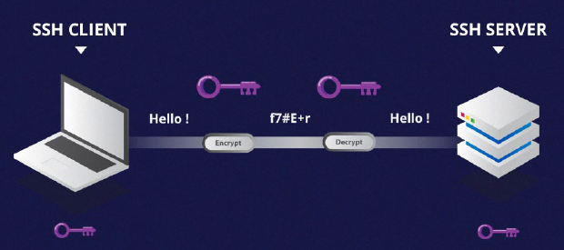

### Cifrado asimétrico

Utiliza dos claves separadas para el cifrado y el descifrado.
Estas dos claves se conocen como la clave pública (publickey) y la clave privada (privatekey). Juntas, estas claves forman el par de claves pública-privada (public-privatekeypair).

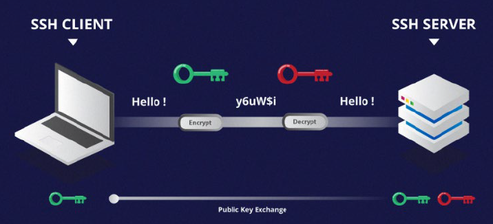

La clave pública, como sugiere el nombre, se distribuye abiertamente y se comparte con todas las partes.

La clave privada no se puede calcular matemáticamente desde la clave pública.

**Un mensaje cifrado por la clave pública de una máquina, sólo puede ser descifrado por la misma clave privada de la máquina.** Esta relación unidireccional significa que la clave pública no puede descifrar sus propios mensajes ni descifrar nada cifrado por la clave privada.

La clave privada debe permanecer privada, es decir, para que la conexión sea asegura, ningún tercero debe conocerla. Y aún más, es obligatorio no perderla.

Un ejemplo de cifrado asimétrico se da en la Administración y en los accesos a los Walletsde Criptomonedas.

### Hashing

El hashingunidireccional es otra forma de criptografía utilizada en SecureShell Connections.

Las funciones de hash unidireccionales difieren de las dos formas anteriores de encriptación en el sentido de que nunca están destinadas a ser descifradas.

Es fácil generar un hash criptográfico de una entrada dada, pero imposible de generar la entrada del hash.

- Esto significa que si un cliente tiene la entrada correcta, pueden generar el hash criptográfico y comparar su valor para verificar si poseen la entrada correcta.

SSH utiliza hashes para verificar la autenticidad de los mensajes.

- Esto se hace usando HMACs, o códigos de autenticación de mensajes basados en hash.
- Esto asegura que el comando recibido no se altere de ninguna manera.

El hashinges una técnica muy barata de comprobación. Se utiliza en la comprobación de integridad de los bloques Blockchain. También en la verificación de contraseñas de todo tipo. Incluso es la forma que tiene Youtubepara comprobar que el contenido es original y no de otro canal. Y todo de forma inmediata.

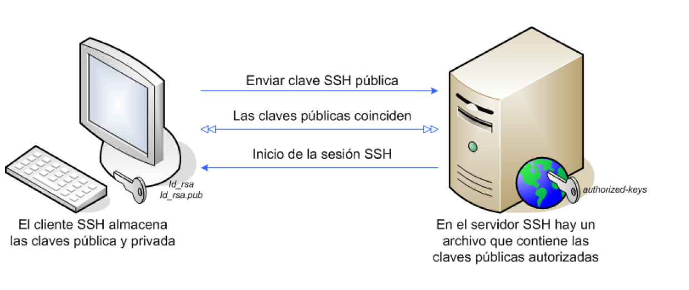


### Cómo funciona SSH con estas tres tecnologías.

Esto se puede dividir en dos procesos:

1. Negociación del cifrado de la sesión:
   - Cuando un cliente intenta conectarse al servidor a través de TCP, el servidor presenta los protocolos de cifrado y las versiones respectivas que soporta.
   - Si el cliente tiene un par similar de protocolo y versión, se alcanza un acuerdo y se inicia la conexión con el protocolo aceptado.
   - El servidor también utiliza una clave pública asimétrica que el cliente puede utilizar para verificar la autenticidad del host.
   - A partir de este momento se utiliza el **Algoritmo de Intercambio de Claves Diffie-Hellman** para crear una clave simétrica.

   **Algoritmo de Intercambio de Claves Diffie-Hellman**
      1. Tanto el cliente como el servidor coinciden en un número primo muy grande, que por supuesto no tiene ningún factor en común. Este valor de número primo también se conoce como el valor semilla (seedvalue).
      2. Luego, las dos partes acuerdan un mecanismo de cifrado común para generar otro conjunto de valores manipulando los valores semilla de una manera algorítmica específica. Estos mecanismos, también conocidos como generadores de cifrado, realizan grandes operaciones sobre la semilla. Un ejemplo de dicho generador es AES (AdvancedEncryptionStandard).
      3. Ambas partes generan independientemente otro número primo. Esto se utiliza como una clave privada secreta para la interacción.
      4. Esta clave privada recién generada, con el número compartido y el algoritmo de cifrado (por ejemplo, AES), se utiliza para calcular una clave pública que se distribuye a la otra computadora.
      5. A continuación, las partes utilizan su clave privada personal, la clave pública compartida de la otra máquina y el número primo original para crear una clave compartida final. Esta clave se calcula de forma independiente por ambos equipos, pero creará la misma clave de cifrado en ambos lados.
      6. Ahora que ambas partes tienen una clave compartida, pueden cifrar simétricamente toda la sesión SSH. La misma clave se puede utilizar para cifrar y descifrar mensajes

2. **Autenticación de usuario**
   - Por contraseña:
     - Se le pide al usuario que introduzca el nombre de usuario, seguido de la contraseña.
     - Estas credenciales pasan con seguridad a través del túnel cifrado simétricamente, así que no hay ninguna posibilidad de que sean capturadas por un tercero.
     - A pesar de la encriptación, no es de todo seguro porque pueden sufrir ataques de fuerza bruta o incluso ingeniería social.
   - Por Clave Pública-Privada
     - Utilizando el modelo ya citado para asegurar que cada uno es quien es.

Resumiendo, en SSH se usa:

- Cifrado simétrico, se utiliza para cifrar toda la comunicación durante una sesión SSH. Este algoritmo puede ser particularmente seguro por el hecho de que la clave nunca se transmite entre el cliente y el host.
- Cifrado asimétrico, se utiliza durante el algoritmo de intercambio de claves de cifrado simétrico. El servidor utiliza la clave pública de los clientes para generar y desafiar y transmitirla al cliente para su autenticación. Si el cliente puede descifrar correctamente el mensaje, significa que contiene la clave privada necesaria para la conexión. Y entonces comienza la sesión SSH.
- Hashing, se utiliza para verificar la autenticidad de los mensajes. Esto se hace usando HMACs, o códigos de autenticación de mensajes basados en hash. Esto asegura que el comando recibido no se altere de ninguna manera.

## SSH sobre sistemas Linux

### Hands On

Conexión entre dos máquinas vistuales. 

Para que dos máquinas se conecten, es imprescindible que se haya **creado una red y las dos máquinas deben tener una IP dentro de esa red.**

Si fueran máquinas reales, bastaría configurar una red tal y como se hizo en la parte de redes.

Pero como este lablo realizaremos a partir de Virtual Box, vamos a necesitar cierto contenido sobre redes en Virtual Box.


### Redes en Virtual Box

Virtual Box nos permite añadir hasta un total de cuatro adaptadores de red diferentes a una misma máquina virtual.

Además, nos permitirá habilitar o deshabilitar estos adaptadores de red de forma fácil y rápida, por si queremos dejar sin conexión de red a la máquina virtual que estemos ejecutando.

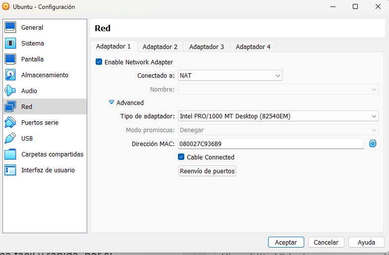

#### Redes NAT. 

Es el predeterminado en todas las máquinas virtuales de Vbox.

La MV obtiene una dirección IP privada de subred definida por el propio Vbox.

La MV sale a Internet utilizando la dirección IP privada del equipo anfitrión. Siempre y cuando el equipo anfitrión tenga acceso a Internet.

También la MV se podrá conectar a cualquier equipo de la red local doméstica. Sin embargo, ningún equipo de la red local podrá conectarse con la red local a menos que la sección Avanzadas, pulsemos en el botón Reenvío de puertos

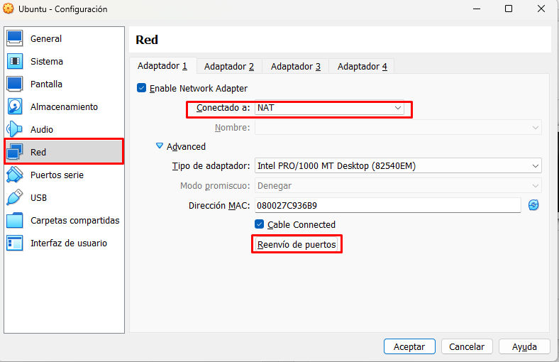

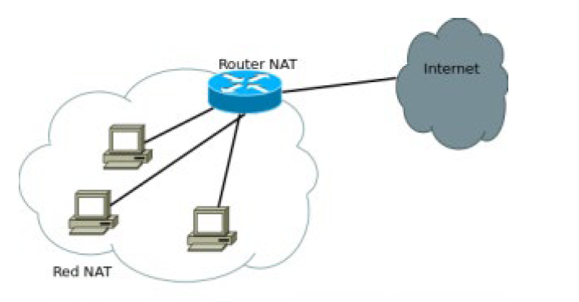

#### Adaptador Punte

En este modo de configuración la máquina virtual pasa a ser un equipo más dentro de la red local doméstica o profesional.

Es decir, se crea un Switch virtual de forma que tanto la tarjeta virtual (NIC) de la MV y la tarjeta física del anfitrión se conectan a el de forma que tanto las MV como el anfitrión están en la misma red. Tendrá su correspondiente dirección MAC, u obtendrá un direccionamiento IP desde el servidor DHCP que tengamos en la red local, y no desde el servidor DHCP del VirtualBox.

En este modo de funcionamiento, la máquina virtual tendrá comunicación con el resto de equipos de la red local y con Internet, además, el resto de equipos también se podrán comunicar con la máquina virtual sin problemas, sin reenvío de puertos.

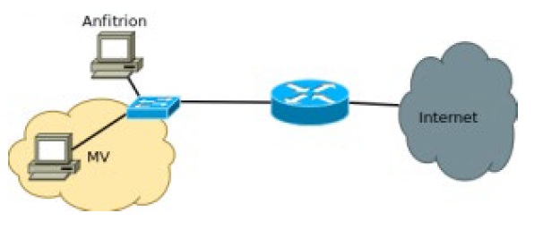

#### Red Interna

Nos permite crear una red en la que solo son visibles las MVirtuales que están en esa red. Cuando definimos una tarjeta como red interna nos pedirá el nombre de esta red, que seleccionaremos en el desplegable y que por defecto es «intnet».

Si queremos que esta red interna tenga salida a internet alguno de las MV deberán tener una de las NIC configurada como NAT o como adaptador puente y así servirá de router.

Se suele combinar con un adaptador NAT o un Puente.

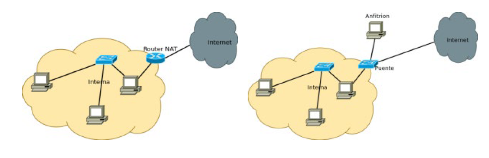

#### Solo anfitrión

El adaptador de red solamente tiene conectividad con el equipo anfitrión.

Tampoco tiene acceso a Internet.

Esta máquina virtual está totalmente aislada de las demás máquinas de la red local donde está conectado el anfitrión, de esta forma, podemos proteger la red local

#### Red NAT

En este modo de configuración tenemos una especie de «Red interna + NAT».

En «RED NAT» tendremos todas las máquinas virtuales en una misma subred NAT y se podrán comunicar entre sí, porque todas ellas tienen el mismo direccionamiento y VirtualBox permite esta comunicación, además, también se podrán comunicar con los equipos de la red local doméstica e incluso salir a Internet.

#### Cloud Network

Este modo de configuración ahora mismo está en fase experimental, el objetivo es poder conectar la VM directamente al Cloud de Oracle para posteriormente añadir más VM y que haya comunicación entre ellas.

#### No conectado

En este modo de configuración la máquina virtual tendrá una tarjeta de red instalada, pero no estará conectada en el VirtualBox, por lo que no tendrá acceso a ninguna red, ya sea red local, Internet ni tampoco tendrá comunicación vía red con el ordenador real.

Perfecto para aislar la máquina virtual del resto.

### Creación de una MV con el adaptador punte o NAT+Red Interna

Ahora crearemos bien una MV con una red por Adaptador puente o bien NAT+RedInterna

1. Seleccionamos una máquina virtual, y cambiamos la configuración de Red a la siguiente:

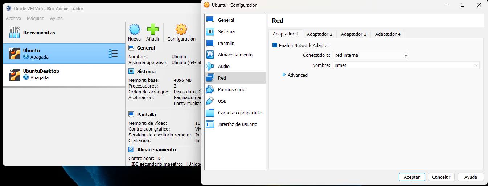

Después creamos un clon de esta máquina con esta configuración:

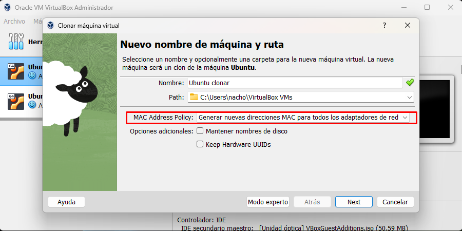

En la siguiente ventana pulsamos **Clonación Completa** y pulsamos el botón **Clonar**.

Deben tener distintas IPs, por lo que haremos lo siguiente en las dos máquinas:

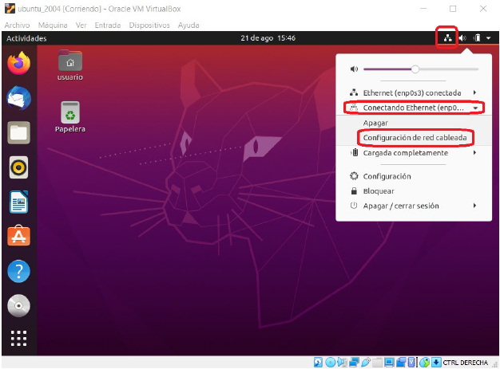

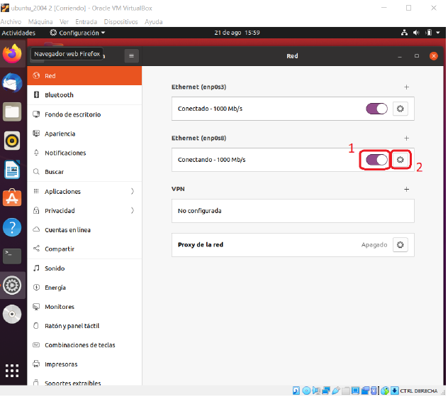

Colocamos una Ip local, consu máscara de subred y su puerta de enlace. Las IPs serán las siguientes para el nodo 1 y para el nodo 2. 

- Nodo 1:
  - Dirección: 192.168.0.101
  - Máscara de red: 255.255.255.0
  - Puerta de enlace: 192.168.0.100

- Nodo 2:
  - Dirección: 192.168.0.102
  - Máscara de red: 255.255.255.0
  - Puerta de enlace: 192.168.0.100

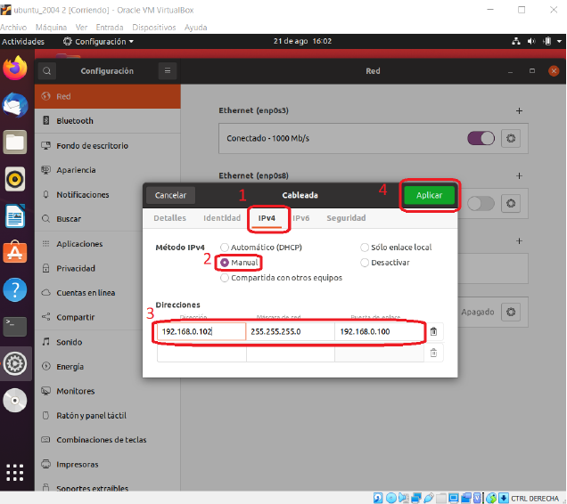

Ahora que tenemos creados los adaptadores y las respectivas IPs de las máquinas vamos a cambiar el nombre del host para ello haremos lo siguiente:

````bash
sudo nano /etc/hostname

# Quitamos el hostname que encontramos y ponemos node1 

sudo nano /etc/hosts

# Quitamos el hostname que encontramos y ponemos node1 
````

Ahora, para no tener que escribir continuamente la Ip, podemos añadir al fichero /etc/hosts lo siguiente:

- 192.168.0.101 nodo1
- 192.168.0.102 nodo2

Para ello:

````bash
sudo nano /etc/hosts
````

Y añadimos lo anterior y guardamos el fichero. También en los dos ficheros. 

Esto renombra el nombre de node1 de la máquina virtual node2 a node2.

Una vez que tengamos estos cambios ejecutamos el siguiente comando
````bash
systemctl restart systemd-hostnamed
````

También podríamos cambiar la red de una forma más sencilla. 

```bash
nmcli general hostname nodo1
systemctl restart systemd-hostnamed
```

Estos cambios nos permitirán poder realizar la llamada a la dirección ip poniendo node1 o node2 en lugar de la ip.   

Vamos a instalar primero **net-tools**, veremos que nos hace falta si queremos hacer un **ifconfig**:

````bash
sudo apt install net-tools
````

Con este elemento podremos lanzar **ifconfig** para ver configuraciones de red de la máquina:

````bash
ifconfig
````

Tamnbién necesitaremos en el servidor (nodo1): 

````bash
sudo apt install openssh-server
````

y en los clientes:

````bash
sudo apt install openssh-client
````

Una vez que tengamos esto, deberemos crear las claves privadas y públicas en ambas máquinas.

Para ello utilizaremos una aplicación que se llama **ssh-keygen**

```bash
ssh-keygen
```

Y tras esto:

````bash
cd .ssh
cp id_rsa.pub authorized_keys
````

También haremos lo mismo en la otra máquina. 

Esto nos creará un fichero en cada máquina que contenga la copia de clave pública de su respectiva máquina. 

Ahora solo tenemos que intercambiar estos ficheros. Para ello abrimos el authorized_keys

Para ello podemos hacerlo de dos maneras:

- Copiamos el contenido del fichero y usamos el portapapeles para intercambiar las claves entre los ficheros. Previamente tenemos que tener activo el portatapeles bidireccional. 
- Usamos scp para copiar los ficheros de un sitio a otro. 
````bash
# Desde node1
scp authorized_keys node1@192.168.0.102:/home/node1/

# Desde node2
scp authorized_keys node1@192.168.0.102:/home/node1/

# Nos pedirá la contraseña de ambas máquinas. 
````

Como véis lo hemos movido a $HOME y no a .ssh, como ya existen ficheros con ese nombre. 
Borramos los ficheros de authorized_keys de la carpeta .ssh y movemos los nuevos a la carpeta .ssh

Si ahora, desde la maquina nodo2 quisiéramos conectarnos con la Ipde la máquina nodo1:

````bash
ssh 192.168.0.101
````
Estableceremos la conexión. 

## Tmux: Cómo usar SSH para multiplexar instrucciones

Tmuxes una aplicación que se basa en sesiones. Es decir, una vez que ejecutas la herramienta se abre una nueva sesión.

- En cada sesión puede haber varios terminales, ya que Tmuxes un multiplexor de terminales.

Entonces, para comenzar a usar esta herramienta necesitarás abrir una nueva sesión. Esto se hace con el comando:

````bash
tmux new
````
Aparece un terminal exactamente igual, salvo que tiene una unabarra verde en la parte inferior. Esta barra te indica la sesión activa y te confirma que estás usando Tmux.

> Si no tenemos instalado tmux ejecuatamos lo siguiente en ubuntu: **sudo apt-get install tmux**

También es posible darle un nombre a la sesión. Para hacerlo puedes escribir el siguiente comando al abrir una sesión nueva:

- **tmuxnew -s [nombre_de_sesion]**

La utilidad más importante de Tmuxes que permite diferentes instancias de terminales en una sola ventana. En otras palabras, varios terminales en una misma sesión. Además, podrás acceder a ellos rápida y fácilmente desde el teclado.

Para salir, escribimos **exit**

El principal comando para trabajar con tmuxes **Ctrl+B**:

**A partir de ahí, pulsaremos una tercera tecla que realizará una acción determinada.**

- Por ejemplo, si queremos abrir una nueva sesión **Ctrl+B** y luego la tecla C
- Si queremos renombrar una sesión **Ctrl+B** y luego la tecla $


Cuando tenemos más de una ventana en la sesión, el asterisco nos indica en qué ventana estamos. Si queremos renombrar esas ventanas, Ctrl+By luego la tecla ,

- **Para ir de una ventana a otra, Ctrl+B+ P (de previous) o Ctrl+B+ N (de Next)**
- **También podemos hacer Ctrl+Bmás el número de ventana 0,1,2...etc**

#### Paneles

Es tal vez por lo que más se conoce Tmux. 

Con el comando **Ctrl+B** más la tecla **%** se irá dividiendo el terminal en tantas partes como veces hagamos el comando

Si la división la queremos horizontal se realiza con **Ctrl+B** y la tecla “

Para eliminar un panel Ctrl+B + X, y nos pedirá confirmación

Para navegar entre paneles podemos usar Ctrl-B más la tecla de la flecha del panel al que nos interese ir

- Ctrl+B+ -> Irá al panel que tengamos a la derecha
- Ctrl+B+ <-Irá al panel que tengamos a la izquierda

Si queremos que sólo se vea nuestro Panel en grande: Ctrl+B + Z y si queremos volver a los paneles, volvemos a pulsar las mismas teclas Ctrl+B + Z

Las flechas arriba, abajo, izquierda y derecha también sirven para redimensionar los paneles, pero eso sí, ahora es imprescindible que Ctrl+B se mantenga pulsado

También podemos usar Ctrl+B+Q para ver el número del panel y si pulsamos el número inmediatamente, se nos marcha a ese panel.

## SSH sobre sistemas Windows

En Windows, existen otras formas para conectarnos viaSSH a máquinas remotas.

Vamos a utilizar ciertos programas, algunos muy viejos como Puttyy otros no tanto como MobaXterm. Ambos hacen lo mismo, permiten conectar viaSSH a terminales remotos.

A continuación os dejo una serie de enlaces para saber como acceder y descargar putty en windows:

- [Putty en Windows](https://apuntes.de/aws/putty-en-windows/#gsc.tab=0)

Otra herramienta como hemos comentado es MobaXtrem, mucho más completa y nos permite hacer sftp de ficheros. 

- [Guía de uso MobaXtrem](https://www.redeszone.net/analisis/software/mobaxterm-terminal-windows/)


