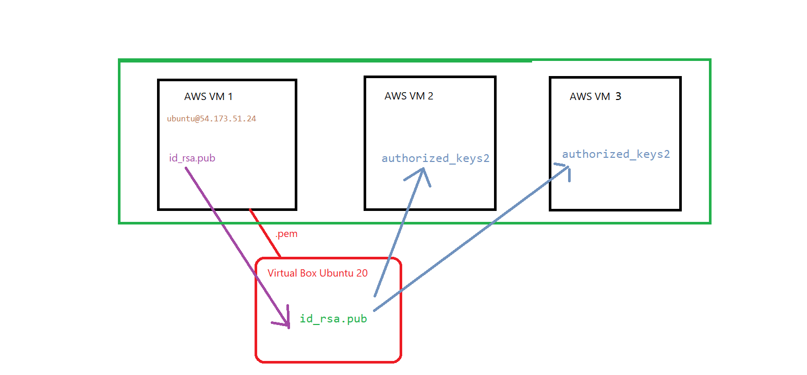

# Ejercicios AWS

## Ejercicio 01

> Importante: Destruir todo, todo, todo, todo tras estos ejercicios.

Instanciar dos máquinas EC2 on-demand. Y utilizando el documento word: Ansible en dos máquinas de AWS.docx, crear una máquina de control y 
un nodo administrado entre ellas. Basta con hacer lanzar un comando ad-hoc que haga ping.

## Ejercicio 02

> Importante: Destruir todo, todo, todo, todo tras estos ejercicios.

Hacer lo mismo, pero esta vez, la máquina de control será una MV ubuntu local, y las administradas serán las dos instancias EC2. También
basta con hacer ping.

> Pista

## Ejercicio 03 

> Importante: Destruir todo, todo, todo, todo tras estos ejercicios.

Ahora queremos que con un playbook que ya vimos que lanzaba apache2, hagáis que en la ip pública de una de esas dos instancias lance la
pantalla de inicio de Apache en un navegador.

## Ejercicio 04

> Importante: Destruir todo, todo, todo, todo tras estos ejercicios.

(Para nota). La idea de este ejercicio es reproducir lo que hemos visto en el fichero node.zip pero a través de ansible y para un solo nodo. 
Escribir una tarea que copie el fichero .zip a una ubicación que es de donde lanzará todo npm.

## Ejercicio 05

> Importante: Destruir todo, todo, todo, todo tras estos ejercicios.

Crear con Beanstalk aplicaciones en Python, en Java y en .NET.
Podéis editar las opciones avanzadas y cambiar por ejemplo la AMI, etc.

