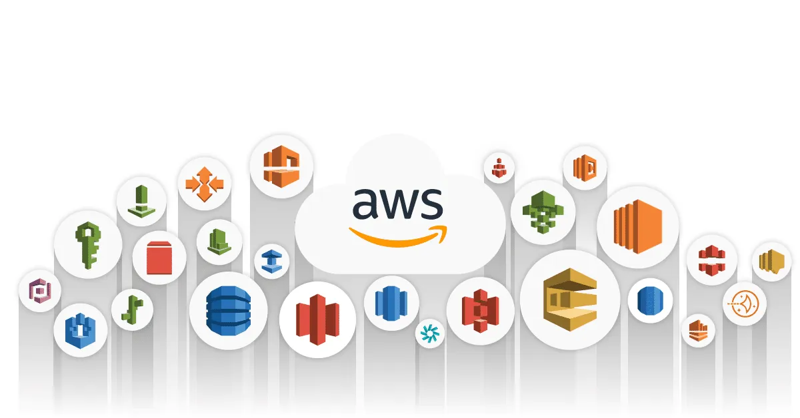

# Amazon Web Services (AWS)

---

## Índice de contenidos

- [Conceptos generales aplicados a la cloud - AWS](#conceptos-generales-aplicados-a-la-cloud---aws)
- [Seguridad y cumplimiento](#seguridad-y-cumplimiento)
- [Cómputo](#computo)
- [Almacenamiento y Bases de datos](#almacenamiento-y-bases-de-datos)
- [Gestión de Redes](#escenarios-de-red)
- [IAM](#iam-seguridad-y-conformidad)
- [Management & Governance](#management__governance)
- [App Integration Service](#app-integration-service)
- [Developer tools](#developer-tools)
- [Facturacion y precios](#facturacin-y-precios)

## Servicios Core

---

>Comparador de servicios con otras clouds [pulse aquí](https://comparecloud.in/)

Cheat sheet de los servicios de AWS consultar [aquí](Resumen%20Core%20Services.pdf)

App Flask en EC2 pincha [aquí](https://medium.com/techfront/step-by-step-visual-guide-on-deploying-a-flask-application-on-aws-ec2-8e3e8b82c4f7)

Como funciona Flask pinche [aquí](https://www.youtube.com/watch?v=Z1RJmh_OqeA)

Subir un fichero a S3 y que lo cargue un [lamda](https://www.youtube.com/watch?v=OJrxbr9ebDE&t=409s)

## Conceptos generales aplicados a la cloud - AWS

---

Consulte la documentación del módulo [aquí](https://docs.google.com/presentation/d/1eG4RP_FpRczMc466GeVDlIlm9SbwjmG0q6dF7cjps3I)

- Capas gratuitas de [AWS](https://aws.amazon.com/es/free/?all-free-tier.sort-by=item.additionalFields.SortRank&all-free-tier.sort-order=asc&awsf.Free%20Tier%20Types=tier%23always-free&awsf.Free%20Tier%20Categories=*all)

Podéis consultar una lista de los 25 mejores servicios de AWS [aquí](https://docs.google.com/document/d/1wm6LOpLxi_PATKMMWzFgisQUuQ1NXeJT/edit?usp=share_link&ouid=102384283797243178688&rtpof=true&sd=true)

Podéis consultar un manual de aws cli [aquí](01_Conceptos_generales/AWS_manual_cli_v2.pdf)

Cheat sheet AWS con los comandos más usados de CLI [pinche aquí](https://devhints.io/awscli)

**Quiz** distintos escenarios ir [aquí](01_Conceptos_generales/AWS_Insfraestructura_escenarios_preguntas.md)

## Seguridad y cumplimiento

---

Consulte la documentación del módulo [aquí](https://docs.google.com/presentation/d/1C0PvEdOeU1fdftUQeshySGvkGD5_o-TN1LXmp9xDcqs/edit?usp=share_link)

## Computo

---

Consulte la documentación del módulo [aquí](https://docs.google.com/presentation/d/1EDGnu0jKeSAkgEdt46GA-Gk_VNJo3mXn98Pc_wnNLRg/edit?usp=share_link)

**Quiz** distintos escenarios ir [aquí](03_Computo/AWS_Compute_services_escenarios_preguntas.md)

Ahora toca la práctica ¿Eres capaz de resolver los ejercicios? [Ver ejercicios](03_Computo/Ejercicios.md)

## Almacenamiento y Bases de Datos

--- 

Consulte la documentación del módulo [aquí](https://docs.google.com/presentation/d/1n-BCU2Td1WqhFF-Gr19iQJRmJ55y0J4tUZZ-lhQ6Kqg/edit?usp=share_link)

**Quiz** distintos escenarios ir [aquí](04_Almacenamiento_y_bases_de_datos/AWS_escenarios_almacenamiento_preguntas.md)

Podéis consultar ejemplos de LCU (Elastic Load Balancing) [aquí](04_Almacenamiento_y_bases_de_datos/Ejemplos_LCU_Load_Balancer.md)

## Escenarios de red

--- 

Consulte la documentación del módulo [aquí](https://docs.google.com/presentation/d/1A0w_DoRSBPPG8Yp72F1EQlA9DWIuHExTB_FRrOPQ7Jo/edit?usp=share_link)

**Quiz** distintos escenarios ir [aquí](05_Gestion_de_redes/AWS_Escenarios_red_preguntas.md)

## IAM, Seguridad y Conformidad

---

Consulte la documentación del módulo [aquí](https://docs.google.com/presentation/d/10JUu8AG41VF4cvO0xiol33nsQCV0AMK_1AHjXimatqk/edit?usp=share_link)

**Quiz** distintos escenarios ir [aquí](06_IAM/AWS_IAM_Seguridad_Conformidad_preguntas.md)

## Management_&_Governance

---

Consulte la documentación del módulo [aquí](https://docs.google.com/presentation/d/1iQ74RUPkKZIRdeNIsbf1tG-Xy2bIvPXKilM9xj2-T1o/edit?usp=share_link)

**Quiz** distintos escenarios ir [aquí](07_Management_&_Governance/AWS_Management_governance_preguntas.md)

## App Integration Service

---

Consulte la documentación del módulo [aquí](https://docs.google.com/presentation/d/1rPhuptvR7FECcZ1LXRxS5esf-QHtIX9Shg77-5rxXEE/edit?usp=share_link)

**Quiz** distintos escenarios ir [aquí](08_App_Integration_Service)

## Developer Tools

---

Consulte la documentación del módulo [aquí](https://docs.google.com/presentation/d/1hEO7938gOifWvaJycBAf-GAVMTlT1-vwXwNpsLJVaKA/edit?usp=share_link)

## Facturación y Precios

---

Consulte la documentación del módulo [aquí](https://docs.google.com/presentation/d/1bKVF9krGEdiNy-WdJYYoO-FSEWF217oAFgh-b-oVx18/edit?usp=share_link)

