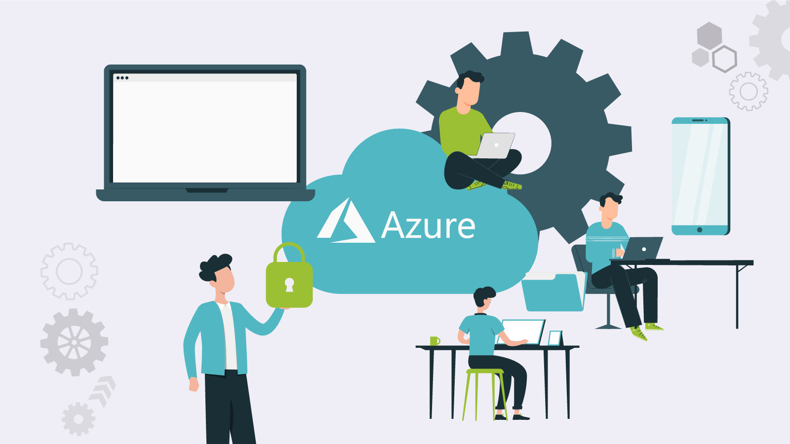

# Azure

---

## Índice de contenidos

- [Conceptos generales aplicados a la cloud - Azure](#conceptos-generales-aplicados-a-la-cloud---azure)
- [IAM, Seguridad y Conformidad](#iam-seguridad-y-conformidad)
- [Computo](#computo)
- [Almacenamiento](#almacenamiento)
- [Gestión de redes](#gestion-de-redes)
- [Ingesta, procesamiento y análisis de información](#ingesta-procesamiento-y-analisis-de-informacion)
- [Facturación de precios](#facturacion-y-precios)

## Servicios Core

---

> Comparador de servicios con otras clouds [pulse aquí](https://comparecloud.in/)

Cheat sheet de los servicios de Azure consultar [aquí](https://tutorialsdojo.com/microsoft-azure-cheat-sheets/)

## Conceptos generales aplicados a la cloud - Azure

---

Consulte la documentación del módulo [aquí](https://docs.google.com/presentation/d/1Ayrfky_dcmq6tyMFQLRcLiSJmm5iVZTmqXnLffo19Xc/edit?usp=share_link)

Consulte [aquí](https://docs.google.com/document/d/1HZBAXLlAC45OD_cOCPQu13nlAo_GntQL/edit?usp=share_link&ouid=102384283797243178688&rtpof=true&sd=true) los 10 mejores servicios de Microsoft Azure 

## IAM, Seguridad y Conformidad

---

Consulte la documentación del módulo [aquí](https://docs.google.com/presentation/d/1jmQD_2SFvXq6Mc4p8uuV5O8wlWMZMpmEvnpCgWzHK9U/edit?usp=share_link)

## Computo

---

Consulte la documentación del módulo [aquí](https://docs.google.com/presentation/d/1M_LXXqaTD22bKoYGhdeMzJiOp1OfZQfmGWVBOi5ptjQ/edit?usp=share_link)

## Almacenamiento 

---

Consulte la documentación del módulo [aquí](https://docs.google.com/presentation/d/1CjT02lS79XzCOYFxDI2Ojhchf7-Xuwpad9BGh8ByJOc/edit?usp=share_link)

## Gestion de redes

---

Consulte la documentación del módulo [aquí](https://docs.google.com/presentation/d/1617Ikoueul8t5xXpCaKO1ejJB24mtn4x1Qukn6Vguno/edit?usp=share_link)

## Ingesta, procesamiento y analisis de informacion

---

Consulte la documentación del módulo [aquí](https://docs.google.com/presentation/d/1dmH2A-MVsekm5oBNJnF3Lp8RF61m_lJKMeGKDG-G930/edit?usp=share_link)

## Facturacion y Precios

---

Consulte la documentación del módulo [aquí](https://docs.google.com/presentation/d/1OafYXp4mztG3j8azfltR3mHOsy2Mu_X-32jyIQm54vc/edit?usp=share_link)

## Azure Shell
***

Consulte la documntación del módulo [aquí](https://docs.google.com/presentation/d/1Z6PGH9ABlY084rtNGkMUJRkz-XsWpLtX5i7itSWQ0QQ/edit?usp=share_link)

## Azure App Service
***

Consulte la documentación del módulo [aquí](https://docs.google.com/presentation/d/1LBkE1cRE3T3YRSCXucuOSnr0yB4yUuFZ39fPUqJ_V2M/edit?usp=share_link)