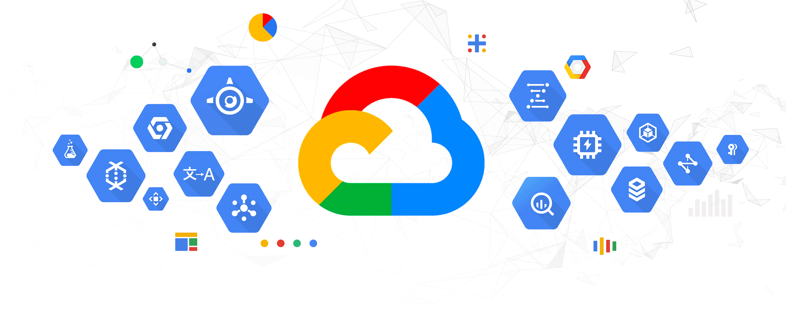

# Google Cloud Platform (GCP)

---

## Índice de contenidos

- [Conceptos generales aplicados a la cloud - GCP](#conceptos-generales-aplicados-a-la-cloud---gcp)
- [IAM, Seguridad y Conformidad](#iam-seguridad-y-conformidad)
- [Computo](#computo)
- [Almacenamiento](#almacenamiento)
- [Gestión de redes](#gestion-de-redes)
- [Monitorización en GCP](#monitorizacion-en-gcp)
- [Facturación de precios](#facturacion-y-precios)
- [Ingesta, procesamiento y análisis de información](#ingesta-procesamiento-y-analisis-de-informacion)
- [Microservicios en GCP](#microservicios-en-gcp)
- [App Service](#app-service)

## Servicios Core

---

> Comparador de servicios con otras clouds [pulse aquí](https://comparecloud.in/)

Cheat sheet de los servicios de GCP consultar [aquí](https://googlecloudcheatsheet.withgoogle.com/) 

## Conceptos generales aplicados a la cloud - GCP

---

Consulte la documentación del módulo [aquí](https://docs.google.com/presentation/d/1mUsIfDzAhjbWzUyaGxHN8oyp66TvSgZi3WxjdXHxXsc/edit?usp=share_link)

Apis para python: pinche [aquí](https://github.com/orgs/googleapis/repositories?language=&q=python&sort=&type=all)

Buscador de ejemplos para cualquier lenguaje: pinche [aquí](https://cloud.google.com/docs/samples?l=python)

Calculadora de precios de Google Cloud Platform: pinche [aquí](https://cloud.google.com/products/calculator?hl=es)

## IAM, Seguridad y Conformidad

---

Consulte la documentación del módulo [aquí](https://docs.google.com/presentation/d/1CU-HmpdTDJ-xUq6qRtucmH_0h_GXCtYO-po9BVSAkFA/edit?usp=share_link)

## Computo

---

Consulte la documentación del módulo [aquí](https://docs.google.com/presentation/d/1_b8khJA22_fUSvvbuecqGKGGC-Y9_I9kv9kOy0Epz4g/edit?usp=share_link)

## Almacenamiento 

---

Consulte la documentación del módulo [aquí](https://docs.google.com/presentation/d/1EkCaBB2igRNHPt2MHFnf0hpymNDR0oFtuivKxbAjrqI/edit?usp=share_link)

## Gestion de redes

---

Consulte la documentación del módulo [aquí](https://docs.google.com/presentation/d/1B567H6ZYeCgk0GDqnaR4V_UhnNhZ5XvMm9siCTEUp5I/edit?usp=share_link)

## Monitorizacion en GCP

---

Consulte la documentación del módulo [aquí](https://docs.google.com/presentation/d/1Zo-FCQTVUUIUkAVu5fgDwp4zpGLaxI79AYo0xqk1OHE/edit?usp=share_link)

## Facturacion y Precios

---

Consulte la documentación del módulo [aquí](https://docs.google.com/presentation/d/111M0fLZzrxzzav2-lJE_KF66RNc67j-QkIhBz6LRvys/edit?usp=share_link)

## Ingesta, procesamiento y analisis de informacion

---

Consulte la documentación del módulo [aquí](https://docs.google.com/presentation/d/1GI1MPQi6sLuBSrUWQpsa6pC_e6xLnfL2jiWvP0tSTWk/edit?usp=share_link)

## Microservicios en GCP

---

Consulte la documentación del módulo [aquí](https://docs.google.com/presentation/d/1J9PpVjVUsupeat5K6xrBuTucaTJbYEvbyWeNayLSBAg/edit?usp=share_link)

## App Service

---

Consulte la documentación del módulo [aquí](https://docs.google.com/presentation/d/1md2ZfuQrlGepwNcUSWSff8mczK--AczKDypctVz2ZnM/edit?usp=share_link)
