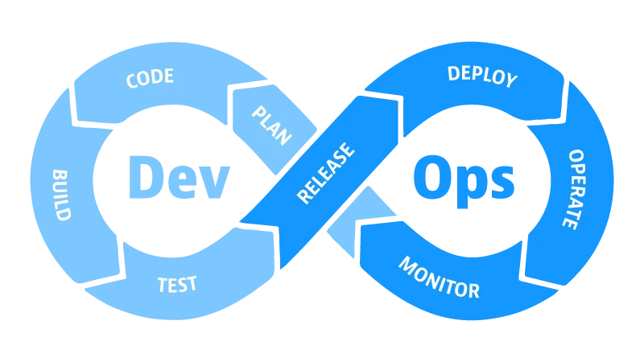
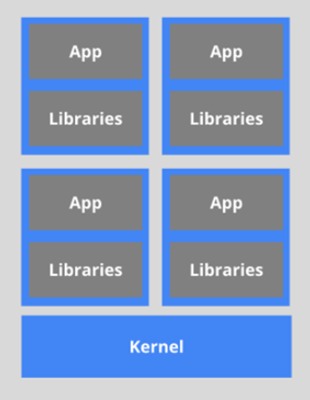

# Introducción a DevOps
***

# Índice 
***

[¿Qué son los microservicios?](#que-son-los-microservicios)
[¿Qué son los contenedores?](#que-son-los-contenedores)
[¿Qué son los orquestadores de contenedores?](#que-es-la-orquestacion-de-contenedores)

# ¿Que son los microservicios?

Actualmente, la nube ha reconvertido los procesos comerciales de las empresas desde las antiguas aplicaciones 
monolíticas a las aplicacionesactuales:
- Las aplicaciones monolíticas tenían todos los componentes fuertemente acoplados:     
  un cambio en uno de ellos suponía un cambio en muchos.
- La arquitectura SOA ya previno muchos de los problemas generados por estas arquitecturas monolíticas, 
  incluyendo muchos elementos de lo que ahora llamamos microservicios.

Un microservicio se vería como una ampliación de la arquitectura SOA, donde ya no se ejecuta directamente 
los servicios en los servidores, sino en contenedores que se pueden crear, escalar o destruir según las necesidades.

Otra ventaja son las actualizaciones, que se producen sin interrupción del servicio para los clientes ya que se 
producen servicio a servicio, sin tener que volver a compilar, reconstruir y reiniciar la aplicación completa.

**Los microservicios** son aplicaciones ligeras escritas en varios lenguajes de programación modernos, con dependencias 
específicas, bibliotecas y requisitos ambientales.

Para garantizar que una aplicación tenga todo lo que necesita para ejecutarse correctamente, se empaqueta junto con sus 
dependencias.

Los **contenedores** encapsulan los microservicios y sus dependencias, pero no los ejecutan directamente.

Distintos enfoques para la “transición” a microservicios:

- Enfoque “Big-Bang”: Se refactoriza todo, lo que retrasa el progreso y la implementación de nuevas características 
hasta que no se tenga el monolito reconstruido.

- Enfoque “incremental”: Se implementan las nuevas características como microservicios mientras que con refactorización 
se va haciendo desaparecer la arquitectura antigua.

¿Qué han aportado los contenedores a los microservicios?

- Cada aplicación se ejecuta en su propio entorno de ejecución, sin interferencias, conflictos ni errores.
- Mayor utilización del servidor.
- Mayor escalabilidad de módulos, flexibilidad e interoperabilidad.
- Mejor automatización.

**Los contenedores** son una forma de agrupar aplicaciones y sus datos, aislándolos para entregar aplicaciones escalables 
y de alto rendimiento en cualquier infraestructura de su elección.

Los contenedores son los más adecuados para proporcionar microservicios al proporcionar entornos virtuales 
**portátiles y aislados** para que las aplicaciones **se ejecuten sin interferencia** de otras aplicaciones en ejecución

# ¿Que son los contenedores?

Ya hemos dicho que los contenedores encapsulan los microservicios y sus dependencias, pero no los ejecutan directamente. 
**_Los contenedores ejecutan_** **_imágenes de contenedores._**

Una **imagen de contenedor** agrupa la aplicación junto con su tiempo de ejecución y dependencias, y se despliega un 
contenedor desde la imagen de contenedor que ofrece un entorno ejecutable aislado para la aplicación.

Los contenedores se pueden implementar desde una imagen específica en muchas plataformas, como estaciones de trabajo, 
máquinas virtuales, nube pública, etc.

A pesar de que en entornos de desarrollo y pruebas, la ejecución de contenedores en un único host sea una opción, 
esto no es así en entornos de producción. En Producción se debe cumplir:
- Tolerancia a fallos
- Escalabilidad bajo demanda
- Uso óptimo de recursos
- Descubrimiento automático para descubrir y comunicarse automáticamente entre sí
- Accesibilidad desde el mundo exterior.
- Actualizaciones / retrocesos sin interrupciones sin ningún tiempo de inactividad.

# ¿Que es la orquestacion de contenedores?

**Los orquestadores de contenedores** son herramientas que agrupan sistemas para formar grupos donde la implementación 
y administración de contenedores se automatiza a escala.

Existen distintos “orquestadores” en el mercado:
- Docker Swarm(parte de Docker Engine)
- Kubernetes
- Open Shift (Red Hat)
- Amazon ElasticContainer Service
- Azure ServiceFabric
- Nomad
- Marathon (Mesos)

Casi todos los orquestadores pueden:
- Agrupar hosts en forma de clúster
- Programar contenedores para que se ejecuten en hosts del clúster según la disponibilidad de recursos
- Permitir que los contenedores se comunique entre sí. Sea cual sea el host.
- Enlazar contenedores y recursos de almacenamiento
- Equilibrar carga en los contenedores.
- Gestionar y optimizar el uso de recursos.
- Implementar políticas para asegurar el acceso a las aplicaciones que se ejecutan dentro de contenedores.

Todos los orquestadores se pueden implementar de muchas formas
- Directamente en las máquinas.
- En máquinas virtuales
- En nube pública.

Los orquestadores hacen las cosas más fáciles para los operadores de contenedores. Sobre todo si hay cientos o miles.
