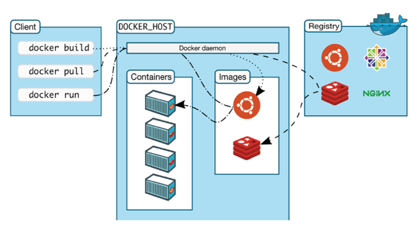
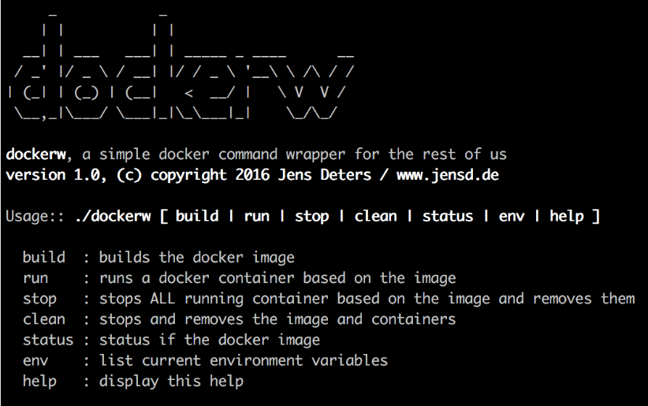
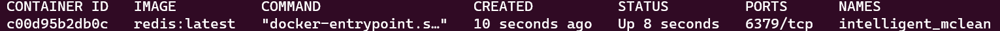
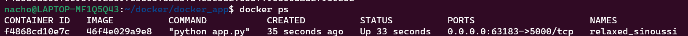
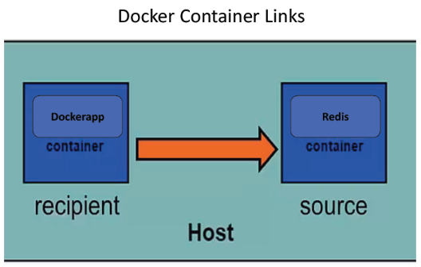
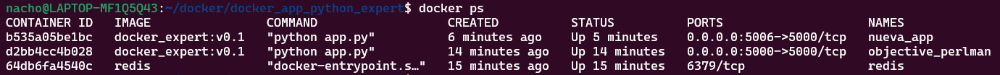
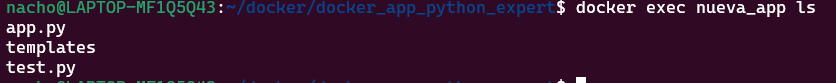
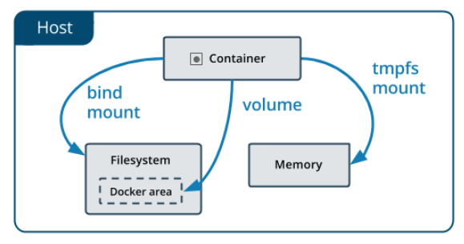

# Docker
***


# Índice 
***

- [Introducción a Docker](#introduccion-a-docker)
  - [Breve introducción a la arquitectura Docker](#breve-introduccion-a-la-arquitectura-docker)
  - [Instalar Docker (Linux)](#instalacion-de-docker-en-linux)
  - [Conceptos Docker](#conceptos-de-docker)
  - [Implementando Docker](#implementando-docker)
  - [Ejecutar Imágenes](#mas-comandos-docker)
  - [Construyendo imágenes](#construyendo-imgenes)
- [DockerFile](#dockerfiles)
  - [Construyendo imágenes a partir de un DockerFile](#construir-imagenes-a-partir-de-un-dockerfile)
  - [Sintaxis de Dockerfile](#sintaxis-de-un-dockerfile)
  - [Buenas prácticas Dockefile](#buenas-practicas-dockerfile)
- [Contenedorizando aplicaciones Web](#contenedorizando-aplicaciones-web)
- [Vincular contenedores](#vincular-contenedores)
- [Exec y Volúmenes](#exec-y-volumenes)
  - [Exec](#exec)
  - [Volúmenes](#volumenes-en-docker)
- [Docker Composer](#docker-composer)


# Introduccion a Docker
***

## Breve introduccion a la arquitectura Docker
***

Docker usa una arquitectura cliente-servidor donde el daemon funciona como servidor.
- El Docker Daemon, que también se le denomina Docker Engineo Docker Server, es quien construye, ejecuta y distribuye 
los contenedores.
- Este Daemon utiliza funciones específicas de Linux

El usuario no interactúa directamente con el daemon sino a través del cliente docker. Este cliente es la interfaz de 
usuario principal de Docker.

La forma de trabajar de este cliente es aceptar comandos del usuario y se comunica con el daemon Docker.




Hasta la aparición de Docker Desktop, había dos tipos de clientes de docker:
- **Cliente de linea de comandos**



- **Kitematic: cliente dockercon interfaz gráfica.**


## Instalacion de Docker en Linux
***

Actualizamos el sistema:

````bash
sudo apt update
sudo apt upgrade
````
Instalamos paquetes necesarios:

````bash
sudo apt-get install curl apt-transport-https ca-certificates software-properties-common
````
- **apt-transport-https**: permite que el administrador de paquetes transfiera datos a través de https
- **ca-certificates**: permite que el navegador web y el sistema verifiquen los certificados de seguridad
- **curl**: transfiere datos
- **software-properties-common**: agrega scripts para administrar el software

Añadimos los repositories de Docker, para facilitarla instalación

````bash
curl -fsSL https://download.docker.com/linux/ubuntu/gpg | sudo apt-key add -

sudo add-apt-repository "deb [arch=amd64] https://download.docker.com/linux/ubuntu $(lsb_release -cs) stable"
````

Actualizamos la información del repositorio (por si acaso)
````bash
sudo apt update
````

Nos aseguramos que instalamos desde Docker repo

````bash
apt-cache policy docker-ce
````

Instalamos (ahora sí)

````bash
sudo apt install docker-ce
````

Comprobamos
```bash
sudo /etc/init.d/docker status


sudo /etc/init.d/docker start
```

Vamos a descargar Docker Desktop o bien Docker Toolbox, según la versión de Windows que tengamos.
- La diferencia es que Docker Desktop facilita los procesos. Pero sólo se puede instalar en Windows 10 Pro o Enterprise. 

También hay que tener en cuenta que puede dar problemas con Virtual Box

Una vez instalado, nos aparecerá un enlace al Docker QuickStart Terminal. Esto hace aparecer un editor de comandos.

## Conceptos de Docker
***

### Imágenes

Las imágenes son plantillas de lectura utilizadas para crear contenedores.

Se crean con el comando Buildde Docker.

Las imágenes de docker están creadas a partir de capas que van definidas en el fichero Dockerfile. 
Estas capas se almacenan en Caché.

Este sistema permite no tener que cargar todas las capas, sino las modificadas.

Así en la descarga, se ahorra tiempo y recursos.

Las imágenes también tienen Tags, que identifican las versiones.
- Distinguen normalmente las diferentes versiones.
- Si no se especifica etiqueta, se entiende que se refiere a latest(la más actual)

###  Contenedores

El contenedor es la instancia de la imagen, la imagen en ejecución.

Son paquetes ligeros y portátiles en los cuales se puede ejecutar aplicaciones.

Cuando un contenedor es creado a partir de una imagen, en él tenemos todos los ficheros binarios y dependencias 
necesarios para ejecutar la aplicación.

### Registro

Es el lugar donde almacenamos nuestras imágenes

Se puede usar el propio o bien el público, que se llama DockerHub

Dentro de un registro, las imágenes de almacenan en repositorios.


### Repositorios

Son colecciones de imágenes con el mismo nombre, que tienen diferentes Tags que muestran las versiones

### DockerHub

Es un registro público de imágenes Docker para descargar.
    
Algunos repositorios se consideran oficiales.
   - Están revisados por Docker.
   - Tienen buena documentación
   - Están diseñados para los casos más comunes.
   - Tienen actualizaciones de seguridad 

Las imágenes no oficiales, han sido hechas por usuarios de la comunidad y suele aparecer un indentificadorantes de la /.

## Implementando Docker
***

### Nuestro “Hola mundo” en Docker

Para comenzar con Docker bastaría abrir un terminal, y teclear lo siguiente:
````bash
sudo docker run hello-world
````

- Es posible que nos pida contraseña que será la misma que tenemos para desbloquear la máquina virtual

- Si no queremos estar escribiendo siempre “sudo” al principio de cada instrucción Docker, podemos abrir en modo root con:

````bash
sudo -i
````

### Cargar imágenes con Docker

Docker ejecuta únicamente imágenes.

La forma de ejecutarlas consiste en buscarlas primero en local y si no las encuentra, las buscará en Docker Hub.

Existen una serie de comandos Docker relacionados con la carga de Imágenes:

- **Images** : Permite saber qué imágenes están almacenadas en local.
````bash
docker images 
docker image ls
````
- **Pull** : Permite descargar una imagen del repositorio DockerHub.
 
````bash
docker pull busybox:1.24
````

- **Search** : Busca una imagen en nuestro registro.

````bash
docker search redis
```` 

- **Image history** : Permite ver las capas en las que se divide una imagen.

````bash
docker history busybox:1.24
````

### Ejecutar imágenes

El comando Docker que ejecuta una imagen es **run** :

````bash
docker run busybox:1.24
echo "He terminado de cargar"
````

Si tras un comando run, escribirmos ls, podremos ver las carpetas que tiene dicha imagen por dentro.
````bash
docker run busybox:1.24 ls
````
En general lo que podemos es lanzar cualquier comando Shell.

#### name

Cuando se ejecuta un contenedor, si no se especifica un nombre, Docker le pone uno a su gusto y criterio.
Para colocar un name personalizado, basta con:

```bash
docker run --name nombredistinto busybox:1.24
```

### Ejecutar imágenes:

Si queremos interactuar con el contenido de un contenedor debemos añadir -i (contenedor interactivo) 
y -t (simulación de entrada)
````bash
docker run -i -t busybox:1.24
````

A continuación se abre un shell desde el cual podemos escribir todas las operaciones necesarias para 
inspeccionar el contenedor.

Si queremos listar cualquier contenedor en ejecución

````bash
docker ps
````

Si también queremos listar cualquier contenedor, en ejecución o no.

````bash
docker ps -a
````

La lista nos va a mostrar información sobre el nombre del contenedor, cuándo se ejecutó, etc. 
El nombre o el id serán muy importantes para poder lanzar otras operaciones:

### Interactuar con contenedores:

Por ejemplo vamos a probar a parar y a iniciar un contenedor, en primer lugar vamos a ejercutar en una terminal un 
contenedor, : 

````bash
docker run nginx:latest
````

Este debe quedarse corriendo y no terminar para poder pararlo

Si queremos parar un contenedor, escribimos:

```bash
docker container stop nginx
```
Para reiniciar un contenedor, escribimos:

```bash
docker container start nginx
```

## Mas comandos Docker
***
### Primer plano / background

Cuando ejecutamos una imagen docker, ésta se lanzará en primer plano por defecto.

Se puede cambiar a segundo plano, si añadimos - **d**

Esto es conveniente si el contenedor es muy pesado y queremos que se pueda seguir introduciendo comandos.

```bash
docker pull redis
docker run -d redis:latest
```

En este caso si no hacemos pull, la instrucción run hará la descarga de la imagen igualmente.


### Eliminar un contenedor

También podemos eliminar un contendor con rm:

```bash
docker rm <id del contenedor>
```

Hay que tener cuidado porque al borrar un contenedor, la información que se haya generado por el uso se eliminará.

Se puede colocar --rm tras run, para que una vez ejecutado, se elimine

```bash
docker run --rm busybox:1.24 sleep 10
```

Si queremos borrar todos los contenedores de golpe:

```bash
docker rm $(docker ps -a)
```
- Si queremos borrar todos las imágenes de golpe:

```bash
docker rmi $(docker images -q)
```

### Eliminar una imagen:

**rmi** : Permite eliminar una imagen de nuestro registro. Sin embargo, hay que tener en cuenta que, 
si existe algún contenedor que la esté utilizando primero habría que borrar el contenedor con rm y después la imagen:
````bash
docker rmi nombre_imagen
````

Si alguna imagen da problemas se puede forzar su eliminación con el comando -f ó --force
````bash
docker rmi -f id_imagen
````

### Contenedor --> Imagen

Podemos crear una imagen a partir de un contenedor. Usar esta capacidad con cuidado por lo costosa de la operación.

- **docker commit -m "comentario" -a "autor" <idcontenedor><nombre:imagen>:<tag_imagen>**

Por ejemplo si lanzamos redis y miramos el proceso con **docker ps**:



Podemos crear una imagen a partir de ese contenedor. 

````bash
docker commit -m "imagenRedis" -a "TuNombre" c00d95b2db0c redis_imagen:v1
````

### Inspect

Para mostrar información de un contenedor o una imagen de manera más profunda, utilizaremos dockerinspect

````bash
docker inspect c00d95b2db0c
````

### Log

También con log, veremos los mensajes generados:

````bash
docker logs c00d95b2db0c
````

Se le puede añadir más opciones (--details --timestamp, etc.)

### Mapeo de puertos

Si queremos especificar puertos en la ejecución de una imagen, debemos usar -p y a continuación indicar:

- **puerto_host:container_host**

Un ejemplo sería la ejecución de tomcat:

```bash
docker run -it --rm -p 8888:8080 tomcat:8.0
```

También podemos exponer en un puerto disponible al azar:

```bash
docker run -it --rm -p 8080 tomcat:8.0
```
02. Introducción a Docker

## Construyendo imágenes
***

Hay dos formas de construir imágenes Docker
- A partir de los cambios realizados en un Contenedor
- A partir de un fichero Dockerfile

### A partir de los cambios realizados.

Ejecutamos la imagen busybox:1.24 de forma que luego podamos editarla a nivel de contenedor:

```bash
docker run -it busybox:1.24
```

Cuando aparece el shell, vemos las carpetas que tenemos con la instrucción: **ls**

Ahora creamos un fichero a partir de un echo:

```
echo "esto es un cambio" >fichero.dat
```

Escribimos **_exit_** para salirnos del contenedor

>Podríamos haber instalado algo más contundente con apt-get, por ejemplo: apt-getupdate && apt-getinstall-y git


Ahora vamos a llevar ese contenedor a una imagen nueva.

Para ello primero debemos saber cómo se llama el contenedor modificado:

````bash
docker ps -a
````

Anotamos el container id: Por ejemplo 9b6ab05329af

Ahora hacemos commit

```bash
docker commit 9b6ab05329af minombre/busybox:1.0
```

La palabra minombrees un identificador que le ponemos por nuestra cuenta.

Tras esto, nos devuelve un sha256 que es el id de la nueva imagen.

Si escribimos: **_docker images_** , veremos nuestra nueva imagen.


# Dockerfiles

> El material práctico para este módulo se encuentra [aquí](Ejemplos/Ejemplos_DockerFile) 

## Construir imagenes a partir de un Dockerfile
***

### A partir de un **Dockerfile**.

Es un documento de texto que contiene todas las **instrucciones** que los usuarios proporcionan para construir una imagen

Una instrucción puede ser por ejemplo:
- Instalar un programa
- Agregar algún código fuente
- Especificar el comando que se ejecutará después de iniciar el contenedor
- etc.


Cada instrucción creará una nueva capa de imagen.


>Nota : Como el fichero Dockerfiledebe estar dentro del proyecto a crear y esto estará dentro de las carpetas de
Docker, intentar acceder a él, supondrán permisos. Es muy importante arrancar Docker QuickStart como
Administrador


Primero creamos un fichero con el nombre Docker file con algún editor de texto plano, y lo guardaremos:

- **_gedit Dockerfile_**
- **_vim Dockerfile_**
- **_nano Dockerfile_**

Y ahora escribimos las instrucciones.

- La primera debe ser un FROM que indica de qué imagen partimos

```dockerfile
FROM busybox:1.24
```

- El resto dependerá de lo que necesitemos. Si por ejemplo queremos ejecutar instrucciones de linux, 
utilizaremos como palabra clave RUN

```bash
RUN echo "esto es un ejemplo" > fichero.dat
```

Para guardar y salir en vi, primero pulsar Esc, y después escribir :wq y pulsar Enter.

Para que ahora nos haga funcionar nuestro Docker file utilizamos build

```bash
docker build -t nacho/busybox .
```
> Nota : El punto final es importante, ya que le dice a docker dónde se encuentra el Dockerfile


### Subiendo una imagen creada a DockerHub

Queremos que nuestro contenedor con Python, etc, se quede ya hecho para que solo haya que descargarlo como imagen.

La app la podemos encontrar [aquí](Ejemplos/Ejemplos_DockerFile/docker_app_python)

Construimos la imagen del Dockerfile

````bash 
docker build -t isotomor/pythonflask:1.0 .
````

Hacemos el run y miramos su id de contenedor: 
````bash
docker run isotomor/python_flask:1.0
````

Hacemos commit
````bash
docker commit <id_container> isotomor/pythonflask:1.0
````

Ahora hacemos loginsobre nuestro dockerhub 
````bash
docker login
````

Una vez logueados, hacemos push:
````bash
docker push isotomor/pythonflask:1.0
````


## Sintaxis de un Dockerfile
***

Hemos visto cómo crear imágenes a partir de comandos escritos en un fichero llamado Dockerfile y que docker busca cuando 
escribimos el comando build.

````dockerfile
FROM python:3.7-alpine
````

Ahora vamos a ver más instrucciones y buenas prácticas:

### RUN

Ya la hemos utilizado, pero como cada vez que hace RUN, convierte lo añadido al contenedor como una nueva 
capa de imagen, cuantas menos RUN mejor.
  - También es conveniente intentar que lleven algún orden alfanumérico. Sobre todo para no duplicar y actualizar mejor.
  - Por ejemplo, en vez de escribir 3 apt-getinstall, lo ponemos así:

```dockerfile
RUN apt-get install -y \git \python \vim
```
 

### CMD
Especifica qué comando se va a ejecutar cuando se inicie el contenedor.
- Si no se especifica, dockerutilizará el predifinidoen la imagen base..
- Por ejemplo, vamos a poner que escriba un texto:

```dockerfile
CMD ["echo","Bienvenidos"]
```

### NO-CACHE

Fuerza a que no se utilice la cache para recostruirimágenes a partir de capas antiguas. Va a ser más lento.

`````bash
docker build -t nacho/busybox . --no-cache=true
`````

### COPY

Copia ficheros desde el fichero de compilación de docker, al contenedor, para ello en el Dockerfile incluiremos:

```dockerfile
COPY abc.txt /src/abc.txt
```

- Se supone que el fichero abc.txt está la misma carpeta que el Dockerfile


### ADD

Es muy similar a COPY, salvo que puede descargar un archivo de internet.

Otra propiedad es que descomprime los archivos comprimidos en el sistema de archivo del contenedor.

- COPY es una versión simplificada de ADD.

- Ejemplo:

> Esta aplicación lo que hace es instalar una APP en Node, por lo que hace falta ejecutar el código en la misma carpeta
> Que donde se encuentre la app en node. 

```dockerfile
FROM ubuntu

RUN apt-get update && apt-get install -y nodejs npm
ADD . /app
RUN cd /app && npm install

CMD npm start
```

### WORKDIR

Cambia el directorio por defecto después de crear el contendor.

- Ejemplo:

```dockerfile
FROM node:7-alpine

WORKDIR /app
ADD . /app
RUN npm install

CMD ["npm", "start"]
```


### ENTRYPOINT

Permite añadir scripts.

- Ejemplo:

```dockerfile
FROM node:7-alpine

WORKDIR /app
ADD. /app
RUN npm install

# Estas dos líneas sería como hacer "./entrypoint.sh start"
ENTRYPOINT ["./entrypoint.sh"]
CMD ["start"]
```

Puede consultar el script .sh [aquí](Ejemplos/Optimizar_Dockerfile/entrypoint.sh)

## Buenas practicas Dockerfile
***

Consulte el documento de buans prácticas de Dockerfile [aquí](https://docs.google.com/document/d/1QDZ_W0hSiUwS6UZXM-ne_hjcgGFl1Gafkq7VSAyHSn4/edit?usp=share_link)

Se acompañan una serie de ficheros con distintas buenas prácticas y errores, consulte los ficheros [aquí](https://docs.google.com/document/d/1QDZ_W0hSiUwS6UZXM-ne_hjcgGFl1Gafkq7VSAyHSn4/edit?usp=share_link)

Estos ejemplos **NO** son ejecutables por si solos sin tener una app en node por ejemplo esta: [App Node](Ejemplos/Ejemplos_DockerFile/docker_app_node) 


# Contenedorizando aplicaciones Web
***

Vamos a continuar con un clásico, hacer un contenedor de una app web.

Vamos a ver un ejemplo que utiliza Python y Flask para escribir un texto en una página Web. El código está [aquí](Ejemplos/Ejemplos_DockerFile/docker_app_python)

Nos copiamos el contenido en el entorno de ejecución que estmos usando y entramos en la carpeta [docker_app_python](Ejemplos/Ejemplos_DockerFile/docker_app_python)

Tras esto, nos metemos en la carpeta dockerapp con **_cd dockerapp_**

Y ahora ejecutamos la instrucción build

````bash
docker build -t dockerapp:1.0 .
````

Cuando ya haya terminado (recordar que es conveniente que tuviéramos ya bajada la imagen de python, 
que es bastante pesada) vemos con **_docker images_** que nos ha creado la imagen.

Ahora hay que ejecutarlo, y como Flask suele trabajar sobre el puerto 5000, pues:

```bash
docker run -d -p 5000 46f4e029a9e8
# Al poner el -d hacemos que se salga pero la app estará ejecutándose en segundo plano. 
```
Nos devuelve un id largo.

Podemos hacer **_docker ps_** para ver la ejecución:



Al ejecutar esto en un entorno de linux, la ruta para poder visualizar la ejecución es la siguiente: http://localhost:5000/

Y al valor de IP que nos de, le añadimos el puerto 5000 y veremos el resultado.

En general, cualquier aplicación web se realizaría de una manera similar.

En la sesión también aparece una carpeta que se llama [docker_app_python_2](Ejemplos/Ejemplos_DockerFile/docker_app_python_2) 
que tiene otro .pycon Flask un poco más elaborado.

Podríamos seguir los pasos anteriores para conseguir ver el programa contenerizado.
- Para que entren los dos programas, vamos a darle como versión la 2.0, pero con el nombre igual.

# Vincular contenedores

En el siguiente ejemplo vamos a tener dos contenedores que van a interactuar entre ellos sin necesidad de un puerto de trabajo.
    
- Por un lado tendremos un contenedor con Redis.
- Por otro, nuestro contenedor con el programa Python.
 
Esto se puede conseguir gracias a los **_enlaces entre contenedores_**.

Los enlaces entre contenedores. permiten que los contenedores interactúen y compartan 
información de forma segura de un contenedor a otro.

Cuando configuras un enlace creas un canal entre un contenedor receptor y un contenedor fuente. 
El contenedor receptor puede acceder a la información del contenedor fuente.



En nuestro caso, el contenedor Redis es el fuente, y nuestra aplicación es el Receptor.

La aplicación la cogeremos del siguiente enlance: [docker_app_python_redis](Ejemplos/Ejemplos_DockerFile/docker_app_python_redis)

## Realización:
***

Primero creamos el contenedor de Redis:

```bash
docker run -d --name redis redis:3.2.0
```

Colocamos la carpeta de dockerapp3 en la carpeta y Segundo, creamos la imagen de nuestra aplicación:

```bash
docker build -t docker_redis:v0.1 .
```

Y ejecutamos el contenedor. Salvo que ahora añadiremos el link:
````bash
docker run -d -p 5000:5000 --link redis docker_redis:v0.1
````

```
Kubernetes
Vincular dos contenedores para que trabajen juntos
```
04 Dockerizandoapp web


# Exec y Volumenes
***

## Exec
***

La instrucción Docker **exec** nos permite **_ejecutar comandos en contenedores “en_ejecución”_**. Esta es la principal 
diferencia con _Docker run_ , porque _run_ crea el contenedor y lo ejecuta, _exec_ sólo lo ejecuta.

Para usar exec se debe contar con el nombre del contenedor (o su ID) y el comando que debe ejecutar en ese contenedor:

```bash
docker exec micontainer <comando>
```

Comando será cualquier instrucción de Shell. Por ejemplo sobre los contenedores del ejercicio anterior, seleccionamos 
uno y ejecutamos la siguiente línea de código: 



````bash
docker exec nueva_app ls
````

Esto nos listará el contenido del contenedor: 




El uso más popular de exec es lanzar un terminal Bash dentro del contenedor, tal y como se hizo en la sesión 1, 
pero sabiendo que esto si lo admite cualquiera.

La diferencia es ahora si Bashes parte del PATH o no. Si lo es, solo hay que escribir:

```bash
docker exec -it bash_terminal bash
```

A veces, estamos interesados en ejecutar un comando en un contenedor como root. Para ello utilizaremos -u con un 
valor 0 (cero) para el usuario root

```bash
docker exec -u 0 bash_terminal whoami
```

Para ejecutar varios comandos con exec y bash, hay que usar -c y a continuación los comandos separados por ; entre 
comillas dobles

```bash
docker exec bash_terminal bash "cd /var/log ; cat dmesg"
# Este ejemplo debvuelve que no se encuentra el fichero, pero sería la forma de encadenar. 
```

Para ejecutar un comando dentro de un directorio específico en el contenedor, se utiliza -w y después el directorio

```bash
docker exec -w /var/log bash_terminal cat dmesg
```

También se suele usar para establecer variables de entorno, con la opción -e y la especificación de la variable de 
entorno.

```bash
docker exec -e UID="myuser" bash_terminal printenv UID
```

## Volumenes en Docker
***

Docker tiene dos opciones para que los contenedores almacenen archivos:

- Almacenar archivos en la máquina host, de modo que los archivos persistan incluso después de que el contenedor se 
detenga: Volumes y Bind mounts

- Otros tipos dependiendo del Sistema:
   - Linux: tmpfsmount
   - Windows: namedpipe

No importa el tipo de montaje a usar, los datos se ven iguales desde dentro del contenedor. Se expone como un 
directorio o un archivo individual en el sistema de archivos del contenedor.



### Volúmenes 


Son creados y administrados por Docker:

```bash
docker volume create
```

Cuando crea un volumen, se almacena dentro de un directorio en el host Docker.

Cuando monta el volumen en un contenedor, este directorio es lo que se monta en el contenedor.

Un volumen dado se puede montar en múltiples contenedores simultáneamente.


Los volúmenes se pueden eliminar definitivamente con :

```bash
docker volume prune
```

Cuando se monta un volumen, puede ser con nombre o anónimo. Los volúmenes anónimos no reciben un nombre explícito 
cuando se montan por primera vez en un contenedor, por lo que Docker les da un nombre aleatorio.

- Crear un volumen:
````bash
docker volume create mivolumen
````

- Listar volúmenes:
````bash
docker volume ls
````

- Inspeccionar un volumen
````bash
docker volume inspect mivolumen
````
    
- Eliminar un volumen:
````bash
docker volume rm mivolumen
````


Cuando se inicia un contenedor con un volumen que aún no existe, Docker lo crea. Aquí se va a crear el volumen 
mivolen /app/ en el cotenedor.

Hay dos formas, con -v y con --mount. Ambas producen lo mismo.

- Con mount:

```bash
docker run -d --name ejemplo --mount source=mivol,target=/app/data nginx:latest
```

- Con -v:

`````bash
docker run -d --name ejemplo -v mivol:/app/data nginx:latest
`````

Si queremos eliminar lo anterior:

```bash
docker container stop ejemplo

docker container rme jemplo

docker volume rm mivol
```


### Ejemplo volúmenes

Se va a añadir un volumen al contenedor busybox:

```bash
docker run -it -v /data --name mibusyV busybox
```

Si hacemos ahora ls, veremos que hay un directorio nuevo.

Nos metemos en el con cd y creamos un archivo dentro:

```bash
cd data
touch file1.txt
ls
```
Salimos del Shell de busybox. Con exit

Si ahora reiniciamos de nuevo el contenedor
````bash
docker restart mibusyV
````

Entramos de nuevo en él:
````bash
docker attach mibusyV
````

Veremos que todo sigue donde estaba. No se ha cambiado nada. Es persistente. Nos salimos con Exit

Si ahora eliminamos el contenedor
````bash
docker rm mibusyV
````

Pero intentamos ver si existe el volumen

````bash
docker volumen ls
````

Ahí se encuentra, no se ha perdido.

El problema es, sin embargo que el volumen no se va si no se lo decimos.

Por ello, si queremos borrar un contenedor y su volumen asociado, deberíamos escribir:
````bash
docker rm-v mibusyV
````
    
Para que así el volumen se elimine también.

> Qué sucede si iniciamos otro contenedor con el mismo volumen de datos. ¿El archivo sigue ahí o cada contenedor tiene su propio sistema
> de archivos?

Vamos ahora a compartir un volumen entre dos contenedores:

Escribimos lo necesario para crear un volumen en un contenedor y le añadimos un fichero:

```bash
docker run --mount type=volume,source=compartido,destination=/root busybox sh -c 'echo Hola contenedor del otro mundo> /root/mensaje.txt'
```

Tras esto, escribimos lo necesario para crear otro contenedor, pero que utilice el mismo volumen:

```bash
docker run --mount type=volume,source=compartido,destination=/otro busybox cat /otro/mensaje.txt
```


# Docker Composer

---

**_Compose_** es una herramienta para definir, ver el estado y ejecutar aplicaciones Docker de contenedores múltiples.

Utiliza un archivo YAML para configurar los servicios de su aplicación.

Así, después, con un solo comando, crear e iniciar todos los servicios desde dicha configuración

Docker Compose se encuentra ya en el propio Docker (Ya sea Docker Quicstart ToolBox incluso), bastaría con escribir 
este comando, para ver si es así
````bash
docker-compose version
````

> Si no está instalado siga las siguientes instrucciones: [Instalación docker-composer](https://www.digitalocean.com/community/tutorials/how-to-install-and-use-docker-compose-on-ubuntu-20-04-es)

En Docker Compose el proceso de automatización tendría tres pasos:
- Creación del **Dockerfile** con la definición del entorno de la aplicación.
- Definir los servicios que componen la aplicación en un fichero **docker-compose.yml** para que puedan ejecutarse 
juntos en un entorno aislado.
- Ejecutar en el terminal: **docker-compose up** para que Compose inicie y ejecute toda la aplicación.

## El fichero **docker-compose.yml**
***

Este fichero comienza siempre estableciendo el número de versión de Docker-Compose

A continuación se irían definiendo “services” por cada contenedor que quisiéramos unir.
   - En el ejemplo anterior dockerappy redis.
   
Dentro se escribirían las instrucciones que dan lugar al funcionamiento del servicio.
- Por ejemplo para dockerapp habrá que construir a partir del Dockerfile

También si fuera necesario, los puertos.

Y lo que nunca debe faltar es la dependencia entre los contendores: depends_on
   - En este caso Dockerapp es un cliente Redis. Es decir que el contenedor Redis se iniciará antes.

El fichero docker-compose.yml para el anterior ejemplo quedaría:

```yaml
version: '3'
services:
   docker_app_redis:
        build: .
        ports:
          - "5000:5000"
        depends_on:
          - miredis
   miredis:
       image: redis:3.2.0
```

Una vez que se ha creado, se iniciaría con :
````bash
docker-compose up -d
````
    
Después se podría ver el flujo de trabajo con:
````bash
docker-compose ps
````

Otro comando puede ser:
````bash
docker-compose logs -f
````

Para detener todos los contenedores
````bash
docker-compose stop
````

Los contenedores detenidos pueden volver a iniciarse con:
````bash
docker-compose up
ó
docekr-compose start
````

Si se quieren eliminar:
````bash
docker-compose rm
````   

El fichero **docker-compose.yml** es la pieza clave de Docker Compose

Siempre empieza con un número de versión, que le indica el formato y las instrucciones que admite. A diade hoy está en 
la versión 3.8

Este fichero lo que define son:
- **Servicios** : Los contenedores iniciados y que utilizarían los usuarios
- **Redes** : Algo así como las distintas agrupaciones de contenedores. Lo cual define que contenedores son accesibles 
por otros.
- **Volúmenes** : Como ya vimos, el almacenamiento de los datos.

### Servicios
La definición de un servicio es muy parecido al hecho de realizar una instrucción docker run....

Al igual que hace la instrucción dockerrun... con los ficheros Dockerfile, la parte de servicios del fichero 
docker-compose.ymlrespeta los comandos CMD, VOLUME, EXPOSE, ENV del Dockerfile.

En el fichero docker-compose.yml se definen debajo de la palabra services.
````yaml
version: "3.8“
services:
    webapp:
        build: .
````

Cada servicio lleva aparejado una serie de opciones:

#### image

Indica la imagen a partir de la cual se construye el servicio.

````yaml
version: "3.8"
services:
  mongo:
   image: mongo:latest
````

#### build

Indica el contexto de construcción (por ejemplo la ruta de un Dockerfile)

Como podemos tener distintos servicios, se puede indicar un nombre distinto de Dockerfile para cada uno. 
Si no, sólo se podría construir uno.

Si esto ocurre, la ruta se define en context:
````yaml
version: "3.8"
services:
   webapp:
      build:
         context: ./app
         dockerfile: Dockerfile-web
````

Si junto a build añadimos image, se creará la imagen con el nombre que pongamos tras image

````yaml
 version: "3.8"
 services:
    webapp:
       build: ./app
       image: miapp:tag
````

Podemos especificar argumentos.

Un argumento son variables de entorno que sólo están disponibles en tiempo de compilación.

 El proceso de creación de estos argumentos siempre es el mismo:
 
 - Definimos los argumentos en el Dockerfile

```dockerfile
ARG compilacion
ARG nombrecommit

RUN echo "Compilacion número: $compilacion"
RUN echo "Basada en el commit: $nombrecommit"
```

- Despuesen el docker-compose.yml, les asignamos valores:
````yaml
version: "3.8"
services:
 webapp:
    build:
       context: ./app
       args:
          compilacion: 2
          nombrecommit: cmp1234
````

También puede definirse los argsen forma de lista:

````yaml
args:
- compilacion= 2
- nombrecommit= cmp1234
````

También podemos especificar a qué red pertenece este servicio indicándolo con network.
````yaml
version: "3.8"
services:
   webapp:
      build:
         context: ./app
         network: host
````

Si network es none, las redes están deshabilitadas

### depends_on

Indica la dependencia entre distintos servicios, lo que implica que:

Cuando arranca docker-composeup, se inician los servicios en orden de dependencia.
````yaml
version: "3.8"
services:
  web:
    build: .
    depends_on:
    - db
    - redis
  redis:
    image: redis
  db:
    image: postgres
````
Cando se para con docker-compose stop, también se detienen los servicios en orden de dependencia.

### ports

Indica los puertos por los que se expondrá el servicio

Es equivalente al -p que colocábamos en la instrucción docker run....

Hay dos formas de escribirlo, la corta y la larga. En la corta, sólo hay que especificar el HOST:PORT

````yaml
version: "3.8"
services:
   web:
      build: .
      ports:
        - "3000"
        - "8001:8000"
        - "127.0.0.1:8001:8000"
        - "127.0.0.1:5000-5010:5000-5010"
````

Indica los puertos por los que se expondrá el servicio

- En la larga especificaremos todo con valores

````yaml
 version: "3.8"
 services:
    web:
       build: .
       ports:
         - target: 80
           published: 8080
           protocol: tcp
           mode: host
````

### volumes

Monta volúmenes especificados o rutas de host.

#### Forma corta:

Es equivalente a la forma que especificábamos volúmenes en la instrucción dockerrun con -v

````yaml
version: "3.8"
services:
   web:
      image: nginx:alpine
      ports:
        - "80:80"
      volumes:
        - mivolumen:/app/data
````

#### Forma larga

Se configura a partir de campos adicionales como son:
- **type**: Tipo de montaje: volume, bind, tmpfso npipe
- **_source_**: Ruta en el docker host o nombre de volume ya creado
- **_target_**: La ruta donde se montará en el contenedor
- **_read_only_**: indica si es de solo lectura o no.
- **_volume**: Otras opciones de volume como _nocopy_, que indica si se deshabilita o no la copia de datos de un
contenedor cuando se crea el volumen.

````yaml
 version: "3.8"
 services:
    web:
       image: nginx:alpine
       ports:
         - "80:80"
       volumes:
         - type: volume
           source: mivolumen
           target: /app/data
           volume:
            nocopy: true
````

Aparte de definir el tipo del volumen, etc, es necesario especificar si el volumen lo tiene
que crear docker-composeo y está creado anteriormente.

Si el volumenlo hemos creado con docker volume create, entonces docker-compose lo tiene que definir como externo.

````yaml
version: "3.8"
   services:
      db:
         image: postgres
         volumes:
            - data:/var/lib/postgresql/data
   volumes:
      data:
         external: true
````

Si no está creado, basta con quitar external:true y lo creará

### restart

Indica la política a seguir con el reinicio automático de contenedores. Hay cuatro posibles valores
 - restart: “no”
 - restart: always
 - restart: on-failure
 - restart: unless-stopped

Compose configura por defecto una única red, a la que cada contenedor de un servicio se une y por tanto, 
es accesible desde otros contenedores de esa red.
- La forma de acceso es a través del nombre del contenedor.
- Además se accede a cualquier lugar dentro de ese contenedor de forma similar a esta: contenedor: //app/data
- La red de una aplicación recibe un nombre basado en el nombre del proyecto (el directorio donde está). 
Este nombre se puede cambiar a través del flag--project-nameo de la variable de entorno COMPOSE_PROJECT_NAME


Así si tenemos un docker-compose.yml dentro de una carpeta llamada miapp:

````yaml
version: "3.8"
services:
   web:
      build: .
      ports:
         - "8000:8000"
   db:
      image: redis
      ports:
         - "8001:6379"
````

Cuando ejecutamos docker-composeup, se crea una red llamada _miapp_default_ , además de que los distintos servicios 
se unen a dicha red.

Además de usar la red por defecto, podemos definir nuestras propias redes con de services, etc. networks, que se 
coloca al nivel
  - Esto permite crear topologías de red de contenedores más complejas
  - Incluso conectar servicios a redes creadas de manera externa y no gestionadas por Compose.
  - Una vez que tenemos definida una network, cada servicio puede conectarse a dicha red a partir de networks:

````yaml
version: "3.8"
services:
  web:
     build: .
     networks:
        - red2
     ports:
        - "8000:8000"
  db:
     image: redis
     networks:
        - red1
     ports:
        - "8001:6379"
networks:
  red1:
  red2:
````

Al igual que le pasaba a los volúmenes, si la red ha sido creada con la instrucción docker network create, en la 
definición del docker-compose tendremos que añadir external:

````yaml
version: "3.8"
services:
  web:
     build: .
     networks:
        - red1
     ports:
        - "8000:8000"
  db:
     image: redis
     networks:
        - red1
     ports:
        - "8001:6379"
networks:
  red1:
     external:
        name: mired
````


### Hands On

Crear el docker-compose.yml del ejecicio [docker_app_python_redis](Ejemplos/Ejemplos_DockerFile/docker_app_python_redis)


## Docker Compose: Otras características
***

- Compose puede mantener múltiples entornos aislados en un solo host.

- Compose puede conservar datos cuando se creen contenedores.

- Compose sólo vuelve a crear los contenedores que hayan cambiado.

- Compose admite secretos

- Compose admite definir los servicios a partir de variables de entorno.

- Los secretos, así como otros elementos de composese pueden utilizar sólo a través de **Docker Swarm**. 
En nuestro caso ya los veremos en Kubernetes

- Un **secreto** sería un /unos **datos sensibles** que debemos proteger de curiosos. (contraseñas, clave privada SSH, 
certificado SSL)

- En Docker se puede administrar de forma centralizada y transmitirlos de forma segura a aquellos contenedores que 
necesiten acceder a ellos.

- Un secreto determinado solo es accesible para aquellos servicios a los que se les ha otorgado acceso explícito, 
y solo mientras esas tareas de servicio están en ejecución.

- Una forma menos segura, pero válida para contenedores individuales es utilizar variables de entorno.
