# Kubernetes
***

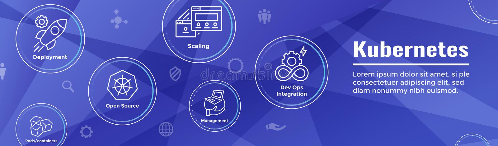

# Índice 
***

- [Introducción a Kubernetes](#introduccion-a-kubernetes)
  - [¿Qué es?](#que-es)
  - [Que nos permite](#que-nos-permite)
  - [Arquitectura](#arquitectura)
  - [Comenzando con Kubernetes](#comenzando-con-kubernetes)
  - [Conceptos básicos](#conceptos-bsicos)
  - [Controladores](#controladores)
  - [Ejercicio app formulario kubernetes](#ejercicio-app-formulario-kubernetes)
- [Un poco mas allá en Kubernetes](#un-poco-mas-alla-en-kubernetes)
  - [Mas sobre Pods](#mas-sobre-pods)
  - [Mas sobre Deployments](#mas-sobre-deployments)
- [Volúmenes](#volumenes)
  - [Volúmenes dentro del Pod](#volumentes-locales-pod)
  - [Volúmenes persistentes](#volumentes-persistentes-pv)
- [Variables de entorno](#variables-de-entorno)
- [ConfigMaps](#config-map)
- [Secretos](#secretos)
- [Actualizaciones de servicios](#actualizaciones-de-servicios)
- [Escalado de servicios](#escalado-de-servicios)
- [Otros tipos de deployments](#otros-tipos-de-deployments)
  - [Statefulset](#mas-sobre-statefulset)
  - [Daemonset](#mas-sobre-daemonset)
  - [Configurando CronJobs en Kubernetes](#configurando-cronjobs-en-kubernetes)
- [Helm](#helm)
  - [¿Cómo funciona?](#como-funciona)
  - [Sobre las versiones de Helm](#sobre-las-versiones-de-helm)
  - [Estructura de un Chart de Helm](#estructura-de-un-chart-de-helm)
- [Ingress](#ingress)
  - [Instalador de controlador Ingress](#instalador-de-un-controlador-ingress)
- [Multiples paths para un mismo host](#multiples-paths-para-un-mismo-host)
- [Registry](#registry)
- [Seguridad en Kubernetes](#seguridad-en-kubernetes)

# Introduccion a Kubernetes
***

## ¿Que es?
***

La definición genérica de Kubernetes es la “orquestador”,”timonel”, “gobernador”, etc. La palabra es de origen griego 
(κυβερνήτης)

En realidad es un sistema “open source” que permite controlar el despliegue, la automatización, la escalabilidad y 
el manejo de aplicaciones en contenedores.

Fue diseñado por Google (Project Seven) y actualmente lo gestiona la Linux Foundationa través de la CNCF (Cloud 
Native Computing Foundation)

Soporta distintos tipos de contenedores, entre los que destaca Docker.

Para entender bien que son los kubernetes y todas las piezas que entran en juego, usaremos la documentación oficial,
para acceder a ella en español [pinche aquí](https://kubernetes.io/es/docs/concepts/architecture/nodes/)

## ¿Que nos permite?
***

Gracias a la “contenedorización”:
- Ofrecer servicios 24x
- Los desarrolladores pueden implementar mejoras que se publican y actualizan de forma sencilla sin interrupciones. 

Permite arrancar o parar contenedores

Escalar las réplicas de una aplicación

Determinar los recursos,

Describir el estado del cluster, etc.

## Arquitectura
***

Podríamos definir la arquitectura de Kubernetes como una estructura de nodos donde algunos de ellos toman el rol de 
Master y el resto el rol de Workers (Esclavos).

- Los nodos Master se les llama **Nodos del plano de control**
- Los nodos Esclavos, Nodos o **Nodos trabajadores**

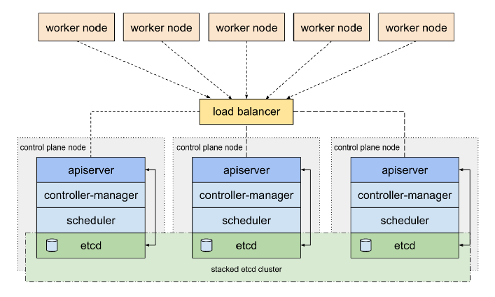


### Nodo Master

En él se ejecutan tres procesos:
- kube-apiserver:Es la API de Kubernetes, que valida y configura los datos para los Objetos (Pods, Services,etc)

- kube-controller-manager: Demonio integrador de todos los controladores que vigilan el estado del cluster para que 
siempre tenga el estado deseado. Controladores como el de replicación, de espacio de nombre, cuentas de servicio, etc.

- kube-scheduler: Realiza la función de carga de trabajo teniendo en cuenta topología de cluster, disponibilidad, 
rendimiento, capacidad, etc.


### Nodos NO Master

En ellos se ejecutan dos procesos:

- kubelet: Es el agente primario que se ejecuta en cada nodo. Para ello utiliza PodSpec(YAML o JSON) que describe pods. 
Con estos, garantiza que los contenedores descritos en esos PodSpec funcionen y en buen estado.

- kube-proxy: Implementa los servicios de red de Kubernetesen cada nodo.


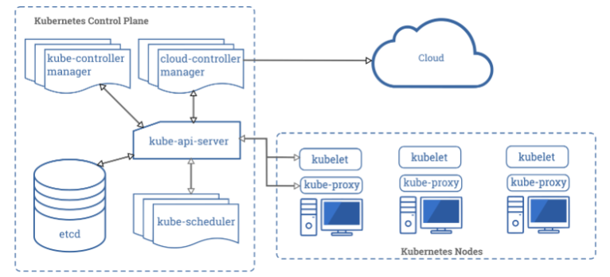

El máster es responsable de gestionar el clúster.

Cada nodo es una máquina virtual o una computadora física que funciona como una máquina de trabajo en un 
clúster Kubernetes.

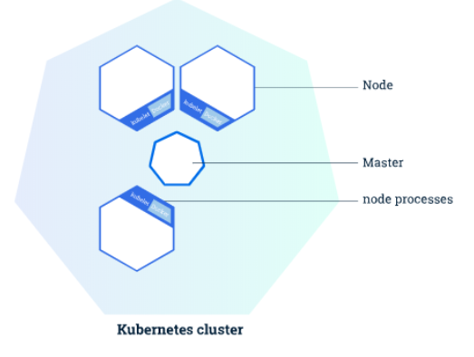

## Comenzando con Kubernetes
***

Hay dos formas de trabajar con Kubernetes:
- En forma de clúster de nodo único (MiniKube)
- En forma de clúster convencional
    - A través de Servicio Cloud (AWS, GCE, etc)
    - A través de máquinas “onpremise” donde crearemos el cluster.

La mejor forma de empezar con Kubernetes es de manera similar a como lo hicimos con Docker, con un clúster de nodo 
único: MiniKube

### Minikube

Implica instalar dos elementos:

- kubectl: También llamado kube control, que nos permite escribir comandos que entenderá Minikube
- minikube: El cluster de nodo único en sí mismo y que recibirá las instrucciones de kubectl.

Pasos de instalación en Ubuntu:

- Actualizamos el sistema e instalamos apt-transport-https y curl si no estuviera ya instalado.

```bash
sudo apt-get update
sudo apt-get install curl apt-transport-https
```

- Descargamos e instalamos Minikube:

```bash
curl -Lo minikube https://storage.googleapis.com/minikube/releases/latest/minikube-linux-amd64

chmod +x minikube

sudo mv minikube /usr/local/bin/
```

Si escribimos el comando:

````bash
minikube version
```` 
Debería aparecer la versión instalada de Minikube.

### kubectl

- Ahora vamos a instalar kubectl.
  - Descargamos

````bash
curl -LO https://storage.googleapis.com/kubernetes-release/release/`curl -s https://storage.googleapis.com/kubernetes-release/release/stable.txt`/bin/linux/amd64/kubectl
````
  - Marcamos el binario como ejecutable:

````bash
chmod +x ./kubectl
````

- Lo movemos a la ruta adecuada:
````bash
sudo mv ./kubectl /usr/local/bin/kubectl
````

- Si escribimos el comando:

````bash
kubectl version -o json
````
- Ahora, si estamos en una máquina virtual, deberíamos lanzar Minikube a partir del propio Docker, por lo que vamos a 
realizar 3 instrucciones para ello:

```bash
minikube config set vm-driver none
sudo systemctl enable docker
sudo systemctl start docker
```
- Si estás en WSL estos dos últimos pasos pueden dar error, en tal caso hay que editar el fichero 
**.profile** añadiento lo siguiente

````bash
wsl.exe -u root -e sh -c "service docker status || service docker start"

# porteriormente recargar el fichero 
source .profile
````

El último paso sería encender Minikube, que lanzará un proceso de descarga y mi configuración con lo que al final 
debería informarnos de que todo está correcto y de kubectl está configurado para usar minikube.

````bash
sudo apt-get install -y conntrack
minikube start --driver=docker # No se usa sudo ya que minikube no admite root. 
# (para pararlo: sudo minikube stop)
````

Un momento antes de que se inicie Minikube aparece un mensaje de que si queremos usar kubectl y minikube con nuestro 
usuario y no en modo root, debemos ejecutar las instrucciones siguientes:

````bash
sudo chown -R $USER $HOME/.kube $HOME/.minikube
````

Una vez que termine nos saldrá lo siguiente: 

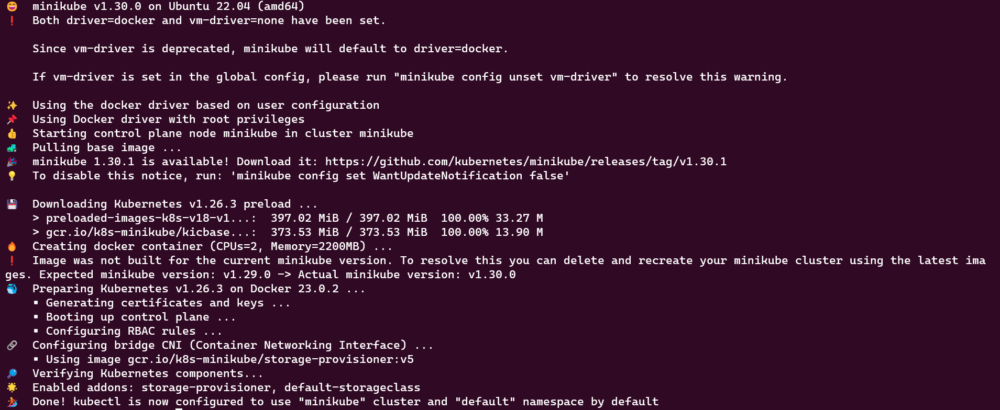

Ahora podemos realizar pasos básicos en Minikube: 

- Consultar la configuración actual de Minikube:
````bash
kubectl config view
````

- Revisamos el estado de los nodos (vamos, EL NODO):
````bash
kubectl get nodes
````

Hay que entender que los comandos de kubectl están diseñados de la siguiente forma:

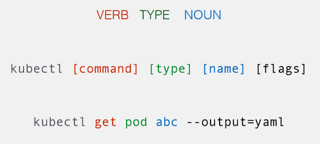

Toda la información la podemos consultar con kubectl, es la forma de acceder a kubernetes. 
Por ejemplo si queremos consultar todos los componentes: 

`````bash
kubectl get all # Consulta todos los componentes
kubctl get pods # Consulta todos los pods
`````

Para sacar más información podemos usar:

````bash
kubectl get all -o wide
````

### Dashboard Minikube

Podemos consultar el dashboard de Minikube para ver que estamos ejecuando y que tenemos levantado. 

````bash
minikube dashboard --url
````
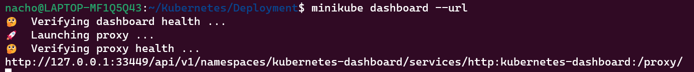

Al pegar la Url en el navegador veremos algo así:

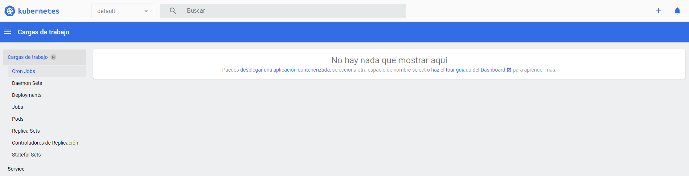

Si no carga la imagen puede ser problema del proxy y de que estéis usando Windows Subsystem Linux, en ese caso debes ejecutar

````bash
kubectl proxy
````

Y luego usar el 127.0.0.1:8001 como la ip y el puerto de la página. 

## Conceptos básicos
*** 

A continuación vamos a describir los conceptos básicos de Kubernetes.

En Kubernetes podemos distinguir entre Objetos y Controladores:

- [Objetos](#objetos):
    - [Pods](#pod)
    - [Services](#servicio)
    - [Volumes](#volume)
    - [Namespaces](#namespace)
- [Controladores](#controladores)
    - [ReplicaSet](#replicaset)
    - [Deployment](#deployment)
    - [StatefulSet](#statefulset)
    - [DaemonSet](#daemonset)
    - [Job](#job)

### Objetos

Los objetos representan los distintos aspectos del estado del sistema.

Son tomados por Kubernetes como el objetivo a mantener en todo momento.

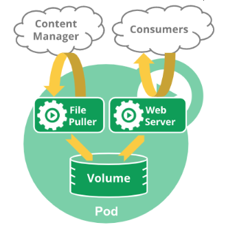

#### Pod

Es la unidad de ejecución básica de una aplicación Kubernetes

Han sido diseñados como entidades efímeras y desechables.
- Se crea por un controlador o directamente
- Se ejecuta en el nodo o en el grupo
- Cuando finaliza, el Pod se elimina.
- También se elimina si el nodo falla o faltan recursos.


Se pueden ejecutar de dos maneras:
- En un solo contenedor: Es el más común. Aquí Pod y contenedor es equivalente y Kubernetes administra los Pods en vez 
de los contenedores. 
- En múltiples contenedores que trabajan juntos: Por ejemplo compartiendo recursos, pueden formar una única unidad de 
servicio.

Cada Pod ejecuta una sola instancia de una aplicación. Si queremos más instancias, se debe usar varios Pods, uno para 
cada instancia. Esto es lo que se llama Replicación en Kubernetes.

Cada Pod tiene asignada una dirección IP única. Los contenedores dentro de un Pod se comunican entre sí usando localhost.

Cada Pod puede especificar un conjunto de volúmenes de almacenamiento compartido.  
Todos los contenedores del Pod pueden acceder para compartir datos. Estos persisten a pesar de algún contenedor tenga 
que reiniciarse.


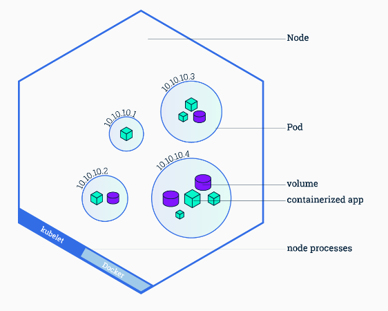


##### Hands On

Plantilla para un pod: 

````yaml
apiVersion: v1
kind: Pod
metadata:
  name: <nombre_del_pod>
  namespace: <nombre_del_namespace> 
spec:
  containers:
  - name: <nombre_del_contenedor>
    image: <usuario/nombre_imagen:version>
````

Ejecute algunas operaciones básicas con la siguiente guía: [Operaciones_basicas_pods](Ejemplos/01_Pods/Operaciones_basicas_pods.md)

Es ahora de probar lo aprendido, accede a los siguientes ejemplos para ejecutar una serie de pods [pinche aquí](Ejemplos/01_Pods)

### Servicio

Es la forma de mostrar una aplicación como un servicio de red. Es decir, define un conjunto lógico de Pods y cómo acceder 
a ellos. (microservicio)

El conjunto de Pods a los que apunta un Servicio viene determinado por un Selector.
   - El Selector apunta al servicio, y ya da igual que cambien los Pods que construyen ese servicio.

Un servicio es un objeto REST, similar a un Pod. Se puede hacer POST al servidor API para crear una nueva instancia a 
partir de la definición de un Servicio.

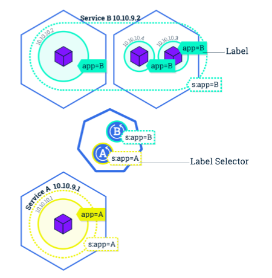

Aunque cada Pod tiene una dirección IP única, esas IP no están expuestas fuera del clúster sin un Servicio. 
Los servicios permiten que sus aplicaciones reciban tráfico.

Los servicios se pueden exponer de diferentes maneras especificándolo en type:
- **ClusterIP** (predeterminado): expone el servicio en una IP interna en el cluster.
- **NodePort** : expone el servicio en el mismo puerto de cada nodo seleccionado en el clúster usando NAT.
- **LoadBalancer** : crea un equilibrador de carga externo en la nube actual (si se admite) y asigna una IP externa fija 
al Servicio.
- **ExternalName** : expone el servicio usando un nombre arbitrario (especificado por externalNameen la especificación) 
al devolver un registro CNAME con el nombre. No se utiliza ningún proxy.

#### Hands On

Para entender como funciona vamos a ver un ejemplo comentado [Ejemplo_service_comentado.yml](Ejemplos/02_Services/00_Ejemplo_service_comentado.yml)

Ahora vamos a practicar con el siguiente ejemplo [01_Ejemplo_Service_Pods.yml](Ejemplos/02_Services/01_Ejemplo_Service_Pod.yml)
En el veremos como ejecutar un servicio y como comprobar si la web que ha levantado está funcionando. 

Si estamos con Windows Subsystem Linux, podremos tener problemas para abrirlo con el browser. Para ejecutarlo tendremos 
que generar una url del servicio:
````bash
minikube service nginx-service --url
````

### Volume

Como ya sabemos, por la propia definición de los contenedores, los ficheros son efímeros. Además si un contenedor falla,
se reinicia, lo cual también hace desaparecer los ficheros.

Para evitar esto y para poder compartir archivos entre contenedores que se ejecutan juntos en un Pod, se ha creado _Volume_.

Los volúmenes en Kubernetes:
   - Tienen duración explícita.
   - Sus datos se conservan entre reinicios de contenedores.
   - Admiten varios tipos. (awsElasticBlockStore, AzureDisk, AzureFile, cephfs, cinder, etc)
   - Los Pods pueden usar cualquier número de ellos simultáneamente.

### Namespace

Kubernetes permite disponer de varios clústeres virtuales respaldados por el mismo clúster físico. 
A estos clústeres se le llama **namespace**.

Es una forma de dividir recursos de clúster entre distintos usuarios a través de la cuota de recursos.

Los nombres de los recursos deben ser únicos dentro de un namespace, pero pueden estar duplicados entre distintos 
namespaces.

Se usa cuando hay muchos usuarios distribuidos en varios grupos.


De inicio, Kubernetes implementa tres namespaces:
- **Default**: el predeterminado para objetos sin otro namespace
- **Kube-node-lease**: objetos lease. Relacionado con la salud del nodo.
- **Kube-system**: Para objetos creados por Kubernetes
- **Kube-public**: namespacede acceso público, y reservado para el uso del clusteren
   el caso de aquellos recursos que deban ser visibles para todo el clúster.

Para consultarlos puedes usar:

````bash
kubectl get ns 
# o 
kubectl get namespaces
````

#### Hands On

Plantilla para un namespace:

````yaml
apiVersion: v1
kind: Namespace
metadata:
   name: <nombre_del_namespace>
````
Ejecute algunas operaciones básicas con la siguiente guía: [Operaciones_basicas_namespaces](Ejemplos/03_Namespaces/Operaciones_basicas_namespaces.md)

#### ¿Cuándo es conveniente usar namespace?

- **Gran número de objetos**: Cuando tenemos una gran cantidad de objetos (pods, deployments, services, etc.) es complicado 
saber a qué se dedican cada uno. Usar namespaces nos permite agrupar por algún criterio:

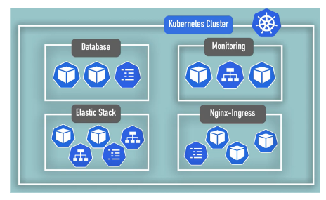

- **Varios equipos, conflicto de nombres**: Cuando varios equipos estén trabajando en un mismo cluster, podemos tener 
conflicto de nombres.


- **Varios equipos, conflicto de nombres**: La solución crear namespacescon el nombre del proyecto y así podremos usar 
los mismos nombres

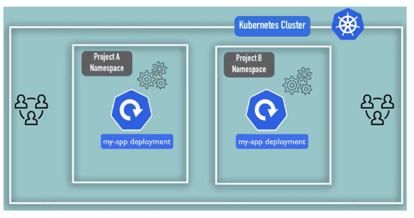

- **Distintos entornos**: Podemos tener diferentes entornos (Produccion, Desarrollo) que reutilicen los mismos elementos.

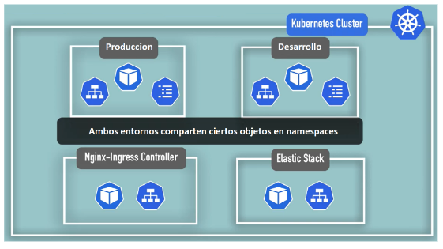

- **Despliegues Blue/Green**: Es un caso similar, pero ahora el entorno Blue será el entorno de producción actual y el 
Green el próximo.

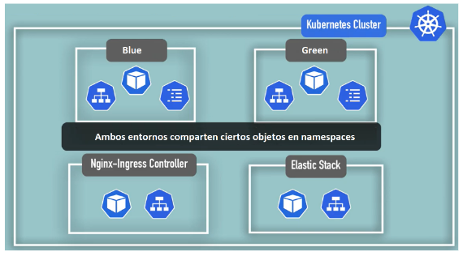

- **Limitar recursos y acceso a los namespaces**: Si queremos que distintos equipos tengan ciertos recursos o que no 
puedan acceder a los objetos de otro equipo.

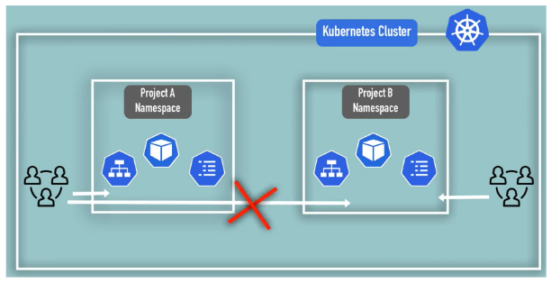

Por último, hay recursos como los volúmenes que no están asociados a ningún namespace. Algo parecido ocurre con los nodos.

- Si queremos ver qué recursos no están asociados a ningún namespace utilizaremos:

```bash
kubectl api-resources --namespaced=false
```

## Controladores

Los Controladores de Kubernetes proporcionan funcionalidades adicionales  a los objetos que hemos visto.


### ReplicaSet

Mantiene un conjunto estable de Pods replicados en ejecución en un momento dado.

Garantiza la disponibilidad de un número de Pods idénticos.

Su definición se realiza a través de campos como el selector del Pod, el número de réplicas y la plantilla de Pod.

Además del selector del Pod, el Pod tendrá especificado el controlador por el campo metadata.ownerReferences

Como el concepto de Deployment, gestiona ReplicaSets, es posible que se utilice más Deployment que ReplicaSets.

### Deployment

Describe el estado deseado para un conjunto de Pods y ReplicaSets y va cambiando del estado real al estado deseado con 
velocidad controlada.

Son típicos estos usos:
- Desplegar un ReplicaSet, que a su vez, creará Pods.
- Declarar el nuevo estado de los Pods, así cada ReplicaSet actualizará con velocidad controlada el nuevo estado.
- Revertir a un estado anterior.
- Detener el Deployment para aplicar correcciones y luego reanucarlo.
- Limpiar ReplicaSet santiguos que ya no se necesitan.

#### Hands On

La plantilla para un Deployment: 

````yaml
apiVersion: apps/v1
kind: Deployment
metadata:
  name: <nombre_del_deployment>
  namespace: <nombre_del_namespace>
spec:
  selector:
    matchLabels:
      <etiqueta1>: <etiqueta2>  
  replicas: <numero_de_replicas>
  template:
    metadata:
      namespace: <nombre_del_namespace>
      labels:
        <etiqueta1>: <etiqueta2>
    spec:
      containers:
      - name: <nombre_del_contenedor>
        image: <usuario/nombre_imagen:version>
````

En el siguiente enlace puede consultar un ejemplo de un deployment comentado. Pinche [aquí](Ejemplos/04_Deployment/00_Ejemplo_deployment_comentado.yml) 

### StatefulSet

Es el controlador que administra aplicaciones con estado. Es decir, a diferencia de Deployment, StatefulSet mantiene una
identidad fija para cada uno de sus pods.

Son perfectos para:
- Identificadores de red únicos y estables
- Almacenamiento estable y persistente
- Escalado y despliegue ordenado
- Actualizaciones ordenadas y automatizadas

Funcionan de la misma forma que todos los controladores: Se especifica un estado deseado y el StatefulSet realiza las 
modificaciones necesarias para llegar a él desde el estado actual.

No está disponible antes de la versión 1.5.

Eliminar un StatefulSet no elimina los volúmenes asociados..

Los componentes de un StatefulSetson:
- Un servicio Headless(sin cabeza) que permite acceder a los Podsdirectamente a través de la red.
- El StatefulSet propiamente dicho
- Un volumeClaimTemplates que proporcionará almacenamiento estable usando PersistentVolumes


Debe coincidir el selector de Pod del campo spec.selector en el StatefulSet con el campo spec.template.metadata.labels
del Pod.

A cada Pod de un StatefulSet se le añadirá un número ordinal entero para darte identidad única:

````txt
<nombre del statefulset> - <ordinal>
````

A continuación se muestra como se pueden configurar los nombres a patir de un StatefulSet que se llame web y un servicio 
Headless que se llame nginx

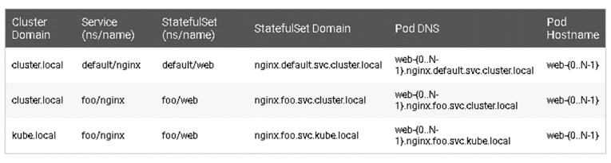

Hay que recordar que Kubernetes crea un volumen persistente para cada VolumeClaimTemplate. Si no especifica la clase 
de almacenamiento se utilizará la clase predeterminada.

Estos volúmenes persistentes no se eliminan cuando se eliminan los Pods o los StatefulSet. Se deben eliminar manualmente.

### DaemonSet

Garantiza que todos los nodos (o al menos algunos) ejecuten una copia de un Pod.

Cuando se agregan nodos al clúster, el Daemon agrega Pods a ellos.

Cuando se eliminan nodos del clúster, el Daemon recolecta como basura esos nodos.  
Por lo que eliminar un Daemon también eliminará los Pods que creó.

Los usos principales:
- Daemon de almacenamiento de clusteren cada nodo
- Daemon de recopilación de registros en cada nodo.
- Daemon de monitorización de cada nodo.

En su forma más simple, hay un DaemonSet (todos los nodos) para cada tipo de Daemon. En los más complejos, 
se pueden utilizar múltiples DaemonSets para un Daemon.

Se suelen describir, como los anteriores , en ficheros YAML

### Job

Un Job crea uno o más Pods y se asegura que un número específico de ellos termine con éxito.

Cuando este número de Pods se completa, el Job se completa, se elimina, y la eliminación de un trabajo limpiará los 
Pods que creó.

Si no se alcanza esa cifra, el Job creará nuevos Podshasta alcanzarla.

***

Kubernetes implementa los servicios de varias formas.

La más sencilla es la que utiliza pods, deployments y la propia definición del servicio.

¿Cómo lo hace?
- Uniendo todos los elementos a través de selectores:

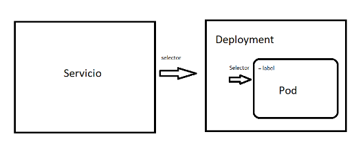

Esta unión se puede dar dentro de un mismo fichero .yml o en varios .yml  que se lanzan juntos. 
Por ejemplo con instrucciones como estas:

```bash
kubectl apply -f ./my1.yaml -f ./my2.yaml
kubectl apply -f ./dir
```

Si el fichero es el mismo .yml, sólo hay que tener en cuenta que los servicios se definen antes que los deployments y 
que tie separados por ---

## Ejercicio app formulario kubernetes

Para la realización de este ejercicio vamos a utilizar la app creada en el apartado de docker [docker_app_python_formulario](../02_Docker/Ejemplos/Ejemplos_DockerFile/docker_app_python_formulario)

Tendremos que crear una imagen en nuestro DockerHub con el contenido de esa app. 

````bash
docker build -t isotomor/app_python_formulario .

docker push isotomor/app_python_formulario
````

El siguiente paso es crear el yml para que despliegue esta app, se facilita [aquí](Ejemplos/ejemplo_app_formulario_python.yml) 

Una vez que lo tengamos en nuestro servidor tendremos que desplegarlo. 

````bash
 kubectl apply -f ejemplo_app_formulario_python.yml
````

Recordamos que esto nos generará un pod y un service. 

Para poder comprobar que funciona, podríamos abrir la url en el navegador o con curl. 
La url será la IP del nodo más el puerto de salida que hemos definido. 
Para comprobar la Ip ponemos 

````bash
minikube ip 
# o 
kubectl get nodes # Consultamos la internal ip de nuestro nodo. 
````

En mi caso sería "http://192.168.49.2:30060"

Si estamos en Windows Subsystem Linux, tendremos que salir del fireware. Para ello consultaremos la url del servicio 
creado y podremos usar esta web en nuestro navegador:
````bash
minikube service formulario-python --url
````

Si no te acuerdas del nombre del servicio, puedes usar este comando:
````bash
minikube service --all
````


# Un poco mas alla en Kubernetes

Hemos visto hasta ahora que los Pods son la forma de definir los contenedores que ejecutarán un servicio.

Básicamente los hemos visto que cargan una imagen y tienen una etiqueta pero está claro que pueden hacer mucho más:

- Pueden tener más de un contenedor
- Pueden especificar una política de reinicio con restartPolicy(puede ser Always, On Failureo Never)
- Pueden lanzar comandos Shell, ya sea a través de commando bien a través de args
- Pueden definir el puerto del contenedor, una información adicional que le dice al sistema donde se expone el 
contenedor. Pero esto es meramente informativo. No es el puerto por donde saldrá el servicio.

## Mas sobre Pods

###  Pruebas de container (Sondas)

Al igual que hacíamos en docker, los pods pueden tener pruebas que validen que todo ha ido bien. En kubernetes se 
denominan Probes. (Sondas)
- Comprueban si el entorno es correcto
- Se interactúa con el contenedor en busca de resultados

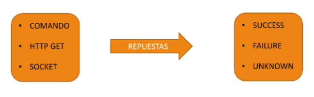

Hay tres tipos de sondas:
- **Comando**: Lanzan un comando de Shell o activan un script interno de la aplicación que permite comprobar si todo está 
bien.
- **Http get**: Es la sonda perfecta para las aplicaciones web. Si no accede a una página, algo no anda bien.
- **Socket**: Si se puede acceder por algún puerto. Si responde a un socket, las cosas están
   bien.

Estas sondas generan respuestas que pueden ser:
   - Correcto (Success)
   - Fallo (Failure)
   - Desconocido (Unknown)

Además de esto, se pueden también categorizar respecto al comportamiento que van a tener respecto al contenedor:

- **Liveness**: Permiten saber si nuestro contenedor está funcionando. Si no responde, Kubernetes lo elimina. 
Luego, dependiendo de la política de restart. (**RestartPolicy**)

- **Readiness**: Si el contenedor funciona pero el programa no. Es decir, no está lista. La estrategia es quitar IP 
del contenedor de la lista del servicio. Lo dejan inaccesible.

- **Startup**: Comprueban si la aplicación del contenedor ha arrancado bien. Mientras se ejecuta esta, no pueden 
ejecutarse las otras 2.

#### Ejemplo de Sonda Comando 

Esta lanza un comando en la shell directamente. 

Puedes encontrar un pod con esta sonda [aquí](Ejemplos/05_Sondas/pod-sonda-command.yaml) 

En este ejemplo veremos que la ruta /etc/prueba/ no existe, por lo que fallará costantemente hasta dar un error 
en el pod CrashLoopBackOff. 

#### Ejemplo Sonda liveness http

Para este ejemplo de sonda vamos a usar los documentos de la carpeta [sonda liveness de http](Ejemplos/05_Sondas/sonda_liveness_http)

Tendremos que construir el Dockerfile, para ello hay que ir al directorio donde se encuentra y escribir:

````bash
sudo docker build -t isotomor/sonda-web .
````

Haríamos un docker login para entrar en el repositorio de Dockerhub
````bash
sudo docker push isotomor/sonda-web
````

Y ahora el deployment:
````bash
kubectl apply -f .
````

Podríamos comprobar que todo va bien, incluso visitar el navegador.

Pero ahora, vamos a trastear con el pod:

Entramos dentro del pod:
````bash
kubectl exec -it <nombre del pod> /bin/bash
````

Nos movemos hasta el httdocs para eliminar el sonda.html

Cuando hagamos un describe del pod, veremos que ha saltado por los aires, pero inmediatamente Kubernets lo vuelve a 
levantar.

````bash
kubectl describe pod <nombre del pod>
````

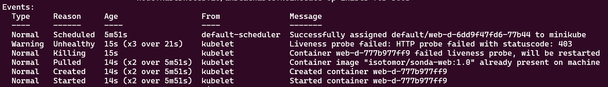

#### Ejemplo Sonda Readiness

Sonda de tipo readiness

 Este tipo comprueba si el servicio que hay dentro del pod está funcionando. 
 Kubernetes lo quitará del endpoint si no está funcionando.

Para este ejemplo vamos a usar el contenido de la siguiente carpeta [sonda_readlines_tipo_socker](Ejemplos/05_Sondas/sonda_readines_tipo_socket))

En este caso es de tipo Socket
````bash
sudo docker build -t isotomor/tomcat .
````

Comprobamos:
````bash
sudo docker images
````

La llevamos a DockerHub (Previamente hemos hecho dockerlogin)
````bash
sudo docker push isotomor/tomcat
````

Ahora toca crear todos los componentes, deployment y servicio.
````bash
kubectl apply -f .
````

Ahora podemos comprobar con kubectl describe <nombrepods>

También podemos acceder a la web (Para acceder ver casos anteriores): 

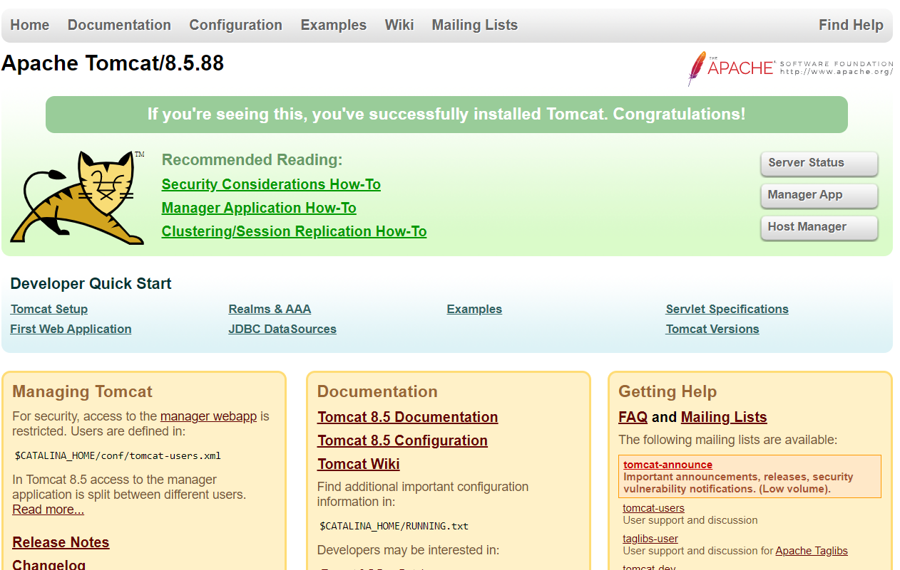


###  Ciclo de vida de un Pod.

Los pods se definen, nacen, se replican y mueren. Esto es un típico ciclo de vida de un pod.

Pero podemos hacer algo más con ellos ya que Kubernetes nos permite realizar acciones en dos momentos importantes en la 
vida de un Pod: tras comenzar (postStart) y antes de morir (preStop)

- **postStart** es un evento que se envía inmediatamente después de que se crea el contenedor.
  - Se ejecuta de forma asincrónica en relación con el código del contenedor, Kubernetes bloquea la ejecución del 
  contenedor hasta que se completa el controlador postStart.
  - El estado del contenedor no se establece en RUNNING hasta que se completa el controlador postStart.
  
- **preStop** se envía inmediatamente antes de que finalice el contenedor. Kubernetes bloquea el contenedor hasta que 
se complete el controlador preStop, a menos que expire el período de gracia del pod.

###  Recursos.

Al igual que en Docker asignábamos recurso mínimos para un contenedor y recursos límite. (Recordamos con resources y 
después reservationy limits)

Ahora es exactamente igual, salvo que la reserva de recursos mínima se llama **request**

## Mas sobre Deployments
***

Hasta ahora hemos explorados los pods en ejecución. Los pods son muy útiles para proporcionar estructura a los 
contenedores, pero si un pod falla, no se reiniciará.

Para remediar esto, Kubernetes creó un objeto llamado Deployment. Las implementaciones son especificaciones para 
ejecutar uno o más pods y métodos para mantenerlos en ejecución.

- Para ejecutar una implementación de Kubernetes desde la línea de comandos:

````bash
kubectl run nginx --image=nginx --port 80
````

El comando run realizó automáticamente algunas cosas:
- buscó un nodo adecuado para ejecutar el pod
- programó el pod para ejecutarse en ese nodo
- configuró el clúster para reiniciar / reprogramar el pod cuando fuera necesario

Para verificar que el comando creó una implementación:

````bash
kubectl get deployments
````

- Para ver los pods creados por la implementación:

````bash
kubectl get pods
````

### Cómo funcionan las deployments. 

Si un pod creado por una implementación (deployments) llegara a fallar, la implementación lo reiniciará automáticamente. 
Para ver esto en acción, eliminamos el pod directamente:

```bash
kubectl delete pod $( kubectl get pods --no-headers=true | awk '{ print$1;}')
```
El pod debe eliminarse correctamente. Ahora esperamos un momento o dos y revisamos el pod nuevamente:

```bash
kubectl get pods
```

Observamos que el módulo se está ejecutando nuevamente. Esto se debe a que la implementación reiniciará un pod cuando 
falle.

Para eliminar por completo el pod y los contenedores en ejecución, debe eliminar la implementación:

```bash
kubectl delete deployment nginx
```

###  Los archivos yml de implementación

Los archivos de implementación especifican un objeto de implementación de Kubernetes. 
Estos objetos están definidos por la API de Kubernetes. Un ejemplo:

```yaml
apiVersion: apps/v1
kind: Deployment
metadata:
  name: nginx-deployment
spec:
  template:
    spec:
      containers:
      - name: nginx
        image: nginx

```

### apiVersion: apps/v1

Los api Version especifican la versión de la API para su uso. Los objetos de la API se definen en grupos.

El objeto deploymento pertenece al grupo apps de la API. Los objetos de grupo pueden ser declaradas alpha, beta o stable:

- **alpha**: puede contener errores y no hay garantía de que funcione en el futuro.
> Ejemplo:(object)/v1alpha1

- **beta**: sigue siendo algo inestable, pero lo más probable es que entre en las API principales de Kubernetes. 
> Ejemplo:(object)/v1beta1

- **stable** Solo se recomienda el uso de versiones estables en sistemas de producción.
> Ejemplo:apps/v1

###  kind: deployment

Un kind declara el tipo de objeto de Kubernetesque se describirá en el archivo Yaml. Kubernetesadmite los 
siguientes objetos de 'tipo':
- componentstatuses
- configmaps
- daemonsets
- Deployment
- events
- endpoints
- horizontalpodautoscalers
- ingress
- jobs
- limitranges
- Namespace
- nodes
- pods
- persistentvolumes
- persistentvolumeclaims
- resourcequotas
- replicasets
- replicationcontrollers
- serviceaccounts
- services

### metadata
El metadata declara datos adicionales para identificar de forma única un objeto Kubernetes. Los metadatos clave que se 
pueden agregar a un objeto son:
- labels: pares clave-valor restringidos por tamaño utilizados internamente por kubernetes para seleccionar objetos en 
función de la información de identificación
- name: el nombre del objeto (en este caso, el nombre de la implementación)
- namespace: el nombre del espacio de nombres para crear el objeto (implementación)
- annotations: pares clave-valor no estructurados grandes que se utilizan para proporcionar información no 
identificativa para objetos. k8s no puede consultar anotaciones.
- spec: el estado deseado y las características del objeto. spectienetres subcampos importantes:
- replicas: la cantidad de podsque se ejecutarán en la implementación
- selector: las etiquetas de podque deben coincidir para administrar la implementación
- template: define cada pod(contenedores, puertos, etc.)

### Servicios y deployments

Los services exponen los deployments como hemos visto.

Por lo que básicamente indican el puerto y protocolo por el que va a salir el servicio.

En la especificación de los puertos por parte del servicio, tenemos:
- nodePort: Permite que el servicio sea visible fuera del clúster de Kubernetes mediante la dirección IP del nodo y el 
número de puerto declarado en esta propiedad. El servicio también debe ser del tipo NodePort(si no se especifica este
campo, Kubernetes asignará un puerto de nodo automáticamente).

- port: Expone el servicio en el puerto especificado internamente dentro del clúster. Es decir, el servicio se vuelve 
visible en este puerto y enviará las solicitudes realizadas a este puerto a los pods seleccionados por el servicio.

- targetPort: Este es el puerto del podal que se envía la solicitud. Su aplicación debe estar escuchando las 
solicitudes de red en este puerto para que el servicio funcione. Coincide con containerPort si se ha definido.

Sin embargo hay un campo llamado type que hay que remarcar y que  determina cómo se expone el Servicio.

El valor predeterminado es **ClusterIP** y las opciones válidas son ExternalName, ClusterIP, NodePorty LoadBalancer.

- **ClusterIP(predeterminado)**: expone el servicio en una IP interna en el cluster.
- **NodePort**: expone el servicio en el mismo puerto de cada nodo seleccionado en el clúster usando NAT.
- **LoadBalancer**: crea un equilibrador de carga externo en la nube actual (si se admite) y asigna una IP externa 
fija al Servicio.
- **ExternalName**: expone el servicio usando un nombre arbitrario (especificado por external Name en la especificación) 
al devolver un registro CNAME con el nombre. No se utiliza ningún proxy.


> ¿Qué diferencia un Deployment de un Service?

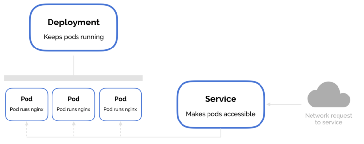

### Hands On

```
Ejemplos de ymls con Pods, Deploymentsy Services
```
```
Ejercicios de implementación de Pods, Deploymentsy Services
```


# Volumenes
***

Los volúmenes en Kubernetes, son similares a los de Docker.

Se definen dentro de la declaración de Pod. ¿Qué problema puede originar eso?

Sin embargo, hay varios tipos de volúmenes en Kubernetes:

- **emptyDir** (Directorio temporal que morirá con el Pod)
- **hostPath** (volúmenes asociados a un directorio del disco, local)
- **nfs** (volúmenes asociados a un cluster completo)
- Discos de Amazon, de Azure.

Ya hemos visto que uno de los problemas que generan **los volúmenes** es que **son efímeros, desaparecen con el pod.**

Para evitar que se pierda información entre desaparición y desaparición, Kubernetes aporta el concepto de 
**Volumen Persistente**.

Un Volumen Persistente es un volumen de almacenamiento en el sistema, pero que su ciclo de vida es independiente de los 
podsque lo usan.

Además, a este concepto se une el de **Persistent Volume Claim**, que son las solicitudes de pods para obtener un 
volumen. Cuando se obtiene, el volumen se monta en una ruta específica en el pod.

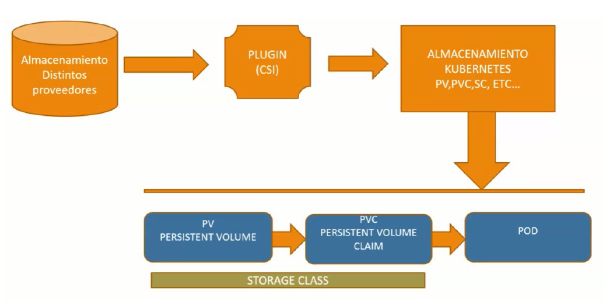

En definitiva:
- Un **PersistentVolume(PV) es** el volumen "físico" en la máquina host que almacena sus datos persistentes.
- Un **PersistentVolumeClaim (PVC)** es una solicitud para que la plataforma cree un PV para nosotros, y nosotros 
adjuntemos un PV a nuestros podsa través de un PVC.

Existen una gran cantidad de volúmenes persistentes, estos volúmenes persistentes además tienen varios tipos de acceso.
- ReadWriteOnce
- ReadOnlyMany
- ReadWriteMany

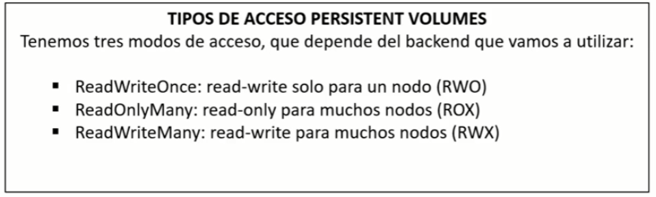

Por último también existen varios tipos de estrategias cuando se decide reciclar un volumen persistente.

- Retain
- Recycle
- Delete

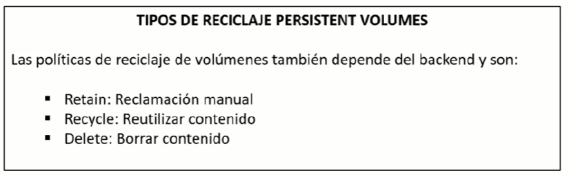

## Volumentes locales (Pod)
*** 

De forma análoga a como se hizo en Docker, hay dos partes:
- Parte volumeMounts, que se incorpora en cada definición de contenedor. Al mismo nivel que image.
- Parte volumes, que está a nivel de containers, dentro del specde un Deployment.

### volumeMounts

En toda definición de volúmenes hay elementos que siempre aparecen:
- mountPath: Lugar del contenedor donde se va a montar ese volumen
- name: el nombre
- Puede tener un ReadOnly para especificar solo lectura

### volumes

En esta parte, se especifica el montaje del volumen.

- name: indica el nombre del volumen que coincide con el de VolumeMounts

- Tras esto viene un tipo de volumen, que puede ser:
  - **hostPath** : asociado a un directorio real del sistema de ficheros Este directorio real se define en path. 
  Tiene que tener permisos de lectura y  escritura.
  - **emptyDir** : un directorio temporal que se eliminará cuando se termine el pod.

### Hands On

En el siguiente bloque se realizarán las prubeas con volumenes. 

Los ejemplos propuestos son los siguientes [ejercicios_volumenes](Ejemplos/06_Volumenes/01_volumenes)

## Volumentes persistentes (PV)

Pero crear así los volúmenes puede llevar al problema de que se pueden crear duplicaciones de volúmenes y no se 
cumpliría el cometido.

Para solucionar esto, se definen los volúmenes persistentes.

Un PersistentVolumese crea por separado, en un yaml.
- Parte metadata: donde se especificará el nombre
- Parte spec: donde se definirán las características:
  - storageClassName
  - capacity
  - accessModes
  - hostPath
- Para crear el pv. Creamos el directorio:
- 
````bash
sudo mkdir /mnt/data
kubectl apply -f pv.yaml
kubectl get pv -o wide
````

Para que el PV se pueda acceder de forma independiente, lo que el Pod debe incorporar es un PersistentVolumeClaim(PVC)

Es decir: El Pod no hace referencia directa al PV, sino que la hace a través del PVC. Porque el Pod sólo define el 
PVC en la sección volumes.

Es obligatorio que:
- El campo storageClassName del PV y del PVC tengan el mismo valor.
- El campo accessMode del PV y del PVC tengan el mismo valor

Para crear el pvc:

```bash
kubectl apply -f pvclaim.yml
kubectl get pvc
```

Observamos que bound está asociado a un volumen determinado
Si ahora hacemos...

````bash
kubectl get pv # (ahora me dice que está unido)
````

Hemos dicho que el Pod hace referencia solamente al PVC

Esto se hace en la definición: volumes (la que está a la altura de containers)
- Necesitamos un name, el que queramos
- Definir el PersistentVolumeClaim, cuyo claimNamedebe coincidir con el que hemos definido en el yaml del PVC

Después, dentro de la definición del container, especificaremos un volumeMounts que hará referencia a ese persistent 
volumen claim.

- El name del volumeMounts debe coincidir con el name del volumes.

Creamos el pod
````bash
kubectl apply -f pod-pvc.yml
kubectl get pvc
kubectl get pod
````

## Hands On 

Ejemplos de implementación de volúmenes. 
Volumenes NFS

# Variables de entorno

Es el objeto más sencillo para conectarnos al exterior e insertarle datos a  nuestros pods.
- En el yaml **Var1.yaml**. Vemos que tenemos unas variables que se añaden a un contenedor.
````bash
kubectl apply -f var1.yaml
kubectl exec -it var-ejemplo -- /bin/bash
````

- Una vez dentro, podemos hacer **print env** y vemos las variables.

Haciendo un ejemplo más real: Vamos a utilizar una imagen de Docker hub de Mysql.

- Vamos a crear variables para que se asignen a las variables de entorno de la propia imagen.

Creamos con apply
````bash
kubectl apply -f mysql.yaml
````

Y ahora mismo tendremos un podfuncionando
````bash
kubectl exec -it <nombre del pod> /bin/bash
````

Si ahora hacemos un print env, vemos los datos.  
> (Estos valores como la passwordse ocultarán con secretos)

- Ahora nos conectamos a mysql. Metemos la password y ya estaremos dentro y podremos ver la base de datos.

> Para acceder ponemos `mysql -u root -p` y la contraseña. 

- ¿Qué pasa si ahora tenemos muchas variables?

# Config-Map

Config-Map nos permite crear matrices de asociación. Estas matrices permiten desacoplar también ciertos elementos 
constantes que todo código tiene. Es decir llevamos el desacoplamiento al máximo.

Es un concepto similar al que usan las aplicaciones que manejan varios idiomas. Por un lado están los ficheros con las 
equivalencias clave-valor y por otro, los lugares donde están las claves que serán sustituidas.

Los datos en los Config-Mapno se van a cifrar. Si la información es sensible es preferible utilizar secretos.

El principal uso de los Config-Mapes en el campo de la configuración. Pero  también se puede aplicar en otros entornos, 
en general aquellos que necesiten asociar claves únicas a valores únicos.

Hay varias formas de crear Config-Map:
- De forma imperativa (literales)
- Desde un archivo
- Desde un archivo entorno Docker
- Desde directorios.

## De forma imperativa

```bash
kubectl create configmap cf1 --from-literal=usuario=usu1 --from-literal=password=pass1
```
Para ver lo que se ha hecho

````bash
kubectl describe cm cf1
````
Esto lo pone de forma literal. Si ahora hacemos

```bash
kubectl get cm cf1 -o yaml
```
Nos construye el yaml para ese configmap

## Config-Map desde un archivo.

- Si vemos las variables que tenemos en el fichero [datos_mysql.properties](Ejemplos/08_ConfigMaps/01_desde_fichero)
````bash
cat datos_mysql.properties
````
- Y ahora:
````bash
kubectl create configmap datos-mysql --from-file=datos_mysql.properties
kubectl get cm
````

Nos aparece, pero nos dice que tiene solo 1 dato. Al hacerlo desde FromFile, lo carga todo como 1 solo valor.
````bash
kubectl describe cm datos-mysql
````

Ahora veremos como creamos un podcon esto:
````bash
kubectl apply -f pod_desde_fichero.yaml
kubectl exec -it podcm /bin/bash
````

Y si hacemos un print `env` parece correcta, pero está junta

## Cargar variables con ConfigMap

Lo anterior no valdría para cargar variables de entorno, sí que por ejemplo valdría para  meter un json, u otros fichero 
necesarios.

Es fácil solucionarlo:

```bash
kubectl create configmap datos-mysql-env --from-env-file datos_mysql.properties
```

Si ahora hacemos:
````bash
kubectl get cm datos-mysql-env -o yaml
````
Y ya nos sale.

Ahora para crear el Pod, lo que cambia es valueFrom catpor envFrom

Como se ve en el [fichero](Ejemplos/08_ConfigMaps/02_desde_ConfigMap) 


## Configurar un MySQL con ConfigMaps

Si vemos el fichero, [mysql.yaml](Ejemplos/08_ConfigMaps/03_Mysql_con_configmaps/mysql.yaml) analizamos cómo lo implementa.

## Config-Maps y Volumenes

Hay una característica muy importante de los configmaps: Nos permiten dejarlos dentro de un lugar de nuestro contenedor 
como si fuera un fichero.

Vemos el fichero [configmap.yaml](Ejemplos/08_ConfigMaps/04_configmap_y_volumenes/configmap.yaml)

Vemos ahora el pod
- En el vemos que el mount está en /etc/config-map

````bash
kubectl apply -f .
kubectl describe cm config-volumen
````

Ahora vemos el contenedor
````bash
kubectl get pod
kubectl exec -it pod-vol-config sh
````

Ahora podemos comprobar que se ha guardado la información del configmap en el volumen que hemos montado:

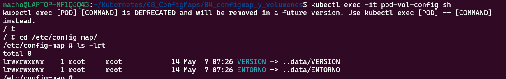

## Otras formas de crear configmaps

### Config-Map desde un archivo entorno Docker.

Crearemos un archivo de claves-valor: [datos_cmap.txt](Ejemplos/08_ConfigMaps/05_configmap_entorno_docker/datos_cmap.txt)

Creamos el config-map:
````bash
kubectl create configmap cmapfile2 --from-env-file=./datos_cmap.txt
````

Para ver qué tiene configmap:
````bash
kubectl describe configmap cmapfile2
kubectl get configmap cmapfile2 -o yaml
````

### Config-Map a partir de directorios:

Crearemos una [carpeta](Ejemplos/08_ConfigMaps/06_configcarpeta) con dos archivos de claves-valor: datos_cmap1.txt y 
datos_cmap2.txt  y un tercero en formato linux

Creamos el config-map:
````bash
kubectl create configmap fconfigmap --from-file=06_configcarpeta
````
Ahora el --from-file ha apuntado a la carpeta directamente:

Para ver qué tiene configmap:

```bash
kubectl describe configmap fconfigmap
```

Tendríamos un problema con los saltos de linea:

```bash
kubectl get configmaps fconfigmap -o yaml
```

## Acceso a través de variable de entorno:

Vamos de realizar un configmap a través de un literal llamado literal-config


```bash
kubectl create configmap literal-config --from-literal=city=madrid --from-literal=shipping=free

kubectl get configmaps literal-config -o yaml
```

Si ahora quisiéramos acceder a él desde un yaml, tendríamos que usar env:

````yaml
- name: ENV_CITY
    valueFrom:
       configMapKeyRef:
          name: literal-config
          key: city
````

Podríamos definir más de uno a la vez:

```yaml
env:
- name: ENV_CITY
    valueFrom:
       configMapKeyRef:
          name: literal-config
          key: city
- name: ENV_SHIPPING
    valueFrom:
       configMapKeyRef:
          name: literal-config
          key: shipping
```          

Incluso podríamos acceder a todas a la vez:
````yaml
apiVersion: v1
kind: Pod
metadata:
    name: configmap-pod-3
spec:
    container:
       - name: cm-container- 3
          image: alpine
          imagePullPolicy: IfNotPresent
          command: ["/ bin/ sh" , "-c", "env"]
          envFrom: # Configuración
          - configMapRef:
             nombre: literal-config
    restartPolicy: Never
````    

***

Otros comandos:

- Obtener una lista de todos los Config-Map:
````bash
kubectl get cm
````    

Borrar un Config-Map:
````bash
kubectl delete cm literal-config
````

Borrar un Config-Map forzando:
````bash
kubectl delete cm literal-config --force--grace-period=0
````

# Secretos

Los **secretos** de Kubernetes permiten almacenar y administrar información confidencial, como contraseñas, tokens OAuth 
y claves ssh.

Poner esta información en un **secret** es más seguro y flexible que ponerlo literalmente en la definición de un pod o 
en una imagen de contenedor, ya que los secretos se encriptan.

Hay secretos que crea directamente Kubernetes con credenciales para el acceso a la API. Kubernetes modifica 
automáticamente los Pods para añadirlos.

Pero nosotros también podemos crear secretos personalizados.

Por ejemplo, algunos pods necesitan acceder a bases de datos que tiene  usuario y contraseña:

Vamos a crear dos ficheros, uno de usuario y otro de contraseña

Ahora crearíamos el secreto, casi del mismo modo que creábamos el Config-Map.

Si creáramos el secreto desde un literal, tendremos que tener cuidado de que,  si la contraseña lleva caracteres 
especiales, tendremos que colocar la  contraseña entre comillas simples

Esto no se aplica cuando creamos un secreto desde un archivo.


````bash
# Crear archivos necesarios para el resto del ejemplo.
echo -n 'admin' > ./username.txt
echo -n '1f2d1e2e67df' > ./password.txt

kubectl create secret generic db-user-pass --from-file=./username.txt --from-file=./password.txt
````

Para verificar que hemos creado un secreto:

````bash
kubectl get secrets
````

Observamos que el tipo es Opaque. Es lo que nos advertiría que esto es un secreto.

- También podríamos crear un secreto a partir de un fichero, por ejemplo secret.yaml:

```yaml
apiVersion: v1
kind: Secret
metadata: 
  name: mysecret 
type: Opaque
data:
  username: YWRtaW4=
  password: MWYyZDFlMmU2N2Rm
```

y para crearlo:

````bash
kubectl apply -f ./secret.yaml
````

Para obtener el secreto:

````bash
kubectl get secret db-user-pass -o yaml
````

Para editar un secreto:

````bash
kubectl edit secrets db-user-pass
````

Se abrirá una ventana de edición, con un yaml, donde podremos cambiar lo que necesitemos.

Para usar un secreto en pod, se utiliza una estructura volumes y volumeMounts:

```yaml
apiVersion: v1
kind: Pod
metadata:
  name: mypod
spec:
  containers:
    - name: mypod
      image: redis
      volumeMounts:
        - name: foo
          mountPath: "/etc/foo"
          readOnly: true
      volumes:
        - name: foo
          secret:
            secretName: db-user-pass
```       

 Si queremos que el secreto tenga un tipo de permiso determinado, hay que especificarlo con valor por defecto: 0644 mode. 
 Si no se especifica tendrá el

````yaml
apiVersion: v1
kind: Pod
metadata:
  name: mypod
spec:
  containers:
    - name: mypod
      image: redis
      volumeMounts:
        - name: foo
          mountPath: "/etc/foo"
          readOnly: true
      volumes:
        - name: foo
          secret:
            secretName: db-user-pass
            mode: 511 # Tipo de terminado de permisos. 
````            
El 256 equivale a 0400 en octal. 511 esequivalente a 0777, etc.


Podemos también crear secretos como variables de entorno:
````yaml
apiVersion: v1
kind: Pod
metadata:
    name: secret-env-pod
spec:
    containers:
    - name: mycontainer
       image: redis
       env:
          - name: SECRET_USERNAME
             valueFrom:
                secretKeyRef:
                   name: db-user-pass
                   key: username
          - name: SECRET_PASSWORD
             valueFrom:
                secretKeyRef:
                   name: db-user-pass
                   key: password
    restartPolicy: Never
````

## Otras consideraciones:

Dentro del contenedor, el secreto se puede consumir como si fuera una variable de entorno.

Cada secreto está limitado a 1MiB de tamaño.Esto es para desalentar la creación de secretos muy grandes que agotarían 
la memoria del apiserver y el kubelet. Sin embargo, la  creación de muchos secretos más pequeños también podría agotar 
la memoria.

Los secretos deben crearse antes de que se consuman en pods como variables de entorno a menos que estén marcados como 
opcionales.

Las referencias **secretKeyRef** a claves que no existan en un secreto con nombre evitarán que el podse inicie.

## Hands On: Ejemplos de Secretos

Vamos a ver ahora, cómo modificar el código de la Aplicación Java para  que permita utilizar Config-Map y Secretos.
Todos estos ejercicios los trabajaremos con los ficheros de la ruta [02_ejercicio_configmap_y_secretos](Ejercicios/02_ejercicio_configmap_y_secrets)

### Parte 1. Planteamiento del problema:
Tenemos que en el fichero Aplicacion.java, tanto la conexión como el usuario y la password están escritas directamente 
sobre el código. Esto no puede quedarse así.

Para ello se va a crear una clase que proporcione unos métodos para acceder a un fichero config-map que contenga la 
conexión y el usuario y otro método que acceda a un fichero de secrets para obtener la contraseña.

Además se tendrá que modificar aspectos de los yaml que se tienen definidos en la carpeta [k8s](Ejercicios/02_ejercicio_configmap_y_secrets/Con_ConfigMaps/k8s).


### Parte 2. Crear los ficheros de datos posibles:

Se tendrían que crear dos ficheros planos, a ser posible formato LINUX/UNIX (sin retorno de carro) que contengan pares 
clave-valor

La diferencia entre ambos, es que config.propertiesse almacenará sin más y secretos.properties se encriptará por 
Kubernetes.

### Parte 3. Crear la clase que lea los ficheros de configy secrets:

Es la forma de encapsular los datos anteriores. Consistirá en dos métodos getPropiedady getSecreto que devolverán 
cadenas. Sólo leen los ficheros anteriores.

En la carpeta de recursos se adjunta una implementación posible.

Este fichero deberá ir junto con el de aplicacion.java y compilarse de nuevo junto con él para general un nuevo .war
que será el que utilicemos para la imagen.

### Parte 4. Crear el config-map y el secreto:

Antes de crear cualquier config-mapy cualquier secreto deberemos crear un namespace, ya que estos deben ir asociados a 
un nuevo namespace, aprovechamos el ymlhecho:
````bash
kubectl apply -f namespace.yml
````

Ahora crearíamos el config-map:
````bash
kubectl create configmap config-app --from-file=config.properties -n curso
````    

Podemos verlo o describirlo:
````bash
kubectl describe configmaps config-app
kubectl getconfig maps
````

Ahora crearíamos el secreto, de forma parecida:
````bash
kubectl create secret generic db-user-pass --from-file=secretos.properties -n curso
````
````bash
kubectl describe secret db-user-pass
kubectl get secrets
````
03. Secretos

### Parte 5. Crear secreto como literal (opcional):

Podríamos haber creado el secreto como un literal. Tal y como se vio al principio de la presentación:
````bash
kubectl create secret generic db-pass --from-literal=password=admin123 -n curso
````

Hay que tener cuidado que antes y después de los símbolos igual, no puede haber espacios.

### Parte 6: Modificar el deploymentde la base de datos para que no muestre la contraseña y si el secreto

En el ejemplo, el deploymentde MariaDB, expone abiertamente la contraseña.

Vamos a modificarlo añadiendo el secreto: Cambiar el valuepor:
````yaml
       valueFrom:
          secretKeyRef:
             name: db-pass
             key: password
````

Y solo faltaría aplicar de nuevo el deploymentafectado:
````bash
kubectl apply -f deploymentMariadb.yml
````       

# Actualizaciones de servicios

Hasta ahora, hemos visto una serie de elementos dependientes directamente de la sección **spec** de un Deployment, 
como puede ser **replicas** o **template.**

Otros elementos de esta sección son:

- **minReadySeconds** : Segundos que un pod recién creado debe estar listo sin que ninguno de sus contenedores se 
bloquee, para que se considere disponible. El valor predeterminado es 0 es decir, el pod se considerará disponible tan 
pronto como esté listo.

- **progressDeadlineSeconds** : El tiempo máximo en segundos para que una implementación progrese antes de que se 
considere fallida. El valor por defecto es 600.

- **revisionHistoryLimit** : La cantidad de ReplicaSets antiguos que se deben retener para permitir la reversión. 
El valor por defecto es 10.

Sin embargo, el más importante es strategy, que marca la política de actualización del Deployment.

````yaml
apiVersion: apps/v
kind: Deployment
metadata:
  name: deplo
spec:
  replicas: 5
  strategy:
     rollingUpdate:
        maxSurge: 1 # maxSurge: 20%
        maxUnavailable: 1 # maxUnavailable: 20%
....
````

Tras strategy, type puede ser **Recreate** o **RollingUpdate** (por defecto)

El siguiente rollingUpdate que aparece (si type no está), sería la estrategia que se va a seguir a la hora de actualizar.
Sólo tiene dos valores a establecer:

- **maxSurge** : El número máximo de pods que se ejecutarán simultáneamente en la actualización. Puede ser un número 
o un porcentaje. Por ejemplo si decimos 30% indicamos que como mucho podemos tener un 130% de pods funcionando entre 
nuevos y viejos.

- **maxUnavailable** : El número máximo de pods no disponibles durante la actualización. Por ejemplo, si decimos 30%, 
al menos durante la actualización deben estar en funcionamiento un 70% entre nuevos y viejos.

Los usuarios esperan que el servicio siempre esté disponible.
- Disponible y actualizado claro.

Para ello, Kubernetes utiliza el concepto de **actualización continua**, es decir actualizaciones sin tiempo de 
inactividad.

Si una implementación se expone públicamente, el servicio equilibrará la carga del tráfico solo a los pods disponibles 
durante la actualización.

- Actualización continua: Paso 1

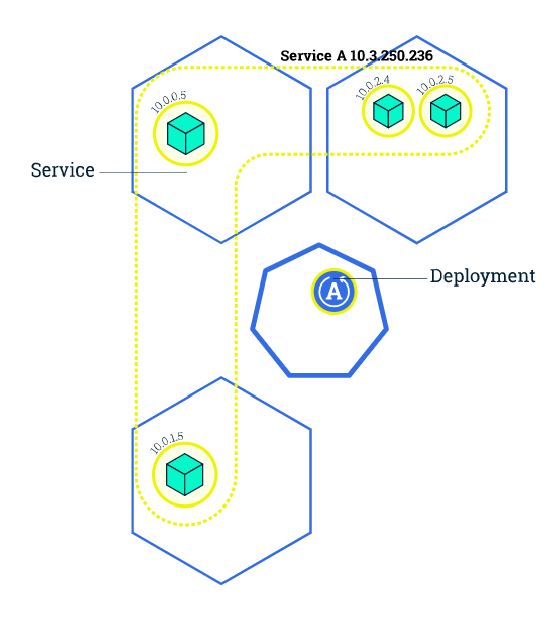

- Actualización continua: Paso 2

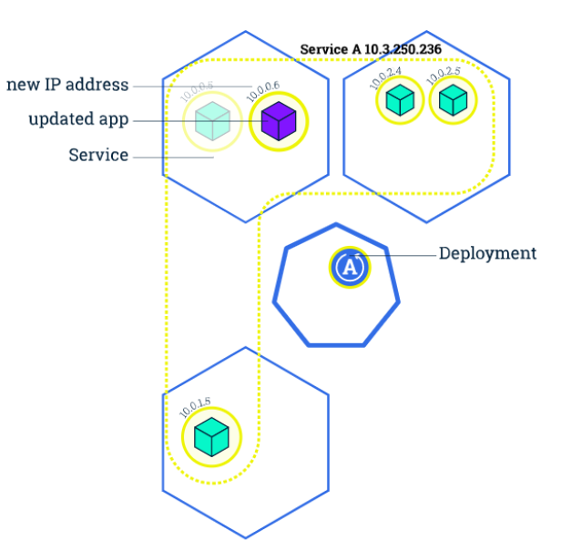

- Actualización continua: Paso 3

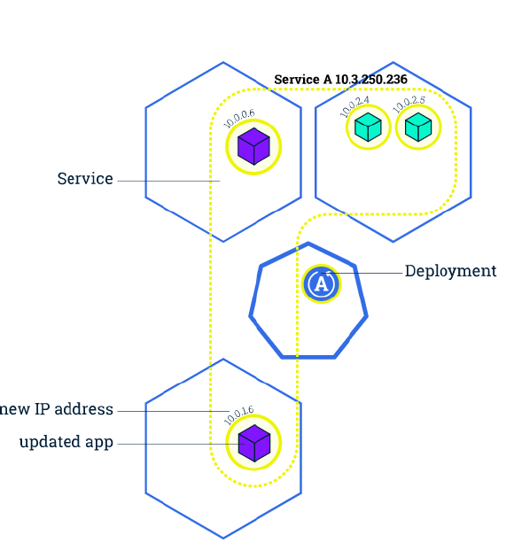

- Actualización continua: Paso 4

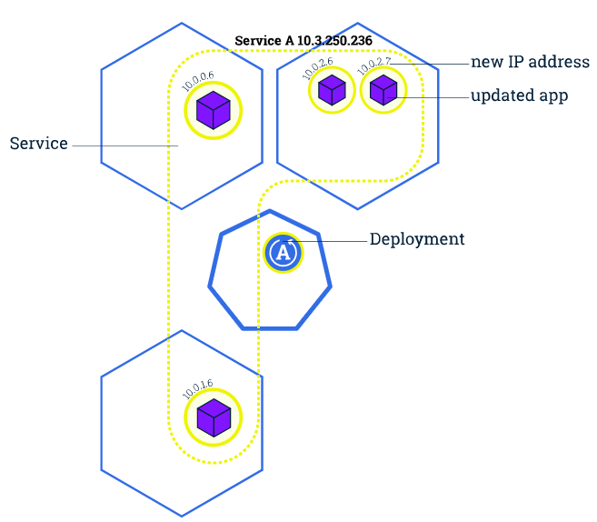

## Ejemplo

Vamos a por un ejemplo

Supongamos que tenemos el deployment definido en el fichero [deplo-actualizar.yml](Ejemplos/10_Actualizacion_servicios/deplo-actualizar.yml)

````bash
kubectl apply -f deplo-actualizar.yml
````
       
Para ver el resultado haremos: 
````bash
kubectl get deployments --watch
````

Ahora imaginemos que queremos actualizar de la versión 1.7.9 de nginxa la versión 1.9.1, entonces escribiremos una 
instrucción como esta:

```bash
kubectl set image deployments/nginx-deployment nginx=nginx:1.9.1
```

En la instrucción anterior, tendríamos el nombre del deployment `deployments/nginx-deployment`, 
el nombre del contenedor `nginx=nginx` que se quiere cambiar la imagen, y por último la nueva imagen a actualizar:

Si volvemos a ver el deployment, observamos que puede suceder que en algún momento haya 4 pods en funcionamiento en 
vez de 3.

```bash
kubectl rollout status deployments/nginx-deployment
kubectl describe deployments nginx-deployment
```

Pero supongamos que nuestra actualización falla, por ejemplo, porque haya un fallo en el nombre de la imagen, o porque 
la nueva versión no es correcta:

```bash
kubectl set image deployments/nginx-deployment nginx=nginx:191
kubectl get pods
kubectl rollout status deployments/nginx-deployment
```

La actualización se queda atascada con un ErrImagePull

Si queremos volver a la versión anterior

````bash
kubectl rollout undo deployments/nginx-deployment
kubectl get pods
kubectl rollout status deployments/nginx-deployment
````

Y todo vuelve a la normalidad.

Para ver el historial de actualizaciones:
````bash
kubectl rollout history deployments/nginx-deployment
````

# Escalado de servicios

Vamos a aplicar el ejemplo que tenemos en la carpeta: [Escalado-hpa](Ejemplos/11_Escalado_servicios)
```bash
kubectl apply -f php-apache.yml
```

Podemos escalar un deployment de forma manual:
````bash
kubectl scale deployments/php-apache --replicas=10
````

O bien autoescalar con un máximo y un mínimo y una condición de uso de cpu:
````bash
kubectl autoscale deployments/php-apache --min=1 --max=10 --cpu-percent=50
````

Ahora para ver la sicuación del escanado podemos ejecutar los siguiente:
````bash
kubectl get hpa
````

# Otros tipos de deployments
***
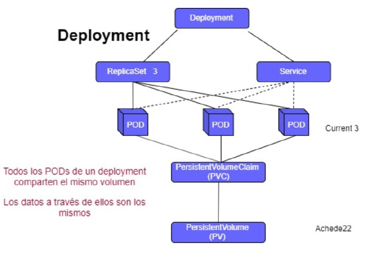

## Mas sobre StatefulSet
***
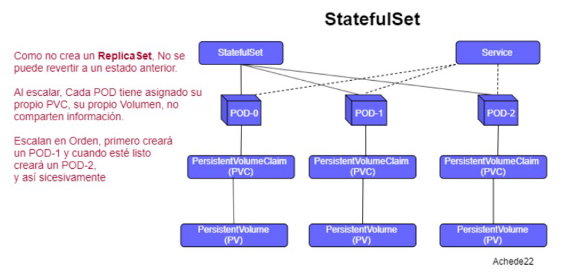

## Mas sobre DaemonSet
***
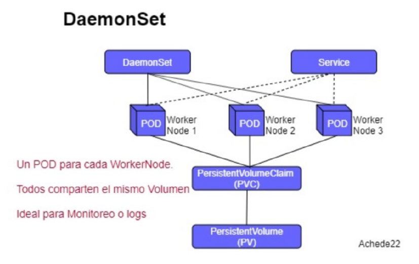

*** 

## Configurando CronJobs en Kubernetes
- En Kubernetesse suelen usar deployments y jobs para ejecutar algo una vez,
- Pero también se pueden usar CronJobs para ejecutar cargas de trabajo en un horario determinado.
- Vamos a utilizar el siguiente yaml: [cronjob.yaml](Ejemplos/12_Otros_controllers/cronjob.yml)

````bash
kubectl apply -f cronjob.yml
````

Cuando pase aproximadamente un minuto, el trabajo se ejecutará y podremos ver el resultado:
````bash
kubectl get cronjob n-cronjob
````

# Helm

Helm es un Gestor de Paquetes para Kubernetes.

Algo así como lo que utiliza Linux para instalar paquetes.

Pero además nos permite **empaquetar grupos de ficheros yml** que tengan un propósito en particular, y distribuirlos 
en repositorios privados o públicos.

- Por ejemplo, supongamos que tenemos que implementar elasticsearch en nuestro cluster. Necesitaríamos una serie de 
componentes que habría que definir.


## ¿Como funciona?

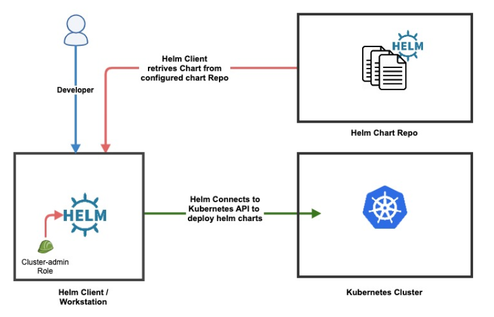

Hacerlo nosotros nos podría costar un tiempo, pero seguro que otros ya han tenido esa misma inquietud y habrán hecho 
este trabajo.
 
- Algunos incluso lo habrán empaquetado todo para ser utilizado por otros.

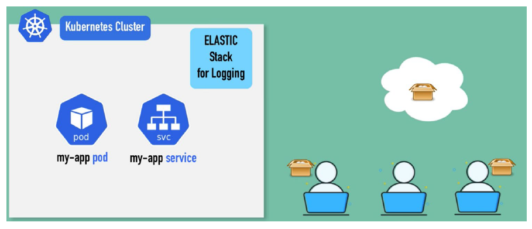

Pues ahí es donde entra Helm, ya que estos paquetes de yml prefabricados son lo que se llama Helm Charts.
- Podemos crear nuestro Charts
- Subirlos al repositorio de Helm
- Descargarlos en otro lugar para instalar inmediatamente o que lo instalen otros.

En Helm nos podemos encontrar de todo, desde bases de datos que ya tienen sus secretos, sus configmaps, sus servicios, 
etc, hasta monitorización, etc.

En primer lugar debemos instalar Helm, para ello puedes seguir la documentación oficial ponchando [aquí](https://helm.sh/docs/intro/install/) 

Podemos buscar Charts en Helm, bien sea a través del comando:
````bash
helm search hub
````

O bien podemos usar el [Helm hub](https://artifacthub.io/)
    
Helm hub tiene repositorios públicos o privados.

##  Sobre las versiones de Helm

La actual versión de Helm es la 3.

Los cambios que han ocurrido son significativos, por lo que es necesario consultar documentación por si nos cae alguna 
implementación de Helm 2.

### Ejemplo de Helm

Ahora vamos a ver un Ejemplo de Helm

Vamos a instalar nginx ingress desde Helm:

```bash
helm repo add ingress-nginx https://kubernetes.github.io/ingress-nginx
```
```bash
helm install mi-ingress ingress-nginx/ingress-nginx
```

Se puede consultar la tabla de instalación con:
````bash
helm ls
````

Cómo eliminar una instalación de Helm
````bash
helm delete mi-ingress
````

Otro uso de Helm es como Motor generador de plantillas.

Es decir, imaginad que tenemos una serie de microservicios, en los que nos hemos dado cuenta que hay pequeños cambios en
su definición.
- El nombre del microservicio
- Las etiquetas
- La imagen de la que parte
- Etc.

Helm nos permite definir una plantilla y después modificar dinámicamente a partir de unos valores

## Misma aplicación - diferentes entornos

Con Helm podríamos crear un Charts con todos nuestros yml para rápidamente lanzarlos en distintas configuraciones de 
entorno.

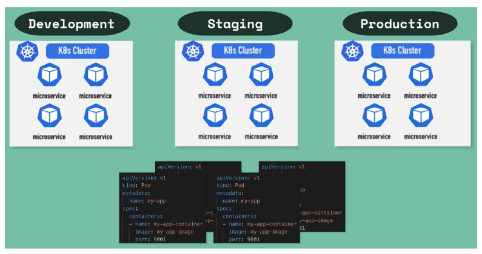

## Estructura de un Chart de Helm

En un Chart de Helm, siempre tendremos una serie de elementos:

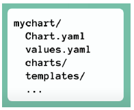

- La carpeta raíz se llamará como el Chart. Dentro aparecerán una serie de carpetas y ficheros:
  - **Chart.yaml** contendrá el nombre y otros metadatos
  - **values.yaml** valores para sobreescribirsobre los templates 
  - La carpeta charts tiene los Charts de los que depende nuestro Chart si los hubiera
  - La carpeta templatesdonde están nuestras plantillas
- Para instalarlo sólo hay que hacer:
  - `helm install <nombre del Chart>`

Si queremos sobreescribir valores, debemos tener en cuenta, que cada par clave-valor en un yaml será sobreescrito si y 
solo sí se menciona:

```bash
helm install --values=my-values.yaml michart
helm install --set version=2.0.0
```

# Ingress

Hasta ahora hemos visto NodePort para acceder a nuestras aplicaciones desde el exterior:

Esta opción no es muy viable para entornos de producción ya que tenemos que utilizar puertos aleatorios desde 30000-40000.

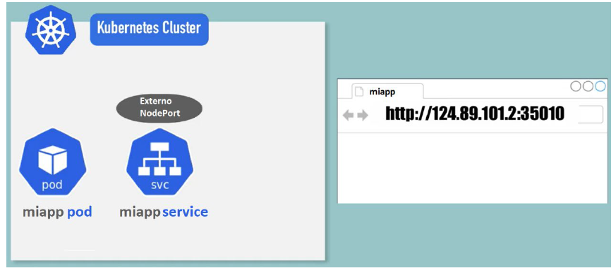

Otra opción es utilizar un servicio interno ClusterIP, y verlo a través del lanzamiento de kubectl proxy:
- Por ejemplo, tenemos un deployment y un servicio definidos como en el ejemplo proxy.yml
- Primero lo aplicamos como siempre
- Después ejecutamos: `kubectl proxy`
- Y después abrimos un navegador y lanzamos una instrucción del tipo:

```url
http://localhost:8001/api/v1/namespaces/<NAMESPACE>/services/<SERVICENAME>:<PORT NAME>/proxy/
```

Es decir, en nuestro caso:

```url
http://localhost:8001/api/v1/namespaces/default/services/nginx:http/proxy/
```

Otra opción es utilizar un servicio interno ClusterIP, y verlo a través del lanzamiento de kubectl proxy:

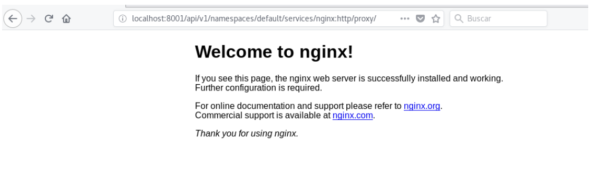

Utilizar un Ingress controller que nos permite utilizar un proxy inverso (HAproxy, nginx, traefik,...) que por medio de 
reglas de enrutamiento que obtiene de la API de Kubernetes nos permite el acceso a nuestras aplicaciones por medio de 
nombres.

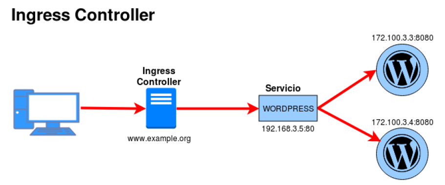

En definitiva, Ingress une las rutas HTTP y HTTPS de fuera, a los servicios dentro de un clúster.

El enrutamiento del tráfico se controla mediante reglas definidas en el recurso Ingress.

Ingress se comporta por tanto como la puerta de entrada a nuestros servicios.
- Puede proporcionar los servicios URL
- Equilibrar la carga de tráfico.
- Configurar un servidor proxy
- etc.

Ingress no discrimina entre puertos o protocolos

La idea es introducir un elemento nuevo de tipo Ingress que determine una serie de reglas para el acceso.

El tipo ahora es interno **ClusterIP**

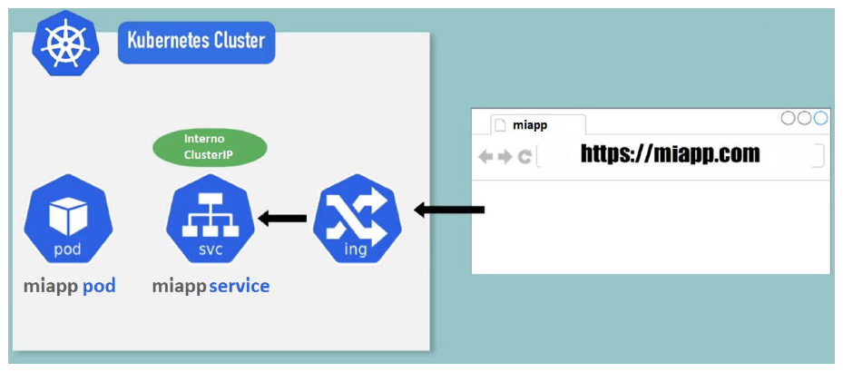

Entonces, cuando hacemos una petición a miapp.com, ésta se redigiríaa un Ingressy a partir de este Ingressse accedería 
a un servicio interno (ClusterIP) que accedería a un podo a un Deployment determinado.


Pero esto no es suficiente.

- Necesitamos además una implementación para Ingress, es decir un IngressController, que es básicamente otro podque 
funciona en el cluster

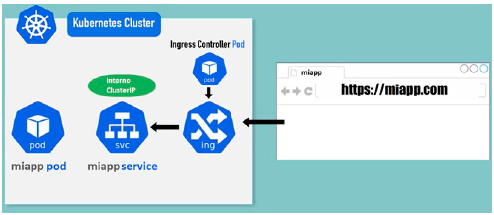

Este controlador Ingress: 
- Verifica las reglas que queremos usar.
- Controla las redirecciones
- Sirve de Punto de entrada (endpoint) al cluster

En Minikube si hemos usado como driver o vm-driver=none, no podremos usar ingress

En Minikube sólo hay que habilitarlo para que funcione:
```bash
minikube addons enable ingress
```

Si ahora hacemos:
````bash
kubectl get pod -n kube-system
````

Veremos que aparece un pod de ingress nginx

En un cluster, para instalar un ingress controller, podemos tener varias alternativas:
- **nginx** , que, junto con GCE son los Ingresscontroller que están dentro del proyecto opensource Kubernetes
- **Traefik (el que vamos a instalar)**
- **HAProxy**
- Ambassador
- Contour
- AWS ALB IngressController

En caso de que nuestro cluster estuviera en cloud, la configuración cambiaría un poco, ya que además de lo anterior, 
también tendríamos un balanceador de carga externo:

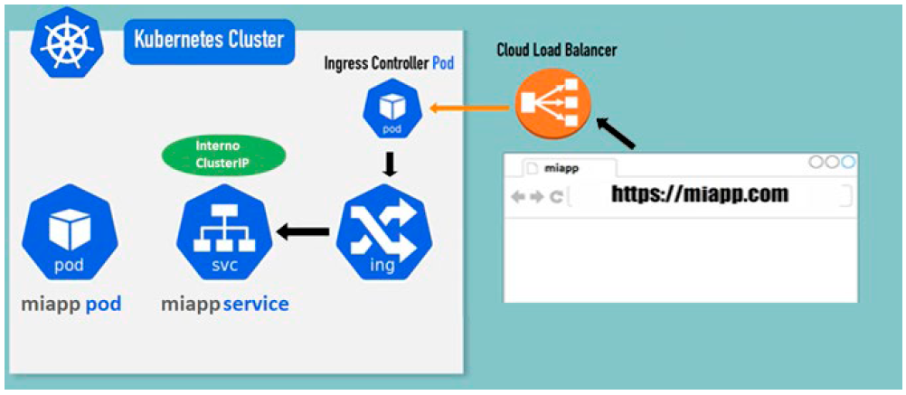

Esto evitará que tengamos que crear nuestro propio balanceador de carga para nuestro cluster.

- En caso de que sea un cluster propio, necesitamos primero crear alguna forma de balanceador de carga. Por ejemplo 
[nginx implementa metalLB](https://kubernetes.github.io/ingress-nginx/deploy/baremetal/)

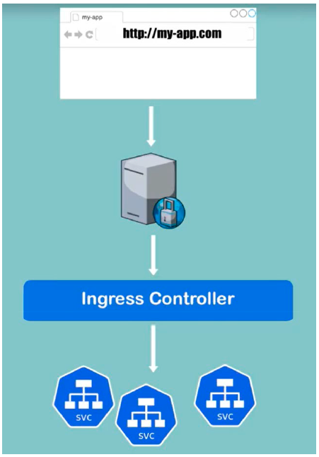


## Instalador de un controlador Ingress
***

Vamos a comenzar instalando traefik, otro controlador ingress.

Podemos instalarlo con Helm o sin Helm:
- Lo primero es crear las reglas de acceso (RBAC) necesarias:

````bash
kubectl apply -f https://raw.githubusercontent.com/containous/traefik/v1.7/examples/k8s/traefik-rbac.yaml
````

Se va a desplegarel proxy comoun DaemonSet, que pondráun controlador traefik enc ada nodo:
````bash
kubectl apply -f https://raw.githubusercontent.com/containous/traefik/v1.7/examples/k8s/traefik-ds.yaml
````

Comprobamos dentro del namespace de kube-system:
````bash
kubectl get ds -n kube-system
kubectl get pods -n kube-system -o wide
````

En nuestro cluster, tenemos direcciones de red interna como esta: 192.168.174.132, que corresponde al worker1. 
Comprobamos:
````bash
curl http://192.168.174.132
```` 

Ahora vamos a volver a utilizar el servicio nginx interno que teníamos en el fichero [proxy.yml](Ejemplos/13_Ingress/proxy.yml)

Y vamos a utilizar también el fichero [nginx-ingress.yml](Ejemplos/13_Ingress/nginx-ingress.yml)

Este fichero es así:

````yaml
    apiVersion: networking.k8s.io/v1
    kind: Ingress
    metadata:
       name: nginx
    spec:
       rules:
       - host: nginx.192.168.174.132.nip.io
          http:
             paths:
             - path: /
                backend:
                   serviceName: nginx
                   servicePort: 80
````

En este caso este fichero crea una regla: cuando accedemos con el nombre nginx.192.168.174.132.nip.io a la ruta /, 
accederemos al servicio llamado nginxen el puerto 80.

Y esto es básicamente Ingress: Podemos definir una ruta (regla) y ya el controlador se encarga de llevar a la ip y 
puerto determinado.

Ahora podremos acceder desde el navegador directamente colocando:
- nginx.192.168.174.132.nip.io

Si ahora, en otra pestaña del navegador accedemos a: [http://192.168.174.132:8080/dashboard/](http://192.168.174.132:8080/dashboard/)

Aparecerá el panel de control de Traefik

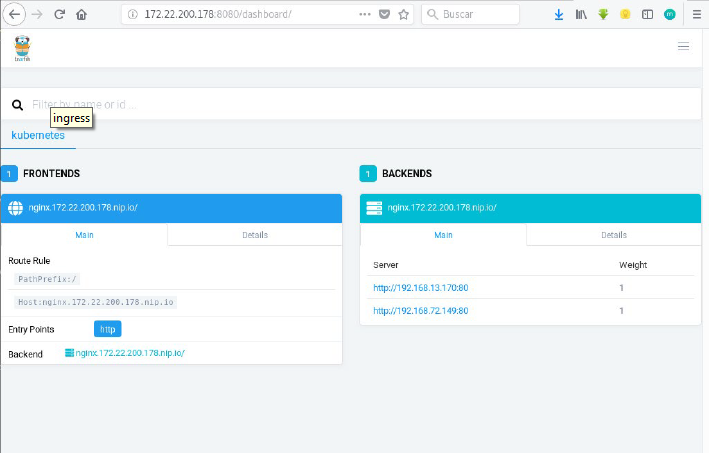

Para mostrar un ejemplo más potente, vamos crear dos nombres de dominios y asociarlos a dos servicios web. 

Los ficheros están en las carpetas [guestbook](Ejemplos/13_Ingress/guestbook) y [lestchat](Ejemplos/13_Ingress/letschat).

Podemos lanzar los ficheros de un directorio directamente con:
````bash
sudo kubectl apply -f guestbook/
sudo kubectl apply -f letschat/
````

Una vez que verifiquemos que están levantados, vamos a estudiar el [ingress.yaml](Ejemplos/13_Ingress/ingress.yaml) que les acompaña

````yaml
apiVersion: networking.k8s.io/v1
kind: Ingress
metadata:
  name: ingress-nombres
  annotations:
    traefik.ingress.kubernetes.io/affinity: "true"
spec:
  rules:
  - host: www.guestbook.com
    http:
      paths:
      - path: "/"
        backend:
          serviceName: frontend
          servicePort: 80
  - host: www.letschat.com
    http:
      paths:
      - path: "/"
        backend:
          serviceName: letschat
          servicePort: 8080
````

Aplicamos el ingress.yaml

Y verificamos

````bash
sudo kubectl apply -f ingress.yaml
sudo kubectl get ingress
````

Ahora, vamos a utilizar resolución estática indicándole a cada una de las rutas en que nodo se va a ejecutar. 
Para evitar esto tendríamos que usar algo como bareMetalLB.

En estática, asignamos la ipa los nombres en el fichero /etc/hosts

```url
192.168.174.132 http://www.guestbook.com
192.168.174.133 http://www.letschat.com
```

Y ya, cuando en el navegador pongamos los nombres, se direccionará directamente a esos servicios.

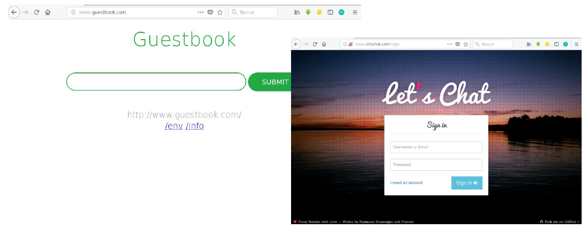


# Multiples paths para un mismo host

Múltiples paths para un mismo host

Para este caso, hay que definir el valor path tras paths y antes de backend

````yaml
apiVersion: networking.k8s.io/v1
kind: Ingress
metadata:
   name: app
   annotations:
      nginx.ingress.kubernetes.io/rewrite-target: /
spec:
   rules:
   - host: miapp.com #el nombrede dominio
      http:
         paths:
         - path: /analiticas
            backend:
            service:
               name: app-analiticas #el nombre del servicio
               port:
                  number: 3000 # este es el puerto interno
````

Múltiples dominios y subdominios

Para este caso, sólo hay que aplicar distintos hosts para cada servicio. 
El ejemplo se encuentra aquó

````yaml
apiVersion: networking.k8s.io/v1beta1
kind: Ingress
metadata:
  name: app
  annotations:
    nginx.ingress.kubernetes.io/rewrite-target: /
spec:
    
  rules:
  - host: analiticas.miapp.com         #el nombre de dominio
     http:
      paths:
      - path:/analiticas
        backend:
          serviceName: app-analiticas  #el nombre del servicio
          servicePort: 3000   # este es el puerto interno
      - path:/resultados
        backend:
          serviceName: app-resultados  #el nombre del servicio
          servicePort: 3010   # este es el puerto interno
  - host: compras.miapp.com         #el nombre de dominio
     http:
      paths:
      - path:/compras
        backend:
          serviceName: app-compras  #el nombre del servicio
          servicePort: 8000   # este es el puerto interno
  tls:
    - hosts:
      - compras.miapp.com
      secretName: ejemplo-tls 
````

# Registry

Un Registro es un sistema de almacenamiento que contiene imágenes de Docker con nombre y distintas versiones etiquetadas.

Registry incorpora de forma nativa TLS y autenticación básica para proteger las imágenes.

Además incorpora un sistema de notificación que llama a webhooks en  respuesta a la actividad del registro.

Hasta ahora extraíamos las imágenes desde Docker Hub, a través de comandos  como este:

````bash
 docker pull busybox:latest
````

Si la imagen pertenecía a un repositorio propio, debíamos loguearnos y posteriormente incluir el nombre del repositorio.

Pero básicamente, Docker pull lo que hace es llamar (de forma larga) a esto:

````bash
docker pull docker.io/library/busybox:latest
````

También podemos indicarle un lugar de registro distinto del de Docker-hub:

````bash
docker pull midominioderegistro:puerto/path/al/registro/imagen:tag
````

Disponer de un Registro propio es una gran solución para incorporar CI/CD.
- CI enviaría una nueva imagen al Registro si la compilación es exitosa
- Una notificación del Registro desencadenaría una implementación en un entorno de prueba o en otros sistemas.

Aunque también es una forma de distribuir imágenes en un entorno aislado.

## Registro en local

Para crear el registro:
````bash
docker run -d -p 5000:5000 --restart=always --name miregistro registry
````

El registro miregistro ya estaría listo para usarse.

Deberíamos “llenar” nuestro registro de imágenes para usar. Para ello debemos primero descargar de Docker-hub lo que 
necesitemos.

```bash
docker pull busybox:1.24
```

Ahora se etiqueta la imagen como:
```bash
docker tag busybox:1.24 localhost:5000/mibusy
```

Tras esto, se envía la imagen al registro local:
`````bash
docker push localhost:5000/mibusy
`````

Si ahora eliminásemos las imágenes y las almacenadas en cache local:
`````bash
docker image remove busybox:1.24
docker image remove localhost:5000/mibusy
`````

No se eliminaría la imagen del registro creado y podríamos extraerla con:
````bash
docker pull localhost:5000/mibusy
````

O bien, colocarla como imagen para el lanzamiento de un contenedor:
````bash
docker run --name conbusy localhost:5000/mibusy
````

Si queremos parar el servicio de registro:
````bash
docker container stop miregistro
````

Si lo queremos eliminar:
`````bash
docker container rm -v miregistro
`````       

# Seguridad en Kubernetes


## Acceso a la API

Es muy importante conocer, a través de autenticación, autorización y control de admisión, a  quién está permitido que 
acceda a etcd, lugar donde se encuentra la información de todos los objetos del cluster Kubernetes

Esto se consigue a través de dos tipos de cuentas:
- **Las cuentas de usuario**: Son cuentas que Kubernetes conoce, pero no las administra. Por ejemplo, no se puede crear o 
borrar con kubectl.

- **Las cuentas de servicio** : son cuentas que Kubernetes crea y administra, pero solo las pueden usar las entidades 
creadas en Kubernetes, como los pods. Forman parte del clúster en el que están definidas y, por lo general, se usan 
dentro de ese clúster.

Diferencias entre los dos tipos de cuentas:

- Las cuentas de usuario son para humanos y las cuentas de servicio son para procesos, que se ejecutan en pods. 
- Las cuentas de usuario están destinadas a ser globales. **Las cuentas de servicio están asignadas a namespaces.**
- La creación de una nueva cuenta de usuario requiere privilegios especiales y está vinculada a procesos complejos 
mientras que la creación de la cuenta de servicio tiene la intención de ser más liviana que la creación de cuentas de 
usuario, permitiendo a los usuarios del clúster crear cuentas de servicio para tareas específicas (es decir, principio 
de privilegio mínimo).

  
**Autenticación**: Los módulos authenticator son utilizados para incluir certificados de cliente,  contraseñas, tokens y 
manejar la autenticación de user y services accounts
 - Las user accounts lo hacen a través de certificados
 - Los service accounts a través de tokens
 - Kubernetes no guarda objetos User, ya que un User es sólo un conjunto de certificados de cliente.
 - Las peticiones no autenticadas son rechazadas con un HTTP Status Code 401
 
**Autorización**: Una vez que una petición viene acompañada de una autenticación de usuario, se  pasa a la autorización:
 - Ésta se realiza a través de Modos de Autorización, que implementa las políticas de acceso. Por lo que una petición 
 es autorizada si existe una regla o política que declara que el usuario tiene permisos para completar esa acción.
 - Estos Modos de Autorización son definidos al definir el Kube-ApiServer.
 - Para hacer cambios en la configuración, se debe acceder a `/etc/kubernetes/manifests/kube-apiserver.yaml`
 

Vamos a ver un ejemplo:
- En el controller, vamos a actuar como root:

````bash
sudo -i
cd /etc/kubernetes/manifests
````

- Con **ls** vemos los ficheros yaml: **etcd, kube-apiserver, kube-controller-manager y kube-scheduler.** 
Estos son los manifests que son usados para crear los componentes centrales de kubernetes.

- Editamos el kube-apiserver y vemos lo que decíamos sobre el flag **authorization-mode**.

- Control de admision: Una vez autenticado y autorizado, entra en juego el Admission Controller
  - Implementa funcionalidad específica, relacionada especialmente con las Quotas. Por ejemplo el ResourceQuota 
  controller se asegura de que un objeto no viole las reglas de cuotas (cpu, disco) establecidas
  - También en el fichero : **/etc/kubernetes/manifests/kube-apiserver.yaml** se encuentra la lista de admission 
  controllers.
    - El flag **--enable-admission-plugins** en este caso está asignado a NodeRestriction. Es decir, que el controlador 
    de admisión limita los objetos Node y Pod que un kubelet puede modificar.

## Autenticacion

Como ya se ha visto, la autenticación en Kubernetes no es sino presentar los certificados  correctos para acceder al 
Cluster.

Estos certificados están conectados al Usuario Kubernetes, que es algo así como un alias  que está definido en el 
fichero $USER/.kube/config

- Podríamos editarlo para ver los certificados. En el usuario:

```bash
cd .kube
gedit config
```

Dentro de este fichero se encuentran tres certificados esenciales:
- **Client-certificate-data**: Contiene el certificado de clave pública
- **Client-key-data**: Contiene la clave privada 
- **Certificate-authority-data**: Contiene la clave pública de la autoridad de certificación.

Estos certificados son utilizados por **_Kubectl_** y también cuando se accede directamente a la  API a través de Curl.

La diferencia radica en que para hacerlo directamente con Curl necesitamos primero tener disponibles los tres 
certificados, por ejemplo:

En el usuario definimos tres variables para sacar del fichero $user/.kube/config los tres  certificados:

```bash
export client=$(grep client-cert /home/usuario/.kube/config | cut -d " " -f 6)
export key=$(grep client-key-data /home/usuario/.kube/config | cut -d " " -f 6)
export auth=$(grep certificate-authority-data /home/usuario/.kube/config | cut -d " " -f 6)
```

Las mostramos para ver su contenido:
````bash
echo $client
echo $key
echo $auth
````

Con estas variables ahora vamos a crear ficheros de certificados:

```bash
echo $client | base64 -d - > client.pem
echo $key | base64 -d - > client-key.pem
echo $auth | base64 -d - > ca.pem
```

Ahora necesitamos conocer la url del server:
````bash
kubectl config view | grep server
````

Y con todo esto podríamos hacer una curl para conocer los pods:
````bash
curl --cert ./client.pem --key ./client-key.pem --cacert ./ca.pem https://192.168.174.1:6443
````

### Estrategias de autenticación

Ya hemos dicho que Kubernetes utiliza certificados de cliente, tokens de portador, un proxy de autenticación o 
autenticación básica HTTP para autenticar las solicitudes de API a través de complementos de autenticación.

A medida que se realizan solicitudes HTTP al servidor API, los complementos intentan asociar los siguientes atributos 
con la solicitud:

- Nombre de usuario: una cadena que identifica al usuario final. Los valores comunes pueden ser kube-admin o 
yomismo@ejemplo.com 
- UID: una cadena que identifica al usuario final e intenta ser más coherente y único que el nombre de usuario.
- Grupos: un conjunto de cadenas que asocian usuarios con un conjunto de usuarios comúnmente agrupados.
- Campos adicionales: un mapa de cadenas a la lista de cadenas que contiene información adicional que los autorizadores 
pueden encontrar útiles.

Certificados de cliente X509
- La autenticación del certificado del cliente se habilita escribiendo --client-ca-file=fichero al servidor API. 
El archivo al que se hace referencia debe contener una o más CAs para validar los certificados de cliente presentados 
al servidor API.

- Si se presenta y verifica un certificado de cliente, el nombre común del sujeto se utiliza como nombre de usuario 
para la solicitud.

- A partir de Kubernetes 1.4, los certificados de cliente también pueden indicar la pertenencia a grupos de un usuario
utilizando los campos de organización del certificado

Archivo de token estático

- El servidor API lee tokens portadores de un archivo cuando se le da la opción --token-auth-file=SOMEFILE en la línea 
de comandos. Actualmente, los tokens duran indefinidamente y la lista de tokens no se puede cambiar sin reiniciar el 
servidor API. 
- El archivo de token es un archivo csv con un mínimo de 3 columnas: token, nombre de usuario, uid de usuario, seguido 
de nombres de grupo opcionales.
- Nota: Si tiene más de un grupo, la columna debe estar entre comillas dobles, por ejemplo: 
**conf token,user,uid,"group1,group2,group3"**

Archivo de contraseña estática

- La autenticación básica se habilita pasando la opción --basic-auth-file=SOMEFILE al servidor API. Actualmente, las 
credenciales de autenticación básicas duran indefinidamente y la contraseña no se puede cambiar sin reiniciar el 
servidor API. 

- La autenticación básica es actualmente compatible por conveniencia mientras terminamos de hacer que los modos más 
seguros descritos anteriormente sean más fáciles de usar.

- El archivo de autenticación básico es un archivo csv con un mínimo de 3 columnas: contraseña, nombre de usuario, 
identificación de usuario. En Kubernetes versión 1.6 y posteriores, puede especificar una cuarta columna opcional 
que contiene nombres de grupos separados por comas. Si son varios pasa lo mismo que con los tokens.

Tokens de cuenta de servicio
- Una cuenta de servicio es un autenticador habilitado automáticamente que utiliza tokens de portador firmados para 
verificar las solicitudes. El complemento toma dos banderas opcionales:

- **--service-account-key-file** : Un archivo que contiene una clave codificada PEM para firmar tokens de 
portador. Si no se especifica, se utilizará la clave privada TLS del servidor API.

- **--service-account-lookup** Si está habilitado, los tokens que se eliminan de la API serán revocados.

- Las cuentas de servicio generalmente son creadas automáticamente por el servidor API y asociadas con pods que se 
ejecutan en el clúster a través del controlador de admisión del Service Account.

- Los tokens de portador se montan en pods en ubicaciones conocidas y permiten que los procesos en clúster se 
comuniquen con el servidor API. Las cuentas pueden asociarse explícitamente con pods asignado el campo 
serviceAccountName a PodSpec.

- Para crear manualmente una cuenta de servicio, se usa el comando: 
````bash
kubectl create serviceaccount (NAME)
````

- Esto crea una cuenta de servicio en el espacio de nombres actual y un secreto asociado.
```bash
kubectl create serviceaccount jenkins
```

- Lo vemos:
```bash
kubectl get serviceaccounts jenkins -o yaml
```

- Y si ahora:
```bash
kubectl get secret jenkins-token-1yvwg -o yaml
```

##  Autorización

Existen distintos Modos de Autorización:
- **Nodo** : Es un modo de autorización especial que otorga permisos a los kubelets en función de
los pods que están programados para ejecutarse.
- **Webhook** : un WebHook es una HTTP Callback: Una HTTP Post que ocurre cuando algo sucede. Una aplicación web que 
implementa WebHooks PUBLICARÁ un mensaje en una URL cuando sucedan ciertas cosas.

- **ABAC** : Es un paradigma de control de acceso mediante el cual se otorgan derechos de acceso a los usuarios mediante 
el uso de políticas que combinan atributos. Las políticas pueden usar cualquier tipo de atributos (atributos de usuario, 
atributos de recursos, objetos, atributos de entorno, etc.).
- Era la autorización por defecto antes de la llegada de RBAC.
- Las políticas son definidas en ficheros JSON y referenciadas por el kube-apiserver con la opción:
```bash
--autorization-policy-file=mi_policy.json
```

- La regla (policy) podría tener esta forma:
````json
{"apiVersion":"abac.authorization.kubernetes.io/v1beta1","kind": "Policy","spec":{"user":"jose",
"namespace":"*", "resource":"*", "apiGroup":"*"}}
````
- **RBAC** : el control de acceso basado en roles (RBAC) es un método para regular el acceso a los recursos informáticos
o de red en función de los roles de los usuarios individuales dentro de una empresa. En este contexto, el acceso es la 
capacidad de un usuario individual para realizar una tarea específica, como ver, crear o modificar un archivo.
  - Cuando se especifica RBAC (Control de acceso basado en roles) utiliza el grupo de APIs rbac.authorization.k8s.io 
  para controlar las decisiones de autorización, lo que permite a los administradores configurar dinámicamente 
  políticas de permisos a través de la API de Kubernetes.
  - Para habilitar RBAC, se inicia el apiserver con --authorization-mode=RBAC.
  - **RBAC** : Define 4 tipos:
    - **Role** : Usado para permitir acceso a recursos dentro de un único namespace.
    - **ClusterRole** : Permite el acceso a recursos a nivel de cluster.
    - **RoleBinding** : Permite acceso a uno o más usuarios. Puede referirse a Role o a ClusterRole
    - **ClusterRoleBinding** : Permite acceso a nivel de cluster y en todos los namespaces.
  - **RBAC** : El proceso que sigue un usuario para ser autorizado por RBAC es el siguiente:
    - Se especifica o se crea un namespace
    - Se crea una cuenta de usuario, definiendo las credenciales (certificados)
    - Se configuran las credenciales ofrecidas por el usuario al namespace utilizando un contexto
    - Se crea un rol para las tareas que el usuario necesita realizar
    - Se enlaza el usuario al rol
    - Se verifica que el usuario tiene acceso

## Contextos (Security Context)

Define privilegios y configuraciones de control de acceso para Pods y contenedores.

Incluye:
- Control de acceso basado en UID y GID
- Etiquetas de seguridad SELinux
- AppArmor
- Seccomp
- Configuración AllowPrivilegeEscalation
- Configuración runAsNonRoot

Security Context puede ser configurado a nivel de Pod o de Contenedor.

Para más información podemos teclear:
````bash
kubectl explain pod.spec.securityContext
kubectl explain pod.spec.containers.securityContext
````
Las configuraciones aplicadas a nivel contenedor sobreescribirán configuraciones aplicadas a  nivel de Pod.

Vemos un ejemplo para un pod: [security-context.yaml](Ejemplos/16_seguridad_y_roles/security-context.yaml)

### Ejemplo Security Context

Creamos el Pod:

```bash
kubectl apply -f security-context.yaml
```

Verificamos que el Contenedor de Pod se está ejecutando:

```bash
kubectl get pod security-context1
kubectl exec -it security-context1 -- sh
```

Enumeramos los procesos en ejecución:

```bash
ps
```

Vamos al lugar de montaje del volumen:

```bash
cd /data/demo
```

Creamos un fichero:

```bash
echo hello > testfile
ls -l
```

Y veremos que usuario y grupo tiene. Tras esto salimos del Shell:

```bash
exit
```

Configurar el contexto de seguridad para un contenedor:
- Para especificar la configuración de seguridad para un Contenedor, se incluye el campo securityContext en el 
manifiesto del Contenedor.
- Este campo es un objeto SecurityContext. La configuración de seguridad que especifique para un Contenedor se aplica 
solo al Contenedor individual, y anula la configuración realizada en el nivel Pod cuando hay superposición.
- La configuración del contenedor no afecta los volúmenes del Pod.
- Ver fichero [security-context2.yaml](Ejemplos/16_seguridad_y_roles/security-context2.yaml)

- Creamos el Pod:
````bash````
kubectl apply -f security-context2.yaml
- Verificamos:
````bash
kubectl get pod security-context-demo-2
kubectl exec -it security-context-demo-2 -- sh
````
- Vemos los procesos en ejecución:
````bash
ps aux
````
- Y denotamos que los procesos se están ejecutando como usuario 2000. Este es el valor runAsUser especificado para el 
Contenedor. Anula el valor 1000 que se especifica para el Pod.

## Cuentas de usuario

Recordamos que Kubernetes de por sí, no tiene objetos User, es decir no tiene cuentas de  usuario como tales se entiende.

En realidad son una conjunto de certificados completados con algo de autorización definido por ejemplo con RBAC.

Sin embargo, sí que podemos crear user accounts en kubernetes.

- Se crea primero un par Clave Pública/Privada
- Se hace una petición de firma de certificado
- Se firma el certificado
- Se crea un fichero de configuración que usa estas claves para acceder al cluster de kubernetes
- Se crea un RBAC Role y también un RBAC Role binding


### Cuentas de usuario: Demo

Para hacer más sencillo esto, vamos a crear primero 2 namespaces. Lo hacemos porque vamos ha  crear cuentas de usuario 
que tendrán acceso a ciertos namespaces

```bash
kubectl create ns empleados
kubectl create ns becarios

kubectl get ns

kubectl config get-contexts
```

Nos muestra la configuración actual que está en admin@kubernetes


Ahora vamos a crear una cuenta de usuario de linux:
```bash
sudo useradd jose
sudo passwd jose
```

A continuación generamos el fichero de claves
```bash
openssl genrsa -out jose.key 2048
```

Hacemos una petición de firma:
```bash
openssl req -new -key jose.key -out jose.csr -subj "/CN=jose/O=empleados"
```

Nos comunicamos con la CA de Kubernetes:
```bash
sudo openssl x509 -req -in jose.csr -CA /etc/kubernetes/pki/ca.crt -CAkey /etc/kubernetes/pki/ca.key -CAcreateserial -out
jose.crt -days 180
```

A continuación vamos a visualizar y actualizar los archivos de credenciales de kubernetes  para el nuevo usuario:

```bash
kubectl config view

kubectl config set-credentials jose --client-certificate=./jose.crt --client-key=./jose.key

kubectl config view
```

Creamos el Default Context para el nuevo usuario:

```bash
kubectl config set-context jose-context --cluster=kubernetes --namespace=empleados --user=jose

kubectl --context=jose-context get pods
```

- Esta última fallará ahora porque no hemos definido ninguna regla RBAC para jose.

```bash
kubectl config get-contexts
```
Configuramos RBAC para definir un rol de empleados, usaremos el siguiente fichero [empleados-role.yaml](Ejemplos/16_seguridad_y_roles/empleados-role.yaml):

````bash
kubectl create -f empleados-role.yaml
````
Enlazamos el usario al nuevo rol, usamos el siguiente fichero [rolebind.yaml](Ejemplos/16_seguridad_y_roles/rolebind.yaml)


```bash
kubectl create -f rolebind.yaml
```
Lo probamos:

```bash
kubectl --context=jose-context get pods

kubectl create deployment nginx --image=nginx

kubectl get all

kubectl -n empleados describe role empleados
```

Creamos el fichero [becarios-role.yaml](Ejemplos/16_seguridad_y_roles/becarios-role.yaml)
y el fichero [rolebindbecarios.yaml](Ejemplos/16_seguridad_y_roles/rolebindbecarios.yaml)

Aplicamos los dos ficheros:

```bash
kubectl apply -f becarios-role.yaml
kubectl apply -f rolebindbecarios.yaml
```

Probamos:

```bash
kubectl config set-context josebecarios-context --cluster=kubernetes --namespace=becarios --user=jose

kubectl --context=josebecarios-context get pods
kubectl -n becarios describe role becarios
```

Configuramos RBAC para definir un rol de solo lectura becarios:
- Si ahora intentamos hacer un deployment con el contexto de sólo lectura:

```bash
kubectl --context=josebecarios-context create deployment becnginx --image=nginx
```
- Nos da error de que no puede crear recursos

#### Ejercicio cuenta de usuario

Ahora para practicar se deberá realizar el siguiente ejercicio [pinche aquí](Ejercicios/cuentas_usuario_demo.md)
