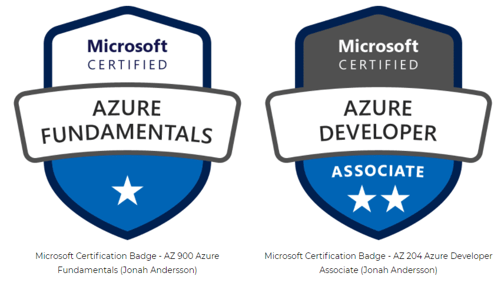

# Azure - AZ-204

---

Con este material puedes prepararte la certificación de Azure AZ-204.

## Índice de contenidos

- [Azure App Service](#azure-app-service)
- [Azure Functions](#azure-functions)
- [Azure Blob Storage](#azure-blob-storage)
- [Azure CosmoDB](#azure-cosmodb)
- [Azure ARM](#plantillas-arm)
- [Azure Container Registy](#container-registy)

## Azure App Service
***

Consulte la documentación del módulo [aquí](https://docs.google.com/presentation/d/1LBkE1cRE3T3YRSCXucuOSnr0yB4yUuFZ39fPUqJ_V2M/edit?usp=share_link)

Repositorio GitHub con ejemplos de Azure para cli [Azure cli samples](https://github.com/Azure-Samples/azure-cli-samples)

## Azure Functions
***

Consulte la documentación del módulo [aquí](https://docs.google.com/presentation/d/1dlohxNseBEo5hOULDqBGfD_iNx1maddVdj2m1Dg6p70/edit?usp=share_link)

## Azure Blob Storage
***

Consulte la documentación del módulo [aquí](https://docs.google.com/presentation/d/1lZtJr0UuqJE4lo1r_4FFh35bXBYToDLCuM_rCoha6WY/edit?usp=share_link)

## Azure CosmoDB
***

Consulte la documentación del módulo [aquí](https://docs.google.com/presentation/d/1gL52qTvwHOH1Q354ghuwmhDZHHn5g_ebxn4fGnArxV8/edit?usp=share_link)

## Plantillas ARM
***

Consulte la documentación del módulo [aquí](https://docs.google.com/presentation/d/1n-YFh2odZQrd680T-_9pW6U8yLzKe95388tg_p966Ak/edit?usp=share_link)

## Container Registy
***

Consulte la documentación del módulo [aquí](https://docs.google.com/presentation/d/1JvUTUBoeySFEY-w4Zopw9MrRjViLrlYKZYL85iHaQt4/edit?usp=share_link)