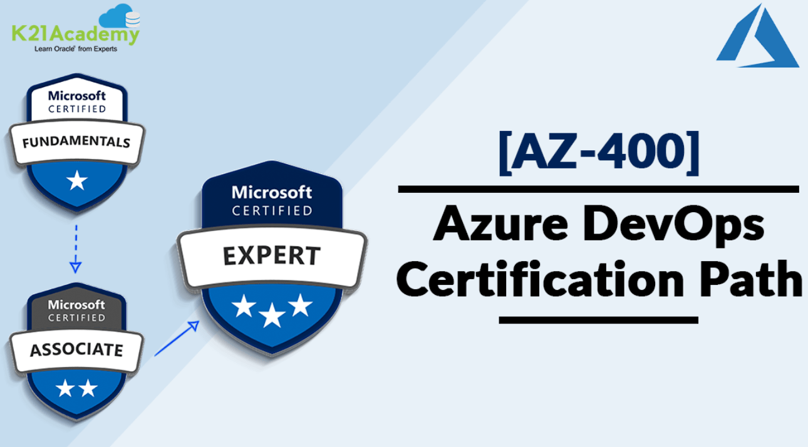

# Azure - AZ-400

---

En este material irá entorno a la certificación AZ-400, aunque no incluye todo lo contenido en esta certificación. 
Si quieres acceder al contenido de la certificación de manera autodirifico, puedes acceder al siguinte enlace:

> [Certificación AZ material auto-dirigido]https://learn.microsoft.com/es-es/certifications/exams/az-400/?tab=tab-learning-paths

## Índice de contenidos

- [Introduccion a Azure DevOps - Azure Boards](#introduccion-a-azure-devops---azure-boards)
- [Source control y Azure Repos](#source-control-y-azure-repos)
- [CI en Azure Pipelines](#ci-en-azure-pipelines)
- [CD en Azure Pipelines](#cd-en-azure-pipelines)
- [Más alla en CD Kubernetes y Ansible](#mas-alla-en-cd-kubernetes-y-ansible)
- [Seguridad en pipelines](#seguridad-en-las-pipelines)
- [Pruebas de lanzamiento](#pruebas-en-el-lanzamiento)
- [Proyectos Agile para la retroalimentacion](#proyectos-agile-para-la-retroalimentacion)

## Introduccion a Azure DevOps - Azure Boards
***

Consulte la documentación del módulo [aquí](https://docs.google.com/presentation/d/1S4K0Sv1Z9LUEFW3cjnlz7NSFx4aQ9h6jOHeisbquzjw/edit?usp=share_link)

## Source control y Azure Repos
***

Consulte la documentación del módulo [aquí](https://docs.google.com/presentation/d/1y5DGpQ7UbmXhJvSf8cqfYnj0OKe54732ATvdONq-eZg/edit?usp=share_link)

## CI en Azure Pipelines
***

Consulte la documentación del módulo [aquí](https://learn.microsoft.com/es-es/azure/devops/pipelines/ecosystems/python-webapp?view=azure-devops)
Seguirá una guía para desplegar una app en Python a través de un tutorial de Azure.

## CD en Azure Pipelines
***

Documentación deploy release in CD: [Classic release pipelines](https://www.golinuxcloud.com/deploy-web-app-ci-cd-pipeline-azure-devops/#Step_01_%E2%80%93_Deploy_Azure_WebApp_for_CICD_Pipeline)

Consulte la documentación del módulo [aquí](https://docs.google.com/presentation/d/15quCo8bVYdVWssVWgPi8drIDd3worGajROzdRDMO9jw/edit#slide=id.p1)

## Mas alla en CD Kubernetes y Ansible
***

Consulte la documentación del módulo [aquí](https://learn.microsoft.com/en-us/azure/aks/devops-pipeline?pivots=pipelines-yaml)

# Modulo 4

## Seguridad en las pipelines 
***

Consulte la documentación del módulo [aquí](https://docs.google.com/presentation/d/1hy9rOovui--cM_13uVzt7HlvJWAQ-YRj/edit?usp=share_link&ouid=102384283797243178688&rtpof=true&sd=true)

## Pruebas en el lanzamiento
***

Consulte la documentación del módulo [aquí](https://docs.google.com/presentation/d/14tw32F3mEhAlgzsGylwns4rHb7QHELaX/edit?usp=share_link&ouid=102384283797243178688&rtpof=true&sd=true)

## Proyectos Agile para la retroalimentacion
***

Consulte la documentación del módulo [aquí](https://docs.google.com/presentation/d/1e4aUeqiK-Ujd0-7FvxMUxhmTnrKb7YrV/edit?usp=share_link&ouid=102384283797243178688&rtpof=true&sd=true)

