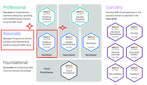

# Architect Associate AWS

---

## Índice de contenidos

- [Modulo 1 Arquitecturas Condiables y Dispoinibles](#modulo-1-arquitecturas-condiables-y-dispoinibles)
- [Modulo 2 Arquitecturas Eficientes en Rendimiento](#modulo-2-arquitecturas-eficientes-en-rendimiento)

## Modulo 1 Arquitecturas Condiables y Dispoinibles 
***

A modo recordatorio puedes consultar la introducción a los comandos más usados de CLI pinchando [aquí](https://docs.google.com/presentation/d/1LCVi0KfRASL2rwU1MzKIrdGrILaokOWP6vpaRo5J5vQ/edit?usp=share_link)
Comandos más usados de CLI, pincha [aquí](https://docs.google.com/document/d/1qDWl_fYcYaelfC9KhEplFcEaTwg4AHP2/edit?usp=share_link&ouid=102384283797243178688&rtpof=true&sd=true)

0. [Herramientas para realizar definir una arquiectura](https://docs.google.com/presentation/d/1JSt9GBKauFenD_SxUNne2ShkW-n0k2WUcpLLC__76Pw/edit?usp=share_link) 
1. [Arquitecturas confiables HA Parte 1](https://docs.google.com/presentation/d/1t9XEVw2sgapunTWUuaJEKVjZ779X_ryDUEEeiR_DV1Q/edit?usp=share_link)  
   Arquitecturas AWS:
      - [Arquitectura autoscaling (fácil)](Modulo_1_Arquitecturas_Confiables_y_Disponibles/01_arquitectura_autoscaling.png)
      - [Arquitectura con una API (asequible)](Modulo_1_Arquitecturas_Confiables_y_Disponibles/02_arquitectura_API.png)
      - [Arquitectura para videojuegos basados en sesión. (pro)](Modulo_1_Arquitecturas_Confiables_y_Disponibles/03_GameLift_con_backend_Serverless.png)  
2. [Comprar dominio y crear certificados TLS](https://docs.google.com/presentation/d/1HqUyV9ZWY3P5mozKJ9FrPlCTaiQY4QhrxRyg_VedPHs/edit?usp=share_link)
3. (Revisar)[Arquitecturas confiables y HA - Parte 2](https://docs.google.com/presentation/d/1OgjS52mn7VKjcsBuq2qba6y34KdsVnRWIv-3Y-nDOLI/edit?usp=share_link)
4. [Introducción a CloudFormation](https://docs.google.com/presentation/d/1Osflc2Wb7lmzuV1K-Ij4BClZT8vPjRdDigxEPyyGtg4/edit?usp=share_link)
   - [Cloud Formation Templace](Modulo_1_Arquitecturas_Confiables_y_Disponibles/CloudFormation/01_cloud_formation_template)  
   Ejercicios:
     - Primer ejercicio, con el stack otro-template-corregido\network-stack1ab.json quiero que se pueda lanzar en Irlanda  
       Y que también, no solo lance 2 publicas y dos privadas, sino que lance 3 de cada una
     - Segundo ejercicio, quiero que la region sea la misma que le dice amazon en la que estas
       y también (para super pros) que podais determinar el numero subredes publicas y privadas que queréis (2 o 3)
- [Más sobre VPCs](https://docs.google.com/presentation/d/1BaQJ0hwkp9_9BZouhuRqXNR_P-T8L8GnO8nSsWup5Rk/edit?usp=share_link)

## Modulo 2 Arquitecturas Eficientes en Rendimiento 
*** 

1. [Arquitecturas eficientes en rendimiento Parte 1](https://docs.google.com/presentation/d/19j8qob9CXrJ1wko-dVjl4YV6H9Ln0f7ja5FCgnQwrSo/edit?usp=share_link)
2. [Arquitecturas eficientes en rendimiento Parte 2](https://docs.google.com/presentation/d/1LTFBLqXydEgWqEfkYjM0vwkZnF1lh9nBrMI6v_TF6Xk/edit?usp=share_link)

## Modulo 3 Arquitecturas Seguras

1. [Arquitecturas Seguras](https://docs.google.com/presentation/d/1zO7k9pgazsGvGGLsT3F92EE-Wc9egE0wasmUFlgx_ZI/edit?usp=share_link)
2. [Cloud Front S3](https://docs.google.com/presentation/d/1ZXjZk9o7j1ATFRoZAQvpbZB2m1otpREC_4OtxiFAwjw/edit?usp=share_link)
3. [CloudTrail y CloudWatch](https://docs.google.com/presentation/d/1FWkKujSJ6eUFxt0T3fSpegP631psey5xPMpMbFhGwv8/edit?usp=share_link)
4. [Recuperación de desastres](https://aws.amazon.com/es/what-is/disaster-recovery/)

## Modulo 4 Reducción de costes y casos de exito

- [Well Architected](https://aws.amazon.com/es/blogs/aws-spanish/well-architected-transformando-una-arquitectura-tradicional-a-una-optimizada-para-computo-en-la-nube/)